# 31.1 A 14.08-to-135.69Token/s ReRAM-on-Logic Stacked Outlier-Free Large-Language-Model Accelerator with Block-Clustered Weight-Compression and Adaptive Parallel-Speculative-Decoding 原文翻译

31.1 一种具备块聚类权重压缩与自适应并行推测解码的 14.08至135.69Token/s ReRAM-on-Logic 堆叠无异常值大语言模型加速器

Pingcheng Dong1,2, Yonghao Tan1,2, Xuejiao Liu2, Peng Luo2, Yu Liu2, Di Pang2, Songchen Ma1,2, Xijie Huang1, Shih-Yang Liu1, Dong Zhang1,2, Zhichao Lu3, Luhong Liang2, Chi-Ying Tsui1,2, Fengbin Tu1,2, Liang Zhao4, Kwang-Ting Cheng1,2

1香港科技大学，中国香港，2新兴智能系统AI芯片中心，中国香港，3合肥睿力存储，中国合肥，4浙江大学，中国杭州

本工作提出了一种基于 55nm 推测解码的 LLM 加速器，采用了基于凸块的面对面 ReRAM-on-logic 堆叠技术。其特点包括用于无异常值低位量化的局部旋转单元，与块级向量量化协同设计以降低权重 EMA 开销的堆叠感知 PNM 架构，以及一种自适应并行

大型语言模型 [1-2] 在自然语言处理任务中取得了卓越的性能，但其逐个 Token 的自回归解码（AD）范式由于大量的权重外部内存访问（EMA）[3- 7] 而导致严重的延迟开销。最近，如图 31.1.1 所示的推测解码（SD）[8-9] 被提出并广泛应用于 GPU 上，以解决此问题。它通过使用小规模的草稿 LLM（DLM）提前解码多个 Token，然后由大规模的目标 LLM（TLM）并行验证这些 Token。然而，在资源受限的边缘加速器上，SD 下的 LLM 延迟仍然主要由权重 EMA 决定，其中超过 60% 来自 TLM。虽然更长的草稿长度（DL）可以通过产生更多被接受的 Token 来减少 TLM 权重 EMA，但增加的 DLM 延迟削弱了这种潜在的延迟改善。因此，TLM 和 DLM 协同成为 SD 的瓶颈，引发了三个挑战：1) 低位训练后量化 [10] 经常被用于减少 TLM EMA，但由于激活异常值 [11] 导致严重的精度下降。最近基于快速沃尔什-哈达玛变换（FWHT）[11-13] 的训练后量化（PTQ）方法可以消除异常值，同时由于 Hadamard 矩阵的正交特性而保持计算不变性，但 TLM 中不同维度所需的深度 FWHT 阵列占据了近 4.37× 的 4K INT8 乘加（MAC）阵列面积，带来了沉重的面积开销。2) 尽管 DLM 要小得多，并且很容易通过量化感知训练（QAT）量化为低位精度，但边缘加速器中有限的片上存储容量仍然无法缓冲所有 DLM 权重，迫使频繁的 EMA，其中受限的外部带宽进一步加剧了延迟开销。3) 在长 DL 下，超过 90% 从 DLM 解码的草稿 Token 被 TLM 拒绝，其延迟开销超过了减少 TLM EMA 带来的延迟节省。

为了克服这些挑战，我们开发了一种基于 SD 的 LLM 加速器，具有三个关键特性：1) 我们设计了一个局部旋转单元（LRU），通过将深度 FWHT 分解为重叠的上下低成本 6 深度 FWHT 来近似全局旋转。通过分两阶段旋转 Token 特征，LRU 以极小的面积负担消除了激活异常值，并比原始 SD 获得了 3.82 至 3.93 倍的加速。2) 为了以低功耗且高性价比的方式扩展片上存储容量并避免 DLM EMA，我们利用基于凸块的 ReRAM-on-logic 堆叠技术，设计了一种具有块级向量量化（BVQ）算法的 ReRAM 堆叠近存处理（RS-PNM）架构。BVQ 将 DLM 权重聚类为存储在高密度 ReRAM 中的块级码本，而 RS-PNM 通过高带宽堆叠接口检索 CB 来重构权重，与带有 LRU 的 W4A8 SD 相比，实现了 1.1 至 1.46 倍的加速。3) 受最近并行 SD [14] 的启发，我们提出了一种自适应并行 SD（APSD）方案，该方案结合了短 DL 的低拒绝率和长 DL 的高接受 Token 产率。APSD 从非并行短 DL 草稿开始，随后进行并行草稿与验证。然后，它根据 TLM 验证的反馈动态调整草稿策略。如果 TLM 接受所有先前的草稿 Token，并且其最新生成的 Token 与并发 DLM 草稿的第一个草稿 Token 匹配，则继续并行草稿与验证。否则，草稿 Token 将被丢弃，APSD 恢复为非并行 DLM 草稿。我们进一步设计了一个乱序调度器，具有 4 个与 APSD 工作负载解耦的并行指令队列，以避免 [14] 中提到的并行草稿与验证中的资源竞争，这实现了 1.1 至 1.29 倍的加速，并将拒绝 Token 比率降低了 10% 至 14%。

## 摘要

图31.1.2展示了所提出的LLM加速器的整体架构，该加速器通过2048个面对面凸块将4个ReRAM裸片堆叠在逻辑裸片上以实现并行读取，在100MHz下提供25.6GB/s的带宽和8MB的内存容量。逻辑裸片主要由顶层控制器、MCU、64KB ISA缓冲区、4个PLL、互连总线、1MB权重缓冲区、2MB全局Token缓冲区、EMA控制器（EMAC）、片间收发器、LRU、负载解耦乱序调度器（WDOS）以及RS-PNM组成，其中RS-PNM包括码本获取单元（CFU）、ReRAM加载接口（RLI）、分块融合张量引擎（TFTE）和非线性处理单元（NLPU）。在SD期间，LRU为TLM执行局部旋转，其中Token分配器（TAU）将上/下特征发送到可重构FWHT阵列（RFA）或Hadamard累加单元（HAU）以进行分解FWHT。旋转后的Token被动态量化，其缩放因子被旁路到TFTE以进行后续的层量化。RS-PNM利用高带宽通过RLI加载ReRAM中的DLM CB，并通过TFTE融合共享相同CB条目的Token分块，以避免冗余CB投机解码方案结合乱序调度器以实现高资源和带宽利用率。我们的芯片实现了14.08至135.69token/s的吞吐量，并且比原始投机解码实现了4.46至7.17倍的加速。

图31.1.3展示了带有分解FWHT的LRU，用于低位无离群值的TLM量化。FWHT中的Hadamard矩阵通过Kronecker积为2的幂次维度构建。然而，TLM通常包含非2的幂次维度。为了处理它们，npot维度n通常被分解为2k×m维度（例如，LLaMA3-8B down\_proj层为14336=29×28），其中m是预计算的npot Hadamard矩阵的大小[15]。这种分解产生了一个级联的FWHT-GEMM阵列，该阵列需要大量高精度运算器，从而导致显著的面积开销。为了解决这个问题，我们利用npot Hadamard构造将FWHT深度从9限制为低成本的6，并使用搜索到的对进行重叠上下旋转来近似全局旋转，使得它们的组合覆盖范围跨越原始维度n。然后，LRU使用开始两阶段局部旋转。在每个阶段，TAU首先将Token分块分配给RFA，RFA可重构以支持21-26 FWHT。为了减少对高精度加法器的需求，早期阶段的相邻FWHT被合并以共享输入，并且轻量级路由器网络进一步根据所选模式分派所需数据。随后，TAU将RFA输出和npot Hadamard分块的二进制部分分配给HAU，通过融合FP16 Hadamard和动态量化器的缩放比例来实现无MAC累加。LRU实现了精确的W4A8 TLM量化，与BF16 SD相比实现了3.82至3.93倍的加速，同时与全局旋转相比节省了92.7%的面积。

图31.1.4描绘了带有提出的BVQ算法的RS-PNM架构。与传统的向量量化（VQ）方法[16-17]不同，后者因索引缓冲区和多端口解码器[18]而产生沉重的面积开销。BVQ通过使用INT4 QAT联合学习分块CB以及受[19-20]启发的使用Gumbel softmax重参数化学习块索引来执行块级聚类，这只需要一个轻量级ISA解码器来检索CB。在RS-PNM中，MCU通过SPI接口将DLM CB存储到堆叠的ReRAM裸片中，之后CFU触发ReRAM控制器和RLI将CB从ReRAM加载到权重缓冲区。RLI使用双倍时钟速率（200MHz）来稳定读取数据，然后再将其传输到异步FIFO组以实现可靠的时钟域交叉。为了避免在有限时钟频率下由水平CB映射引起的数据拥塞，采用了垂直CB映射。此外，每个CB内的块维度受每个ReRAM裸片bank宽度的约束，以最大化带宽利用率。然而，当完整的权重在片上重构时，垂直映射会导致冗余的CB访问问题，从而导致额外的延迟开销。为了缓解这一问题，分块融合单元（TFU）融合了共享相同CB条目的Token分块，确保每个CB只被获取一次，从而将CB读取延迟减半。此外，TFU通过独立执行Token融合来促进层内和层间并行性。与带有LRU的W4A8 SD相比，带有INT4 BVQ的RS-PNM实现了1.1至1.46倍的加速。

图31.1.5展示了带有WDOS的APSD方案。最近的一种并行SD方法[14]通过片间并行草拟和验证增强了原始SD，该方法隔离了DLM草拟和TLM验证工作负载，以避免片内并行中的资源竞争问题。然而，缓慢的TLM验证导致严重的DLM空闲时间并浪费了ReRAM带宽。片间并行性进一步降低了ReRAM和DRAM带宽利用率，因为每个芯片中的存储器接口无法在工作负载之间共享。相比之下，APSD根据先前的草拟Token是否全部被接受以及第一个草拟Token是否匹配TLM输出，在短DL草拟和长DL并行草拟和验证之间自适应切换，从而缓解了DLM空闲。此外，APSD采用由WDOS启用的片内并行性，并使用CB交织层内映射（CILM）。CILM在芯片间均匀分配层内CB，并在每个DLM块内交织它们，以确保在加载时充分利用ReRAM带宽。此外，APSD工作负载被简化并解耦为四个指令队列：片间收发器、计算、ReRAM加载和EMAC。然后，队列内解码器提取依赖标记并将它们发送到队列间同步器，后者共同维护一个同步计数器矩阵以跟踪就绪状态。当其父队列就绪时发出指令，然后通知其子队列。这种依赖感知调度有效地实现了具有高资源和带宽利用率的片内并行草拟和验证，与RS-PNM相比实现了1.1至1.29倍的加速，并减少了10至14%的拒绝DLM延迟。

图31.1.6展示了使用基于凸块的面对面ReRAM-on-logic堆叠技术在55nm工艺下制造的LLM加速器的测量结果。裸片照片、规格、4芯片系统、SEM/TEM图像和ReRAM电阻分布曲线如图31.1.7所示。逻辑裸片在0.89至1.40V电压下以63.5至285MHz运行，实现了2.33TOPS的峰值性能。每个ReRAM裸片在1.1V电压下以100MHz运行，功耗为49.54mW。在各种TLM/DLM对中，该芯片与BF16 SD基线相比实现了4.46至7.17倍的加速和3.74至4.85倍的节能。与最新工作[3-7]相比，我们的芯片集成了3.43MB SRAM和8MB堆叠ReRAM，带宽为25.6GB/s。在4芯片系统中，ReRAM进一步扩展到32MB，带宽为102.4GB/s，足以存储所有DLM CB。LRU支持可靠的W4A8量化，其困惑度可与SOTA W8A16 LLM加速器[4]相媲美，并且优于利用4b或sub-4b权重量化的工作[6- 7]。虽然大多数先前的工作[3–6]侧重于计算受限的LLM预填充优化，但关键瓶颈在于解码。为了进行公平的系统级比较，我们使用LPDDR3接口[21]增强了每项工作，以包括EMA和4芯片并行性。对于在包含预填充和解码的MT-Bench数据集上的LLaMA2-7B，我们的芯片实现了17.82tokens/s的高解码吞吐量和123.41mJ/token的低能耗。

## 致谢：

本研究得到了ACCESS——新兴智能系统AI芯片中心的支持，该中心由香港特别行政区InnoHK基金资助。本文的通讯作者是Kwang-Ting Cheng (timcheng@ust.hk) 和 Liang Zhao (lzhao2020@zju.edu.cn)。

## 参考文献：

[1] A. Dubey 等, “The Llama 3 Herd of Models,” arXiv: 2407.21783, 2024. https://arxiv.org/abs/2407.21783

[2] H. Touvron 等, “Llama 2: Open Foundation and Fine-Tuned Chat Models,”

arXiv: 2307.09288, 2023. https://arxiv.org/abs/2307.09288

[3] S. Kim 等, “C-Transformer: A 2.6-18.1μJ/token Homogeneous DNN-Transformer/Spiking-Transformer Processor with Big-Little Network and Implicit Weight Generation for Large Language Models,” ISSCC, pp. 368-370, 2024.

https://doi.org/10.1109/ISSCC49657.2024.10454330

[4] Y. Qin 等, “An 88.36TOPS/W Bit-Level-Weight-Compressed Large-Language-Mode Accelerator with Cluster-Aligned INT-FP-GEMM and Bi-Dimensional Workflow Reformulation,” ISSCC, pp. 420-422, 2025.

https://doi.org/10.1109/ISSCC49661.2025.10904774

[5] S. Kim 等, “Slim-Llama: A 4.69mW Large-Language-Model Processor with Binary/Ternary Weights for Billion-Parameter Llama Model,” ISSCC, pp. 421-423, 2025. https://doi.org/10.1109/ISSCC49661.2025.10904761

[6] Y. Wang 等, “LLM-CIM: A 28nm 126.7 TOPS/W Input-LUT-Based Digital CIM Macro with Reconfigurable Matrix Multiplication and Nonlinear Operation Modes for LLMs,” IEEE Symp. VLSI Circuits, 2025

https://doi.org/10.23919/VLSITechnologyandCir65189.2025.11074939

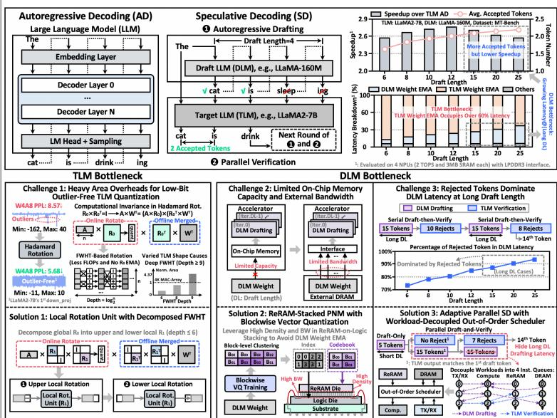  
图 31.1.1：目标与草稿大语言模型（LLM）在投机解码（SD）中引发的挑战及提出的解决方案。

[7] Z. Wu 等, “CELLA: A 28nm Compute-Memory Co-Optimized Real-Time Digital CIM-Based Edge LLM Accelerator with 1.78 ms-Response in Prefill and 31.32 Token/s in Decoding,” IEEE Symp. VLSI Circuits, 2025.

https://doi.org/10.23919/VLSITechnologyandCir65189.2025.11075101

[8] Y. Leviathan 等, “Fast Inference from Transformers via Speculative Decoding,” ICML, pp. 19274-19286, 2023. https://arxiv.org/abs/2211.17192

[9] T. Li 等, “EAGLE: Speculative Sampling Requires Rethinking Feature Uncertainty,” ICML, pp. 28935-28948, 2024. https://arxiv.org/abs/2401.15077

[10] E. Frantar 等, “GPTQ: Accurate Post-Training Quantization for Generative Pre trained Transformers,” ICLR, 2023. https://arxiv.org/abs/2210.17323

[11] S. Ashkboos 等, “QuaRot: Outlier-Free 4-bit Inference in Rotated LLMs,” NeurIPS, pp.100213-100240, 2024. https://arxiv.org/abs/2404.00456

[12] Z. Liu 等, “SpinQuant: LLM Quantization with Learned Rotations,” ICLR, 2025. https://arxiv.org/abs/2405.16406

[13] X. Huang 等, “RoLoRA: Fine-tuning Rotated Outlier-free LLMs for Effective Weight Activation Quantization,” Empirical Methods in Natural Language Proc., pp. 7563-7576, 2024. https://doi.org/10.18653/v1/2024.findings-emnlp.444

[14] T. Liu 等, “PEARL: Parallel Speculative Decoding with Adaptive Draft Length,” ICLR, 2025. https://arxiv.org/pdf/2408.11850

[15] N. Sloane, “A Library of Hadamard Matrices,” 2024. http://neilsloane.com/hadamard/

[16] V. B. Mart 等, “GPTVQ: The Blessing of Dimensionality for LLM Quantization,” arXiv: 2402.15319, 2024. https://arxiv.org/abs/2402.15319

[17] Y. Liu 等, “VPTQ: Extreme Low-bit Vector Post-Training Quantization for Large Language Models,” ACL, pp. 8181-8196, 2024.

https://doi.org/10.18653/v1/2024.emnlp-main.467

[18] S. Li 等, “MVQ: Towards Efficient DNN Compression and Acceleration with Masked Vector Quantization,” ACM ASPLOS, pp. 731-745, 2025. https://arxiv.org/abs/2412.10261

[19] F. Gong 等, “MaskLLM: Learnable Semi-Structured Sparsity for Large Language Models,” NeurIPS, pp.7736-7758, 2024. https://arxiv.org/abs/2409.17481

[20] P. Dong 等, “A 28nm 0.22μJ/Token Memory-Compute-Intensity-Aware CNN-Transformer Accelerator with Hybrid-Attention-Based Layer-Fusion and Cascaded Pruning for Semantic-Segmentation,” ISSCC, pp. 408-409, 2025.

https://doi.org/10.1109/ISSCC49661.2025.10904499

[21] M. Gao 等, “Tetris: Scalable and Efficient Neural Network Acceleration with 3D Memory,” ACM ASPLOS, pp. 751-764, 2017. https://doi.org/10.1145/3093337.3037702

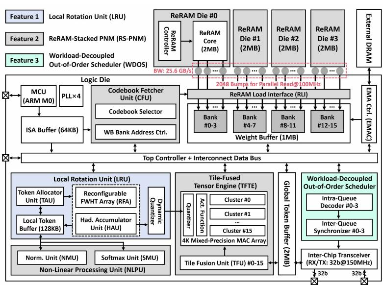  
图 31.1.2：基于凸点键合的 ReRAM 芯片与逻辑晶圆面对面堆叠技术的 LLM 加速器整体架构及三大主要特性。

问题：冗余的 Codebook ReRAM 访问
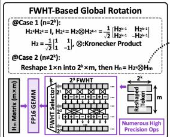

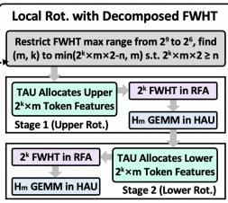

<table><tr><td rowspan=1 colspan=1>TLM</td><td rowspan=1 colspan=1>BF16</td><td rowspan=1 colspan=1>W4A81</td><td rowspan=1 colspan=1>W4A8w/ GR2</td><td rowspan=1 colspan=1>W4A8w/ LRU</td></tr><tr><td rowspan=1 colspan=1>Vicuna-1B</td><td rowspan=1 colspan=1>9.18</td><td rowspan=1 colspan=1>10.34</td><td rowspan=1 colspan=1>9.43</td><td rowspan=1 colspan=1>9.41</td></tr><tr><td rowspan=1 colspan=1>LLaMA2-7B</td><td rowspan=1 colspan=1>5.47</td><td rowspan=1 colspan=1>8.57</td><td rowspan=1 colspan=1>5.68</td><td rowspan=1 colspan=1>5.68</td></tr><tr><td rowspan=1 colspan=1>LLaMA3-8B</td><td rowspan=1 colspan=1>6.14</td><td rowspan=1 colspan=1>7.54</td><td rowspan=1 colspan=1>6.70</td><td rowspan=1 colspan=1>6.71</td></tr></table>

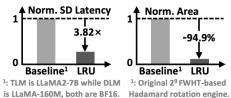

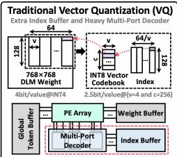

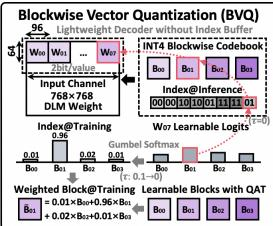

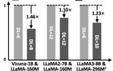

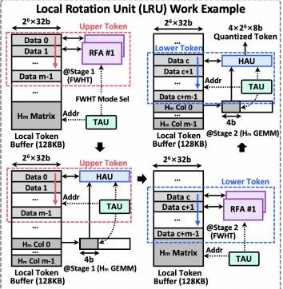

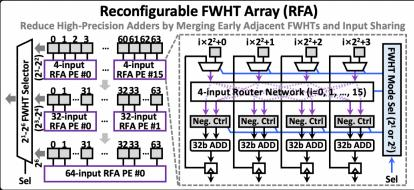

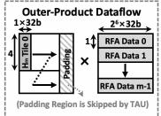

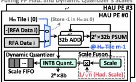

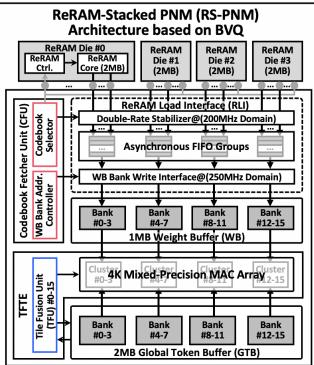

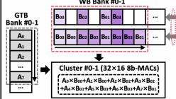

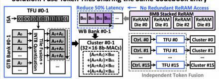

## 图 31.1.3：带有提出的分解快速沃尔什-哈达玛变换 (FWHT) 的局部旋转单元 (LRU)，用于无异常值的低位目标 LLM 量化。

## 图 31.1.4：采用块向量量化 (BVQ) 的 ReRAM 堆叠近存处理 (RS-PNM) 架构，以避免草稿 LLM 外部存储器访问 (EMA)。  
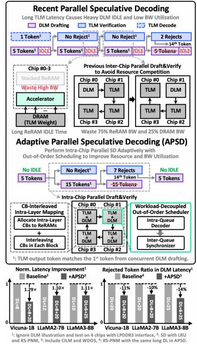

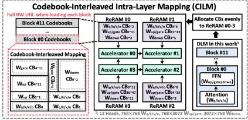

<table><tr><td>TLM 与 DLM</td><td>Vicuna-1B 与 LLaMA-160M</td><td>LLaMA2-7B 与 LLaMA-160M</td><td>LLaMA3-8B 与 LLaMA-296M</td></tr><tr><td>数据精度</td><td colspan="3">TLM: W4A8, DLM: W4A8 (使用 BVQ 的 2bit/值)*1</td></tr><tr><td>TLM 困惑度 (↓)°2</td><td>9.41 (+0.23)</td><td>5.68 (+0.21)</td><td>6.71 (+0.57)</td></tr><tr><td>平均 ReRAM 访问量*3*4</td><td>36.75 MB/Token</td><td>0.0432 GB/Token</td><td>0.0399 GB/Token</td></tr><tr><td>平均 DRAM 访问量3*4</td><td>97.68 MB/Token</td><td>0.6637 GB/Token</td><td>0.8674 GB/Token</td></tr><tr><td>平均 EMA 节省</td><td>6.67×</td><td>4.79×</td><td>4.99×</td></tr><tr><td>解码吞吐量*3*4*5</td><td>135.69 Token/s</td><td>17.82 Token/s</td><td>14.08 Token/s</td></tr><tr><td>加速比7</td><td>7.17×</td><td>4.46×</td><td>5.33×</td></tr><tr><td>能耗 3*4*6</td><td>18.26 mJ/Token</td><td>123.41 mJ/Token</td><td>151.59 mJ/Token</td></tr><tr><td>能耗节省</td><td>4.85×</td><td>3.74×</td><td>3.95×</td></tr></table>

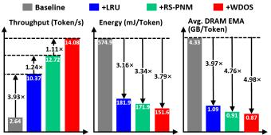  
\*1: 每个 DLM 均在 ShareGPT 数据集上训练。 \*2: 在仅有预填充的 Wikitext-2 数据集上评估，预填充长度为 2048，基线为 BF16 TLM。 \*3: 使用 4 个工作芯片进行评估

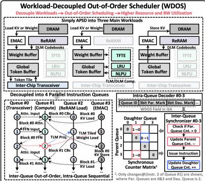

<table><tr><td></td><td>VLSI&#x27;25 [6]</td><td>VLSI&#x27;25 [7]</td><td>ISSCC&#x27;25 [4]</td><td>ISSCC&#x27;25 [5]</td><td>ISSCC&#x27;24 [3]</td><td>本工作</td></tr><tr><td>工艺</td><td>28nm</td><td>28nm</td><td>28nm</td><td>28nm</td><td>28nm</td><td>55nm，在逻辑晶圆上堆叠 ReRAM 裸片</td></tr><tr><td>存储容量</td><td>24KB SRAM</td><td>272KB SRAM</td><td>384KB SRAM</td><td>500KB SRAM</td><td>500KB SRAM</td><td>3.43MB SRAM + 8MB ReRAM</td></tr><tr><td>存储器带宽</td><td>NA</td><td>NA</td><td>NA</td><td>1.6 GB/s (DRAM)</td><td>1.6 GB/s (DRAM)</td><td>25.6 GB/s (ReRAM)</td></tr><tr><td>电源电压 (V)</td><td>0.6-1.0</td><td>0.6-1.0</td><td>0.63-1.0</td><td>0.58-1.0</td><td>0.7-1.1</td><td>0.89-1.40 (逻辑)</td></tr><tr><td>频率</td><td>85-410</td><td>110-500</td><td>50-460</td><td>25-200</td><td>50-200</td><td>63.5-285 (逻辑), 100 (ReRAM)</td></tr><tr><td>裸片面积</td><td>1.56</td><td>12.65</td><td>3.52</td><td>20.25</td><td>20.25</td><td>55.98 (逻辑), 22.21 (ReRAM)</td></tr><tr><td>精度</td><td>W: INT4 A: INT4/INT8</td><td>W: INT8/NUQ1~4 A: FP16</td><td>W: INT8 A: BF16</td><td>W: INT1-16/1.58b A: INT4/8/16</td><td>INT8</td><td>W: INT4/INT8 A: INT8/16/32</td></tr><tr><td>峰值性能*1 (TOPS 或 TFLOPS)</td><td>0.63-2.52 (混合 A4/A8)</td><td>0.12-0.96 (NUQ1~4@解码)</td><td>3.58 (稠密)</td><td>13.1 (87.5% 稀疏度)</td><td>3.41 (稠密)</td><td>2.33*2 (稠密 W4A8/W8A8)</td></tr><tr><td>基准模型与困惑度 (↓)</td><td>LLaMA2-7B (6.16)</td><td>OPT-1.3B (15.1) LLaMA2-7B (6.26)</td><td>GPT2-0.1B (30.85) OPT-1.3B (15.50) LLaMA2-7B (5.66)</td><td>LLaMA-3B (1.58bit: 10.3)</td><td>GPT2-0.7B (14.96)</td><td>Vicuna-1B (9.41) LLaMA2-7B (5.68) LLaMA3-8B (6.71)</td></tr><tr><td>系统级解码*4*5 吞吐量</td><td>LLaMA2-7B (5.46)</td><td>OPT-1.3B (32.75)*3 LLaMA2-7B (6.76)*3</td><td>GPT2-0.1B (286.69) OPT-1.3B (28.13) LLaMA2-7B (5.63)</td><td>LLaMA-3B (1.58bit: 74.92)</td><td>GPT2-0.7B (69.9)</td><td>Vicuna-1B (135.69) LLaMA2-7B (17.82) LLaMA3-8B (14.08)</td></tr><tr><td>系统级能耗*5 (mJ/Token)</td><td>LLaMA2-7B (223.69)</td><td>OPT-1.3B (47.09)°3 LLaMA2-7B (181.48)</td><td>GPT2-0.1B (5.36) OPT-1.3B (55.09) LLaMA2-7B (218.25)</td><td>LLaMA-3B (1.58bit: 16.03)</td><td>GPT2-0.7B (21.90)</td><td>Vicuna-1B (18.26) LLaMA2-7B (123.41) LLaMA3-8B (151.59)</td></tr></table>

## 图 31.1.5：采用工作负载解耦乱序调度器 (WDOS) 的自适应并行推测解码 (APSD)，以实现具有高资源利用率的片内并行起草与验证。

## 图 31.1.6：测量结果及与最先进 LLM 加速器的对比。

<table><tr><td rowspan=1 colspan=1>规格</td><td rowspan=1 colspan=1> (逻辑裸片)</td></tr><tr><td rowspan=1 colspan=1>工艺</td><td rowspan=1 colspan=1>55nm</td></tr><tr><td rowspan=1 colspan=1>电压</td><td rowspan=1 colspan=1>0.89-1.40 V</td></tr><tr><td rowspan=1 colspan=1>频率</td><td rowspan=1 colspan=1>62.5-285 MHz</td></tr><tr><td rowspan=1 colspan=1>裸片面积</td><td rowspan=1 colspan=1>55.98 mm²</td></tr><tr><td rowspan=1 colspan=1>精度</td><td rowspan=1 colspan=1>W: INT4/8, A: INT8/16/32</td></tr><tr><td rowspan=1 colspan=1>SRAM</td><td rowspan=1 colspan=1>3.43 MB</td></tr><tr><td rowspan=1 colspan=1>功耗</td><td rowspan=1 colspan=1>0.265-3.060°W</td></tr></table>

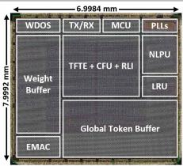

<table><tr><td rowspan=1 colspan=1>规格</td><td rowspan=1 colspan=1> (4 个 ReRAM 裸片)</td></tr><tr><td rowspan=1 colspan=1>工艺</td><td rowspan=1 colspan=1>55nm</td></tr><tr><td rowspan=1 colspan=1>电压</td><td rowspan=1 colspan=1>1.1V</td></tr><tr><td rowspan=1 colspan=1>频率</td><td rowspan=1 colspan=1>100 MHz</td></tr><tr><td rowspan=1 colspan=1>裸片面积</td><td rowspan=1 colspan=1>5.553×4 mm²</td></tr><tr><td rowspan=1 colspan=1>容量</td><td rowspan=1 colspan=1>2×4 MB</td></tr><tr><td rowspan=1 colspan=1>凸点数量</td><td rowspan=1 colspan=1>2912 (数据: 2048, 控制: 864)</td></tr><tr><td rowspan=1 colspan=1>凸点直径</td><td rowspan=1 colspan=1>40μm</td></tr><tr><td rowspan=1 colspan=1>读取功耗</td><td rowspan=1 colspan=1>49.54×4 mW</td></tr></table>

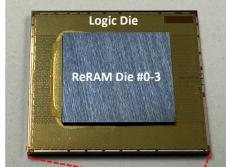

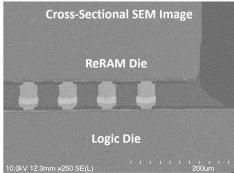

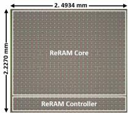

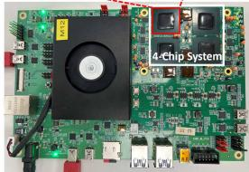

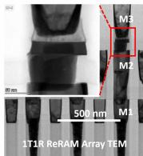

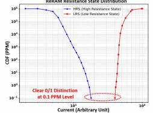  
图 31.1.7：裸片照片、规格、4 芯片系统、逻辑上堆叠 ReRAM 的接口/ReRAM 芯片的 SEM/TEM 图像，以及 ReRAM 电阻分布曲线。