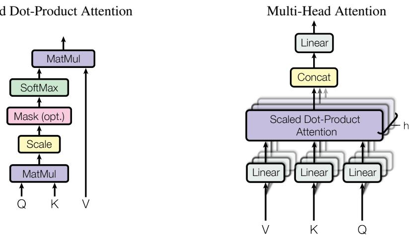
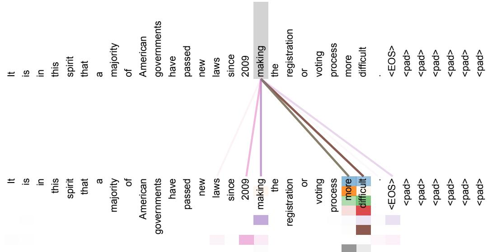
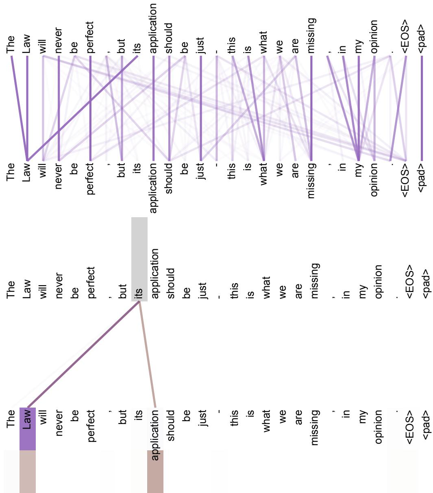
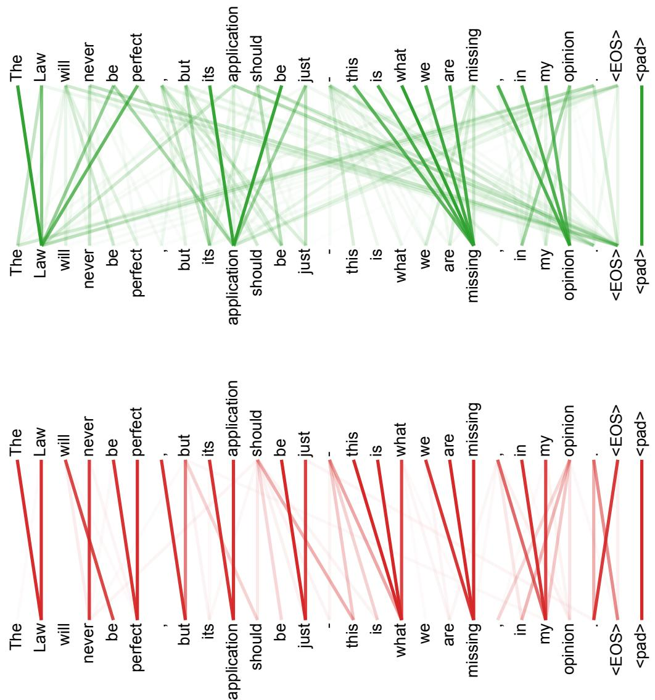

# Attention Is All You Need 原文翻译

在提供适当引用的前提下，Google 特此授权仅出于新闻或学术作品的使用目的，复制本文中的表格和图表。

# Attention Is All You Need

Ashish Vaswani∗ Google Brain avaswani@google.com

Noam Shazeer∗ Google Brain noam@google.com

Niki Parmar∗ Google Research nikip@google.com

Jakob Uszkoreit∗ Google Research usz@google.com

Llion Jones∗ Google Research llion@google.com

Aidan N. Gomez∗ † University of Toronto aidan@cs.toronto.edu

Łukasz Kaiser∗ Google Brain lukaszkaiser@google.com

Illia Polosukhin∗ ‡illia.polosukhin@gmail.com

## 摘要

主流的序列转导模型基于复杂的循环或卷积神经网络，这些网络包含一个 Encoder 和一个 Decoder。表现最好的模型还通过 Attention 机制连接 Encoder 和 Decoder。我们提出了一种新的简单网络架构 Transformer，它完全基于 Attention 机制，摒弃了循环和卷积。在两个机器翻译任务上的实验表明，这些模型在质量上更具优势，同时具有更强的并行性，且所需的训练时间大大减少。我们的模型在 WMT 2014 英德翻译任务上达到了 28.4 BLEU，比现有的最佳结果（包括集成模型）提高了 2 BLEU 以上。在 WMT 2014 英法翻译任务上，我们的模型在 8 个 GPU 上训练 3.5 天后，创下了 41.8 的单模型最先进 BLEU 分数，这只是文献中最佳模型训练成本的一小部分。我们通过将 Transformer 成功应用于具有大量和有限训练数据的英语成分句法分析，证明了它对其他任务具有良好的泛化能力。

## 1 引言

循环神经网络，特别是长短期记忆网络 [13] 和门控循环神经网络 [7]，已被牢固确立为序列建模和转导问题（如语言建模和机器翻译）的最先进方法 [35, 2, 5]。此后，众多努力不断推动循环语言模型和 Encoder-Decoder 架构的边界 [38, 24, 15]。

循环模型通常沿着输入和输出序列的符号位置分解计算。将位置与计算时间中的步骤对齐，它们生成一系列隐藏状态 $h _ { t } ,$，作为前一个隐藏状态 $h _ { t - 1 }$ 和位置 t 的输入的函数。这种固有的串行特性阻碍了训练样本内部的并行化，这在序列长度较长时变得至关重要，因为内存限制阻碍了跨样本的批处理。最近的工作通过分解技巧 [21] 和条件计算 [32] 在计算效率方面取得了显著提升，同时后者也提升了模型性能。然而，顺序计算的根本限制仍然存在。

Attention 机制已成为各种任务中引人注目的序列建模和转导模型不可或缺的一部分，它允许对依赖关系进行建模，而不考虑它们在输入或输出序列中的距离 [2, 19]。然而，除了少数情况 [27] 外，这种 Attention 机制通常与循环网络结合使用。

在这项工作中，我们提出了 Transformer，这是一种摒弃了循环结构，完全依赖 Attention 机制来建立输入和输出之间全局依赖关系的模型架构。Transformer 允许进行更多的并行化，并且在八个 P100 GPU 上训练短短十二小时后，即可在翻译质量上达到新的最先进水平。

## 2 背景

减少顺序计算的目标也构成了 Extended Neural GPU [16]、ByteNet [18] 和 ConvS2S [9] 的基础，它们都使用卷积神经网络作为基本构建块，并行计算所有输入和输出位置的隐藏表示。在这些模型中，关联来自任意两个输入或输出位置的信号所需的操作数量随位置之间的距离增加而增加，对于 ConvS2S 是线性增长，对于 ByteNet 是对数增长。这使得学习遥远位置之间的依赖关系变得更加困难 [12]。在 Transformer 中，这被减少为固定数量的操作，尽管代价是由于平均了 Attention 权重位置而导致有效分辨率降低，我们通过第 3.2 节中描述的 Multi-Head Attention 来抵消这种影响。

Self-attention，有时被称为 intra-attention，是一种将单个序列的不同位置联系起来以计算该序列表示的 Attention 机制。Self-attention 已成功应用于多种任务，包括阅读理解、抽象摘要、文本蕴含和学习与任务无关的句子表示 [4, 27, 28, 22]。

端到端记忆网络基于循环 Attention 机制而不是序列对齐的循环，并且已被证明在简单语言问答和语言建模任务上表现良好 [34]。

然而，据我们所知，Transformer 是第一个完全依赖 self-attention 来计算其输入和输出表示，而不使用序列对齐的 RNN 或卷积的转导模型。在以下章节中，我们将描述 Transformer，阐述 self-attention 的动机，并讨论其相对于 [17, 18] 和 [9] 等模型的优势。

## 3 模型架构

大多数具有竞争力的神经序列转导模型都具有 Encoder-Decoder 结构 [5, 2, 35]。在这里，Encoder 将符号表示的输入序列 $( x _ { 1 } , . . . , x _ { n } )$ 映射为连续表示的序列 $\textbf { z } = ~ ( z _ { 1 } , . . . , z _ { n } )$。给定 z，Decoder 随后每次生成一个元素，从而生成符号的输出序列 $\left( y _ { 1 } , . . . , y _ { m } \right)$。在每一步中，模型都是自回归的 [10]，在生成下一个符号时，将先前生成的符号作为额外输入。

  
图 1：Transformer - 模型架构。

Transformer 遵循这一总体架构，为 Encoder 和 Decoder 使用堆叠的 self-attention 和逐点全连接层，分别如图 1 的左右两半所示。

## 3.1 Encoder 和 Decoder 堆栈

Encoder：Encoder 由 $N = 6$ 个相同的层堆叠组成。每层有两个子层。第一个是 multi-head self-attention 机制，第二个是简单的、逐位置的全连接前馈网络。我们在两个子层周围采用残差连接 [11]，然后进行层归一化 [1]。也就是说，每个子层的输出是 LayerNorm(x + Sublayer(x))，其中 Sublayer(x) 是子层本身实现的函数。为了便于这些残差连接，模型中的所有子层以及 Embedding 层都产生维度为 $d _ { \mathrm { m o d e l } } = 5 1 2$ 的输出。

Decoder：Decoder 同样由 $N = 6$ 个相同的层堆叠组成。除了每个 Encoder 层中的两个子层外，Decoder 还插入了第三个子层，该子层对 Encoder 堆栈的输出执行 multi-head attention。与 Encoder 类似，我们在每个子层周围采用残差连接，然后进行层归一化。我们还修改了 Decoder 堆栈中的 self-attention 子层，以防止位置关注后续位置。这种掩码机制，加上输出 Embedding 偏移一个位置的事实，确保了对位置 i 的预测只能依赖于小于 i 的位置上的已知输出。

## 3.2 Attention

Attention 函数可以描述为将一个 query 和一组 key-value 对映射到一个 output，其中 query、keys、values 和 output 都是向量。output 被计算为加权和

  
图 2：(左) Scaled Dot-Product Attention。(右) Multi-Head Attention 由几个并行运行的 attention 层组成。

其中，分配给每个 value 的权重是由 query 与相应 key 的兼容性函数计算得出的。

## 3.2.1 Scaled Dot-Product Attention

我们将我们特定的 attention 称为“Scaled Dot-Product Attention”（图 2）。输入由维度为 $d _ { k }$ 的 queries 和 keys，以及维度为 √ $d _ { v }$ 的 values 组成。我们计算 query 与所有 keys 的点积，将每个点积除以 $\sqrt { d _ { k } }$ ，并应用 softmax 函数以获得 values 上的权重。

在实践中，我们同时计算一组 queries 上的 attention 函数，将它们打包成一个矩阵 $Q .$ 。keys 和 values 也被打包成矩阵 K 和 V 。我们计算输出矩阵如下：

$$
\mathrm { A t t e n t i o n } ( Q , K , V ) = \mathrm { s o f t m a x } ( \frac { Q K ^ { T } } { \sqrt { d _ { k } } } ) V\tag{1}
$$

两种最常用的 attention 函数是 additive attention [2] 和 dot-product (multiplicative) attention。Dot-product attention 与我们的算法相同，只是多了缩放因子 $\frac { 1 } { \sqrt { d _ { k } } }$ 。Additive attention 使用具有单个隐藏层的前馈神经网络来计算兼容性函数。虽然两者在理论复杂度上相似，但 dot-product attention 在实践中要快得多且空间效率更高，因为它可以使用高度优化的矩阵乘法代码来实现。

虽然对于较小的 $d _ { k }$ 值，这两种机制表现相似，但对于较大的 $d _ { k }$ 值，不加缩放的 dot product attention 的表现不如 additive attention [3]。我们怀疑，对于较大的 $d _ { k }$ 值，点积的幅度会变大，将 softmax 函数推入具有极小梯度的区域 4。为了抵消这种影响，我们将点积缩放 $\frac { 1 } { \sqrt { d _ { k } } }$ 倍。

## 3.2.2 Multi-Head Attention

我们发现，与其使用 $d _ { \mathrm { m o d e l } }$ 维度的 keys、values 和 queries 执行单个 attention 函数，不如将 queries、keys 和 values 分别用不同的、学习到的线性投影投影 $h$ 次到 $d _ { k } , d _ { k }$ 和 $d _ { v }$ 维度，这样做是有益的。然后，我们在这些投影后的 queries、keys 和 values 版本上并行执行 attention 函数，产生 $d _ { v }$ 维的输出值。这些值被拼接起来并再次进行投影，得到最终的值，如图 2 所示。

Multi-head attention 允许模型在不同位置共同关注来自不同表示子空间的信息。对于单个 attention head，平均操作会抑制这一点。

$$
\begin{array} { r } { \begin{array} { r l } & { \mathrm { M u l t i H e a d } ( Q , K , V ) = \mathrm { C o n c a t } ( \mathrm { h e a d } _ { 1 } , . . . , \mathrm { h e a d } _ { \mathrm { h } } ) W ^ { O } } \\ & { \qquad \mathrm { w h e r e ~ h e a d } _ { \mathrm { i } } = \mathrm { A t t e n t i o n } ( Q W _ { i } ^ { Q } , K W _ { i } ^ { K } , V W _ { i } ^ { V } ) } \end{array} } \end{array}
$$

其中投影是参数矩阵 $\begin{array} { r } { W _ { i } ^ { Q } \in \mathbb { R } ^ { d _ { \operatorname* { m o d e l } } \times d _ { k } } , W _ { i } ^ { K } \in \mathbb { R } ^ { d _ { \operatorname* { m o d e l } } \times d _ { k } } , W _ { i } ^ { V } \in \mathbb { R } ^ { d _ { \operatorname* { m o d e l } } \times d _ { \imath } } } \end{array}$ 和 $W ^ { O } \in \mathbb R ^ { \bar { h } d _ { v } \times d _ { \mathrm { m o d e l } } }$ ·

在这项工作中，我们采用 $h \ : = \ : 8$ 个并行的 attention 层，或 heads。对于其中每一个，我们使用 $d _ { k } = d _ { v } = d _ { \mathrm { m o d e l } } / h \stackrel { } { = } \dot { 6 } 4$ 。由于每个 head 的维度减少，总计算成本与具有全维度的 single-head attention 相似。

## 3.2.3 Attention 在我们模型中的应用

Transformer 以三种不同的方式使用 multi-head attention：

• 在“encoder-decoder attention”层中，queries 来自前一个 decoder 层，而 memory keys 和 values 来自 encoder 的输出。这使得 decoder 中的每个位置都能关注输入序列中的所有位置。这模仿了序列到序列模型中典型的 encoder-decoder attention 机制，例如 [38, 2, 9]。

• Encoder 包含 self-attention 层。在 self-attention 层中，所有的 keys、values 和 queries 都来自同一个地方，在这种情况下，即 encoder 中前一层的输出。Encoder 中的每个位置都可以关注 encoder 前一层中的所有位置。

• 类似地，decoder 中的 self-attention 层允许 decoder 中的每个位置关注 decoder 中直到并包括该位置的所有位置。我们需要防止 decoder 中的向左信息流，以保持自回归属性。我们在 scaled dot-product attention 内部通过掩码（设置为 −∞）softmax 输入中所有对应于非法连接的值来实现这一点。见图 2。

## 3.3 Position-wise Feed-Forward Networks

除了 attention 子层之外，我们的 encoder 和 decoder 中的每一层都包含一个全连接的前馈神经网络，该网络分别且相同地应用于每个位置。它由两个线性变换组成，中间有一个 ReLU 激活。

$$
\mathrm { F F N } ( x ) = \operatorname* { m a x } ( 0 , x W _ { 1 } + b _ { 1 } ) W _ { 2 } + b _ { 2 }\tag{2}
$$

虽然线性变换在不同位置上是相同的，但它们从一层到另一层使用不同的参数。另一种描述方式是将其视为两个 kernel size 为 1 的卷积。输入和输出的维度为 $d _ { \mathrm { m o d e l } } = 5 1 2$ ，内层的维度为 $d _ { f f } = 2 0 4 8$ 。

## 3.4 Embeddings 和 Softmax

与其他序列转换模型类似，我们使用学习到的 embeddings 将输入 tokens 和输出 tokens 转换为维度为 $d _ { \mathrm { m o d e l } }$ 的向量。我们还使用通常的学习到的线性变换和 softmax 函数将 decoder 输出转换为预测的 next-token 概率。在我们的模型中，我们在两个 embedding 层和 pre-softmax√ 线性变换之间共享相同的权重矩阵，类似于 [30]。在 embedding 层中，我们将这些权重乘以 $\sqrt { d _ { \mathrm { { m o d e l } } } }$

表 1：不同层类型的最大路径长度、每层复杂度和最小顺序操作数。n 是序列长度，d 是表示维度，k 是卷积的 kernel size，r 是 restricted self-attention 中邻域的大小。
<table><tr><td>层类型</td><td>每层复杂度</td><td>顺序操作数</td><td>最大路径长度</td></tr><tr><td>Self-Attention</td><td> $\overline { { O ( n ^ { 2 } \cdot d ) } }$ </td><td>0(1)</td><td>0(1)</td></tr><tr><td>Recurrent</td><td> $O ( n \cdot d ^ { 2 } )$ </td><td>O(n)</td><td> $O ( n )$ </td></tr><tr><td>Convolutional</td><td> $O ( k \cdot n \cdot \dot { d } ^ { 2 } )$ </td><td>0(1)</td><td> $O ( l o g _ { k } ( n ) )$ </td></tr><tr><td>Self-Attention (restricted)</td><td> ${ \dot { O ( r \cdot n \cdot d ) } }$ </td><td>0(1)</td><td> $O ( n / r )$ </td></tr></table>

## 3.5 位置编码

由于我们的模型不包含循环和卷积结构，为了让模型能够利用序列的顺序，我们必须注入一些关于序列中 token 的相对或绝对位置的信息。为此，我们在 encoder 和 decoder 堆栈底部的输入 embedding 中添加了“位置编码”。位置编码与 embedding 具有相同的维度 $d _ { \mathrm { m o d e l } }$，以便两者可以相加。位置编码有多种选择，包括学习到的和固定的 [9]。

在这项工作中，我们使用不同频率的正弦和余弦函数：

$$
\begin{array} { r } { P E _ { ( p o s , 2 i ) } = s i n ( p o s / 1 0 0 0 0 ^ { 2 i / d _ { \mathrm { m o d e l } } } ) } \\ { P E _ { ( p o s , 2 i + 1 ) } = c o s ( p o s / 1 0 0 0 0 ^ { 2 i / d _ { \mathrm { m o d e l } } } ) } \end{array}
$$

其中 pos 是位置，i 是维度。也就是说，位置编码的每个维度对应于一个正弦波。波长形成从 $2 \pi$ 到 $1 0 0 0 0 \cdot 2 \pi$ 的几何级数。我们选择这个函数是因为我们假设它能让模型轻松学会通过相对位置进行 attention，因为对于任何固定偏移量 k，$P E _ { p o s + k }$ 都可以表示为 $P E _ { p o s }$ 的线性函数。

我们还尝试了使用学习到的位置 embedding [9] 来代替，并发现这两个版本产生了几乎相同的结果（见表 3 第 (E) 行）。我们选择正弦版本是因为它可能允许模型外推到比训练期间遇到的序列长度更长的序列。

## 4 为什么使用 Self-Attention

在本节中，我们将 self-attention 层的各个方面与常用于将一个可变长度的符号表示序列 $( x _ { 1 } , . . . , x _ { n } )$ 映射到另一个等长序列 $\left( z _ { 1 } , . . . , z _ { n } \right)$（其中 $x _ { i } , z _ { i } \in \mathbb { R } ^ { d }$，例如典型序列转换 encoder 或 decoder 中的隐藏层）的循环层和卷积层进行比较。为了激励我们使用 self-attention，我们考虑了三个期望特性。

一个是每层的总计算复杂度。另一个是可以并行化的计算量，由所需的最少顺序操作数来衡量。

第三个是网络中长期依赖关系之间的路径长度。学习长期依赖是许多序列转换任务中的一个关键挑战。影响学习此类依赖能力的一个关键因素是前向和后向信号必须在网络中遍历的路径长度。输入和输出序列中任意位置组合之间的这些路径越短，就越容易学习长期依赖 [12]。因此，我们还比较了由不同层类型组成的网络中任意两个输入和输出位置之间的最大路径长度。

如表 1 所示，self-attention 层以恒定数量的顺序执行操作连接所有位置，而循环层需要 $O ( n )$ 次顺序操作。在计算复杂度方面，当序列长度 n 小于表示维度 d 时，self-attention 层比循环层更快，这在机器翻译中最先进的模型使用的句子表示中通常是成立的，例如 word-piece [38] 和 byte-pair [31] 表示。为了提高涉及非常长序列的任务的计算性能，可以将 self-attention 限制为仅考虑输入序列中以各自输出位置为中心、大小为 r 的邻域。这会将最大路径长度增加到 $O ( n / r )$。我们计划在未来的工作中进一步研究这种方法。

核宽度为 $k <$ n 的单个卷积层无法连接所有输入和输出位置对。在连续核的情况下，这样做需要一堆 $O ( n / k )$ 个卷积层，或者在空洞卷积 [18] 的情况下需要 $O ( l o g _ { k } ( n ) )$ 个，这增加了网络中任意两个位置之间最长路径的长度。卷积层通常比循环层更昂贵，相差 k 倍。然而，可分离卷积 [6] 显著降低了复杂度，降至 $\dot { O ( k \cdot n \cdot d + n \cdot d ^ { 2 } ) }$。然而，即使 $k = n$，可分离卷积的复杂度也等于 self-attention 层和逐点前馈层的组合，这正是我们在模型中采用的方法。

作为附带的好处，self-attention 可以产生更具可解释性的模型。我们检查了模型的 attention 分布，并在附录中展示和讨论了示例。不仅单个 attention head 明确地学会了执行不同的任务，许多 attention head 似乎还表现出与句子句法和语义结构相关的行为。

## 5 训练

本节描述了我们模型的训练机制。

## 5.1 训练数据与批处理

我们在标准的 WMT 2014 英德数据集上进行了训练，该数据集包含约 450 万个句子对。句子使用 byte-pair encoding [3] 进行编码，它具有约 37000 个 token 的共享源-目标词汇表。对于英法翻译，我们使用了大得多的 WMT 2014 英法数据集，包含 3600 万个句子，并将 token 拆分为 32000 个 word-piece 词汇表 [38]。句子对按近似序列长度进行批处理。每个训练批次包含一组句子对，其中包含大约 25000 个源 token 和 25000 个目标 token。

## 5.2 硬件与时间表

我们在一台配备 8 个 NVIDIA P100 GPU 的机器上训练了我们的模型。对于我们使用本文所述超参数的基础模型，每个训练步骤大约花费 0.4 秒。我们总共训练了基础模型 100,000 步或 12 小时。对于我们的大模型（在表 3 的最后一行描述），每步时间为 1.0 秒。大模型训练了 300,000 步（3.5 天）。

## 5.3 优化器

我们使用了 Adam 优化器 [20]，其中 $\beta _ { 1 } = 0 . 9 , \beta _ { 2 } = 0 . 9 8$ 且 $\epsilon = 1 0 ^ { - 9 }$。在训练过程中，我们根据以下公式改变了学习率：

$$
l r a t e = d _ { \mathrm { m o d e l } } ^ { - 0 . 5 } \cdot \mathrm { m i n } ( s t e p _ { - } n u m ^ { - 0 . 5 } , s t e p _ { - } n u m \cdot w a r m u p _ { - } s t e p s ^ { - 1 . 5 } )\tag{3}
$$

这相当于在前 warmup\_steps 个训练步骤中线性增加学习率，然后在此之后按步数的平方根倒数成比例地减小它。我们使用 warmup $. s t e p s = 4 0 0 0$

## 5.4 正则化

我们在训练期间采用了三种类型的正则化：

表 2：Transformer 在 English-to-German 和 English-to-French newstest2014 测试中取得了比以往最先进模型更好的 BLEU 分数，且训练成本仅为后者的一小部分。
<table><tr><td rowspan="2">模型</td><td colspan="2">BLEU</td><td colspan="2">训练成本 (FLOPs)</td></tr><tr><td>EN-DE</td><td>EN-FR</td><td>EN-DE</td><td>EN-FR</td></tr><tr><td>ByteNet [18]</td><td>23.75</td><td></td><td></td><td></td></tr><tr><td>Deep-Att + PosUnk [39]</td><td></td><td>39.2</td><td></td><td> $1 . 0 \cdot 1 0 ^ { 2 0 }$ </td></tr><tr><td>GNMT + RL [38]</td><td>24.6</td><td>39.92</td><td> $2 . 3 \cdot 1 0 ^ { 1 9 }$ </td><td> $1 . 4 \cdot 1 0 ^ { 2 0 }$ </td></tr><tr><td>ConvS2S [9]</td><td>25.16</td><td>40.46</td><td> $9 . 6 \cdot 1 0 ^ { 1 8 }$ </td><td> $1 . 5 \cdot 1 0 ^ { 2 0 }$ </td></tr><tr><td>MoE[32]</td><td>26.03</td><td>40.56</td><td> $2 . 0 \cdot 1 0 ^ { 1 9 }$ </td><td> $1 . 2 \cdot 1 0 ^ { 2 0 }$ </td></tr><tr><td>Deep-Att + PosUnk 集成 [39]</td><td></td><td>40.4</td><td></td><td> $\overline { { 8 . 0 \cdot 1 0 ^ { 2 0 } } }$ </td></tr><tr><td> $\mathrm { G N M T } + \mathrm { R I }$  集成 [38]</td><td>26.30</td><td>41.16</td><td> $1 . 8 \cdot 1 0 ^ { 2 0 }$ </td><td> $1 . 1 \cdot 1 0 ^ { 2 1 }$ </td></tr><tr><td>ConvS2S 集成 [9]</td><td>26.36</td><td>41.29</td><td> $7 . 7 \cdot 1 0 ^ { 1 9 }$ </td><td> $1 . 2 \cdot 1 0 ^ { 2 1 }$ </td></tr><tr><td>Transformer (base model)</td><td>27.3</td><td>38.1</td><td> $\mathbf { 3 . 3 \cdot 1 0 ^ { 1 8 } }$ </td><td></td></tr><tr><td>Transformer (big)</td><td>28.4</td><td>41.8</td><td> $2 . 3 \cdot 1 0 ^ { 1 9 }$ </td><td></td></tr></table>

Residual Dropout 我们将 dropout [33] 应用于每个子层的输出，然后再将其与子层输入相加并归一化。此外，我们还在 Encoder 和 Decoder 堆栈中的 Embedding 和位置编码之和应用了 dropout。对于 base model，我们使用的比率为 $P _ { d r o p } = 0 . 1$

Label Smoothing 在训练期间，我们采用了值为 $\epsilon _ { l s } = 0 . 1 [ 3 6 ]$ 的标签平滑。这会损害困惑度，因为模型学会了变得更加不确定，但能提高准确率和 BLEU 分数。

## 6 结果

## 6.1 机器翻译

在 WMT 2014 English-to-German 翻译任务中，big transformer 模型（表 2 中的 Transformer (big)）比以往表现最好的模型（包括集成模型）高出 2.0 BLEU 以上，创下了 28.4 的新最先进 BLEU 分数。该模型的配置列在表 3 的最后一行。在 8 个 P100 GPU 上训练耗时 3.5 天。即使是我们的 base model，也以极低的训练成本超越了所有先前发表的模型和集成模型。

在 WMT 2014 English-to-French 翻译任务中，我们的 big 模型取得了 41.0 的 BLEU 分数，超越了所有先前发表的单模型，且训练成本不到此前最先进模型的 1/4。针对 English-to-French 训练的 Transformer (big) 模型使用了 dropout 比率 $P _ { d r o p } = 0 . 1$ ，而不是 0.3。

对于 base models，我们使用通过对最后 5 个 checkpoints 取平均得到的单一模型，这些 checkpoints 以 10 分钟的间隔写入。对于 big models，我们对最后 20 个 checkpoints 取平均。我们使用了 beam size 为 4 和长度惩罚 $\alpha = 0 . 6 [ 3 8 ]$ 的 beam search。这些超参数是在开发集上经过实验后选择的。我们将推理期间的最大输出长度设置为输入长度 + 50，但在可能的情况下会提前终止 [38]。

表 2 总结了我们的结果，并将我们的翻译质量和训练成本与文献中的其他模型架构进行了比较。我们通过将训练时间、使用的 GPU 数量以及每个 $\mathrm { G P U } ^ { 5 }$ 的持续单精度浮点运算能力的估计值相乘，来估计用于训练模型的浮点运算次数。

## 6.2 模型变体

为了评估 Transformer 不同组件的重要性，我们以不同方式改变了 base model，测量了在开发集 newstest2013 上 English-to-German 翻译性能的变化。我们使用了前一节所述的 beam search，但没有进行 checkpoint 平均。我们在表 3 中展示了这些结果。

表 3：Transformer 架构上的变体。未列出的值与 base model 的值相同。所有指标均在 English-to-German 翻译开发集 newstest2013 上测得。列出的困惑度是按我们的 byte-pair encoding 计算的每个 wordpiece 的困惑度，不应与 per-word 困惑度进行比较。
<table><tr><td rowspan="2"></td><td rowspan="2"> $N$   $d _ { \mathrm { m o d e l } }$ </td><td rowspan="2"> $d _ { \mathrm { f f } }$ </td><td rowspan="2">h</td><td rowspan="2"> $d _ { k }$ </td><td rowspan="2"> $d _ { v }$ </td><td rowspan="2"> $P _ { d r o p }$ </td><td rowspan="2"> $\epsilon _ { l s }$ </td><td rowspan="2">训练步数</td><td rowspan="2">PPL (dev)</td><td rowspan="2">BLEU (dev)</td><td rowspan="2">参数量  $\times 1 0 ^ { 6 }$ </td></tr><tr><td></td></tr><tr><td>base</td><td>6</td><td>512</td><td>2048</td><td>8</td><td>64</td><td>64</td><td>0.1</td><td>0.1 100K</td><td></td><td>4.92</td><td>25.8</td><td>65</td></tr><tr><td rowspan="3">(A)</td><td></td><td></td><td>1</td><td>512</td><td>512 128</td><td></td><td></td><td></td><td>5.29</td><td></td><td>24.9</td><td></td></tr><tr><td></td><td></td><td>4</td><td>128</td><td></td><td></td><td></td><td></td><td></td><td>5.00</td><td>25.5</td><td></td></tr><tr><td></td><td></td><td>16 32</td><td>32 16</td><td>32 16</td><td></td><td></td><td></td><td>4.91 5.01</td><td>25.8 25.4</td><td></td><td></td></tr><tr><td>(B)</td><td></td><td></td><td></td><td></td><td>16 32</td><td></td><td></td><td></td><td></td><td>5.16 5.01</td><td>25.1 25.4</td><td>58 60</td></tr><tr><td>(C)</td><td>248 256 1024</td><td>1024 4096</td><td></td><td>32 128</td><td>32 128</td><td></td><td></td><td></td><td></td><td>6.11 5.19 4.88 5.75 4.66 5.12</td><td>23.7 25.3 25.5 24.5 26.0 25.4</td><td>36 50 80 28 168 53</td></tr><tr><td>(D)</td><td></td><td></td><td></td><td></td><td></td><td></td><td>0.0 0.2</td><td>0.0</td><td></td><td>4.75 5.77 4.95</td><td>26.2 24.6 25.5 25.3</td><td>90</td></tr><tr><td>(E)</td><td></td><td></td><td>使用 positional embedding 代替正弦曲线</td><td></td><td></td><td></td><td></td><td>0.2</td><td></td><td>4.67 5.47</td><td>25.7</td><td></td></tr><tr><td>big</td><td>6</td><td>1024</td><td>4096 16</td><td></td><td></td><td></td><td>0.3</td><td></td><td>300K</td><td>4.92 4.33</td><td>25.7 26.4</td><td>213</td></tr></table>

在表 3 的第 (A) 行中，我们在保持计算量不变的情况下，改变了 attention head 的数量以及 attention key 和 value 的维度，如第 3.2.2 节所述。虽然 single-head attention 比最佳设置差 0.9 BLEU，但 head 数量过多时质量也会下降。

在表 3 的第 (B) 行中，我们观察到减小 attention key 大小 $d _ { k }$ 会损害模型质量。这表明确定兼容性并不容易，且比点积更复杂的兼容性函数可能是有益的。我们进一步在第 (C) 和 (D) 行观察到，正如预期的那样，更大的模型效果更好，并且 dropout 在避免过拟合方面非常有帮助。在第 (E) 行中，我们用学习到的 positional embeddings [9] 替换了我们的正弦位置编码，并观察到与 base model 几乎相同的结果。

## 6.3 英语成分句法分析

为了评估 Transformer 是否能泛化到其他任务，我们在英语成分句法分析上进行了实验。该任务面临特定的挑战：输出受到强结构约束，且长度显著长于输入。此外，RNN 序列到序列模型在小数据场景下无法达到最先进的结果 [37]。

我们在 Penn Treebank [25] 的 Wall Street Journal (WSJ) 部分上训练了一个 4 层 Transformer，$d _ { m o d e l } = 1 0 2 4$，约 40K 训练句子。我们还在半监督设置下进行了训练，使用了约 17M 句子的大型高置信度和 BerkleyParser 语料库 [37]。我们在仅 WSJ 设置中使用了 16K tokens 的词表，在半监督设置中使用了 32K tokens 的词表。

我们仅进行了少量实验来选择 dropout（包括 attention 和 residual（第 5.4 节））、学习率和 beam size，这些实验在 Section 22 开发集上进行，所有其他参数与英语到德语的基础翻译模型保持不变。在推理时，我们将最大输出长度增加到输入长度 + 300。我们在仅 WSJ 和半监督设置中均使用 beam size 为 21 和 α = 0.3。

表 4：Transformer 在英语成分句法分析上泛化良好（结果在 WSJ 的 Section 23 上）
<table><tr><td>解析器</td><td>训练</td><td>WSJ 23 F1</td></tr><tr><td>Vinyals &amp; Kaiser el al. (2014) [37] Petrov et al. (2006) [29]</td><td>仅 WSJ，判别式 仅 WSJ，判别式</td><td>88.3 90.4</td></tr><tr><td>Zhu et al. (2013) [40]</td><td>仅 WSJ，判别式</td><td>90.4</td></tr><tr><td>Dyer et al. (2016) [8]</td><td>仅 WSJ，判别式</td><td>91.7</td></tr><tr><td>Transformer(4layers)</td><td>仅 WSJ，判别式</td><td>91.3</td></tr><tr><td>Zhu et al. (2013) [40]</td><td>半监督</td><td>91.3</td></tr><tr><td>Huang &amp; Harper (2009) [14]</td><td>半监督</td><td>91.3</td></tr><tr><td>McClosky et al. (2006) [26]</td><td>半监督</td><td>92.1</td></tr><tr><td>Vinyals &amp; Kaiser el al. (2014)[37]</td><td>半监督</td><td></td></tr><tr><td>Transformer(4layers)</td><td></td><td>92.1</td></tr><tr><td>Luong et al. (2015) [23]</td><td>半监督多任务</td><td>92.7</td></tr><tr><td>Dyer et al. (2016) [8]</td><td>生成式</td><td>93.0</td></tr><tr><td></td><td></td><td>93.3</td></tr></table>

我们在表 4 中的结果显示，尽管缺乏针对任务的调优，我们的模型表现令人惊讶地好，除了 Recurrent Neural Network Grammar [8] 之外，其结果优于所有此前报道的模型。

与 RNN 序列到序列模型 [37] 不同，即使仅在 40K 句子的 WSJ 训练集上训练，Transformer 也优于 BerkeleyParser [29]。

## 7 结论

在本工作中，我们提出了 Transformer，这是第一个完全基于 attention 的序列转换模型，用 multi-headed self-attention 替换了 encoder-decoder 架构中最常用的循环层。

对于翻译任务，Transformer 的训练速度显著快于基于循环层或卷积层的架构。在 WMT 2014 英语到德语和 WMT 2014 英语到法语翻译任务上，我们都达到了新的最先进水平。在前一个任务中，我们最好的模型甚至超越了所有此前报道的集成模型。

我们对基于 attention 的模型的未来感到兴奋，并计划将其应用到其他任务中。我们计划将 Transformer 扩展到涉及文本以外的输入和输出模态的问题，并研究局部的、受限的 attention 机制，以高效处理大型输入和输出，如图像、音频和视频。使生成过程更少顺序化是我们的另一个研究目标。

我们用于训练和评估模型的代码可在 https://github.com/ tensorflow/tensor2tensor 获取。

致谢 我们感谢 Nal Kalchbrenner 和 Stephan Gouws 提供的有益意见、修正和启发。

## 参考文献

[1] Jimmy Lei Ba, Jamie Ryan Kiros, and Geoffrey E Hinton. Layer normalization. arXiv preprint arXiv:1607.06450, 2016.

[2] Dzmitry Bahdanau, Kyunghyun Cho, and Yoshua Bengio. Neural machine translation by jointly learning to align and translate. CoRR, abs/1409.0473, 2014.

[3] Denny Britz, Anna Goldie, Minh-Thang Luong, and Quoc V. Le. Massive exploration of neural machine translation architectures. CoRR, abs/1703.03906, 2017.

[4] Jianpeng Cheng, Li Dong, and Mirella Lapata. Long short-term memory-networks for machine reading. arXiv preprint arXiv:1601.06733, 2016.

[5] Kyunghyun Cho, Bart van Merrienboer, Caglar Gulcehre, Fethi Bougares, Holger Schwenk, and Yoshua Bengio. Learning phrase representations using rnn encoder-decoder for statistical machine translation. CoRR, abs/1406.1078, 2014.

[6] Francois Chollet. Xception: Deep learning with depthwise separable convolutions. arXiv preprint arXiv:1610.02357, 2016.

[7] Junyoung Chung, Çaglar Gülçehre, Kyunghyun Cho, and Yoshua Bengio. Empirical evaluation of gated recurrent neural networks on sequence modeling. CoRR, abs/1412.3555, 2014.

[8] Chris Dyer, Adhiguna Kuncoro, Miguel Ballesteros, and Noah A. Smith. Recurrent neural network grammars. In Proc. of NAACL, 2016.

[9] Jonas Gehring, Michael Auli, David Grangier, Denis Yarats, and Yann N. Dauphin. Convolutional sequence to sequence learning. arXiv preprint arXiv:1705.03122v2, 2017.

[10] Alex Graves. Generating sequences with recurrent neural networks. arXiv preprint arXiv:1308.0850, 2013.

[11] Kaiming He, Xiangyu Zhang, Shaoqing Ren, and Jian Sun. Deep residual learning for image recognition. In Proceedings of the IEEE Conference on Computer Vision and Pattern Recognition, pages 770–778, 2016.

[12] Sepp Hochreiter, Yoshua Bengio, Paolo Frasconi, and Jürgen Schmidhuber. Gradient flow in recurrent nets: the difficulty of learning long-term dependencies, 2001.

[13] Sepp Hochreiter and Jürgen Schmidhuber. Long short-term memory. Neural computation, 9(8):1735–1780, 1997.

[14] Zhongqiang Huang and Mary Harper. Self-training PCFG grammars with latent annotations across languages. In Proceedings of the 2009 Conference on Empirical Methods in Natural Language Processing, pages 832–841. ACL, August 2009.

[15] Rafal Jozefowicz, Oriol Vinyals, Mike Schuster, Noam Shazeer, and Yonghui Wu. Exploring the limits of language modeling. arXiv preprint arXiv:1602.02410, 2016.

[16] Łukasz Kaiser and Samy Bengio. Can active memory replace attention? In Advances in Neural Information Processing Systems, (NIPS), 2016.

[17] Łukasz Kaiser and Ilya Sutskever. Neural GPUs learn algorithms. In International Conference on Learning Representations (ICLR), 2016.

[18] Nal Kalchbrenner, Lasse Espeholt, Karen Simonyan, Aaron van den Oord, Alex Graves, and Koray Kavukcuoglu. Neural machine translation in linear time. arXiv preprint arXiv:1610.10099v2, 2017.

[19] Yoon Kim, Carl Denton, Luong Hoang, and Alexander M. Rush. Structured attention networks. In International Conference on Learning Representations, 2017.

[20] Diederik Kingma and Jimmy Ba. Adam: A method for stochastic optimization. In ICLR, 2015.

[21] Oleksii Kuchaiev and Boris Ginsburg. Factorization tricks for LSTM networks. arXiv preprint arXiv:1703.10722, 2017.

[22] Zhouhan Lin, Minwei Feng, Cicero Nogueira dos Santos, Mo Yu, Bing Xiang, Bowen Zhou, and Yoshua Bengio. A structured self-attentive sentence embedding. arXiv preprint arXiv:1703.03130, 2017.

[23] Minh-Thang Luong, Quoc V. Le, Ilya Sutskever, Oriol Vinyals, and Lukasz Kaiser. Multi-task sequence to sequence learning. arXiv preprint arXiv:1511.06114, 2015.

[24] Minh-Thang Luong, Hieu Pham, and Christopher D Manning. Effective approaches to attentionbased neural machine translation. arXiv preprint arXiv:1508.04025, 2015.

[25] Mitchell P Marcus, Mary Ann Marcinkiewicz, and Beatrice Santorini. Building a large annotated corpus of english: The penn treebank. Computational linguistics, 19(2):313–330, 1993.

[26] David McClosky, Eugene Charniak, and Mark Johnson. Effective self-training for parsing. In Proceedings of the Human Language Technology Conference of the NAACL, Main Conference, pages 152–159. ACL, June 2006.

[27] Ankur Parikh, Oscar Täckström, Dipanjan Das, and Jakob Uszkoreit. A decomposable attention model. In Empirical Methods in Natural Language Processing, 2016.

[28] Romain Paulus, Caiming Xiong, and Richard Socher. A deep reinforced model for abstractive summarization. arXiv preprint arXiv:1705.04304, 2017.

[29] Slav Petrov, Leon Barrett, Romain Thibaux, and Dan Klein. Learning accurate, compact, and interpretable tree annotation. In Proceedings of the 21st International Conference on Computational Linguistics and 44th Annual Meeting of the ACL, pages 433–440. ACL, July 2006.

[30] Ofir Press and Lior Wolf. Using the output embedding to improve language models. arXiv preprint arXiv:1608.05859, 2016.

[31] Rico Sennrich, Barry Haddow, and Alexandra Birch. Neural machine translation of rare words with subword units. arXiv preprint arXiv:1508.07909, 2015.

[32] Noam Shazeer, Azalia Mirhoseini, Krzysztof Maziarz, Andy Davis, Quoc Le, Geoffrey Hinton, and Jeff Dean. Outrageously large neural networks: The sparsely-gated mixture-of-experts layer. arXiv preprint arXiv:1701.06538, 2017.

[33] Nitish Srivastava, Geoffrey E Hinton, Alex Krizhevsky, Ilya Sutskever, and Ruslan Salakhutdinov. Dropout: a simple way to prevent neural networks from overfitting. Journal of Machine Learning Research, 15(1):1929–1958, 2014.

[34] Sainbayar Sukhbaatar, Arthur Szlam, Jason Weston, and Rob Fergus. End-to-end memory networks. In C. Cortes, N. D. Lawrence, D. D. Lee, M. Sugiyama, and R. Garnett, editors, Advances in Neural Information Processing Systems 28, pages 2440–2448. Curran Associates, Inc., 2015.

[35] Ilya Sutskever, Oriol Vinyals, and Quoc VV Le. Sequence to sequence learning with neural networks. In Advances in Neural Information Processing Systems, pages 3104–3112, 2014.

[36] Christian Szegedy, Vincent Vanhoucke, Sergey Ioffe, Jonathon Shlens, and Zbigniew Wojna. Rethinking the inception architecture for computer vision. CoRR, abs/1512.00567, 2015.

[37] Vinyals & Kaiser, Koo, Petrov, Sutskever, and Hinton. Grammar as a foreign language. In Advances in Neural Information Processing Systems, 2015.

[38] Yonghui Wu, Mike Schuster, Zhifeng Chen, Quoc V Le, Mohammad Norouzi, Wolfgang Macherey, Maxim Krikun, Yuan Cao, Qin Gao, Klaus Macherey, et al. Google’s neural machine translation system: Bridging the gap between human and machine translation. arXiv preprint arXiv:1609.08144, 2016.

[39] Jie Zhou, Ying Cao, Xuguang Wang, Peng Li, and Wei Xu. Deep recurrent models with fast-forward connections for neural machine translation. CoRR, abs/1606.04199, 2016.

[40] Muhua Zhu, Yue Zhang, Wenliang Chen, Min Zhang, and Jingbo Zhu. Fast and accurate shift-reduce constituent parsing. In Proceedings of the 51st Annual Meeting of the ACL (Volume 1: Long Papers), pages 434–443. ACL, August 2013.

Attention 可视化 Input-Input Laye  
  
图3：在第5层（共6层）的 encoder self-attention 中，attention 机制遵循长距离依赖的示例。许多 attention heads 关注动词 ‘making’ 的远距离依赖，补全了短语 ‘making...more difficult’。此处展示的 attention 仅针对单词 ‘making’。不同的颜色代表不同的 heads。建议在彩色模式下查看。

  
图4：同样在第5层（共6层）的两个 attention heads，显然参与了指代消解。上：head 5 的完整 attention。下：仅针对单词 ‘its’ 的 attention heads 5 和 6 的独立 attention。请注意，该词的 attention 非常聚焦。

  
图 5：许多 attention heads 表现出似乎与句子结构相关的行为。我们在上方给出了两个这样的例子，它们来自 6 层 encoder self-attention 中第 5 层的两个不同的 heads。这些 heads 显然学会了执行不同的任务。