# Practical Data Value Speculation for Future High-end Processors 论文解析

## 0. 论文基本信息

**作者 (Authors)**: Arthur Perais, André Seznec

**发表期刊/会议 (Journal/Conference)**: HPCA

**发表年份 (Publication Year)**: 2014

**研究机构 (Affiliations)**: IRISA/Inria, Rennes, France

---

## 1. 摘要

**目的**

- 重新评估**Value Prediction（VP）**在未来高性能、宽发射、深流水单线程处理器中的实际应用价值，目标是通过预测指令结果、打破真实数据依赖，提高单线程性能。
- 解决限制 VP 工程落地的两项核心问题：
  - **值误预测恢复代价高**：若采用简单的流水线清空机制，误预测惩罚可接近甚至高于分支误预测；若采用**selective reissue**，则会显著增加乱序执行引擎复杂度。
  - **紧密循环中的 back-to-back prediction 难以实现**：依赖局部值历史的 **FCM** 等预测器存在跨迭代反馈关键路径，不适合连续周期预测同一静态指令。
- 提出一种实践导向的 VP 方案：
  - 使用**Forward Probabilistic Counters（FPC）**将预测准确率提升至足以容忍高恢复代价的水平。
  - 使用新型上下文预测器**Value TAgged GEometric history length predictor（VTAGE）**，利用全局控制流历史进行值预测，兼顾性能与可实现性。

---

**方法**

- **置信度估计机制：FPC**
  - 预测结果仅在对应置信度计数器达到饱和状态时投入执行。
  - 采用**3-bit probabilistic saturating counters**，通过低概率执行正向递增、在误预测时重置计数器，以低硬件开销模拟更宽计数器的高置信筛选效果。
  - 针对恢复机制设置不同概率向量：
  
| 恢复机制 | FPC 设计目标 | 论文采用的概率配置特征 |
|---|---|---|
| **Pipeline squashing at commit** | 极高准确率，以容忍较长误预测惩罚 | 近似**7-bit**普通计数器的严格策略 |
| **Selective reissue** | 在较低恢复代价下保留更多覆盖率 | 近似**6-bit**普通计数器的相对宽松策略 |

- **新型预测器：VTAGE**
  - 从间接分支预测器 **ITTAGE** 演化而来，将**global branch history**与**path history**用于预测指令产生的值。
  - 采用一个基础组件与多个带标签组件：
    - 基础组件为无标签的 **LVP**。
    - 多个 tagged components 使用不同长度的全局历史，并行检索候选预测值。
    - 匹配成功且使用最长历史的组件作为 **provider component**。
  - 每个 tagged entry 保存：
    - **val**：预测值。
    - **c**：置信度/迟滞计数器。
    - **tag**：部分标签。
    - **u**：用于替换策略的 usefulness bit。
  - VTAGE 预测只依赖控制流上下文，而不依赖前一动态实例产生的值，因此能够自然支持**back-to-back occurrences**。

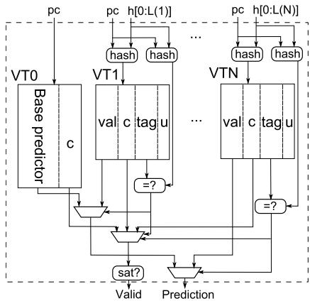 *Figure 2: (1+N)-component VTAGE predictor. Val is the prediction, c is the hysteresis counter acting as confidence counter, u is the useful bit used by the replacement policy.*

- **实现可行性分析**
  - **LVP**：
    - 仅基于 PC 查表，不存在前一次值预测到后一次预测的反馈路径。
  - **Stride predictor**：
    - 需要追踪最近一次可能仍属 speculative 的值。
    - 连续实例预测时存在从前一预测结果到下一次加法器输入的短反馈路径，但实现复杂度尚可接受。
  - **FCM**：
    - 需要追踪最近多个 speculative values。
    - 连续实例预测涉及 **VHT Read → Hash → VPT Read → 下一实例 Hash/VPT Read** 的长关键路径，难以兼顾大容量与高频实现。
  - **VTAGE**：
    - 不需要跟踪指令自身的最近值历史。
    - 查询延迟可横跨从 Fetch 到 Dispatch 的多个周期，适于构建较大容量预测器。

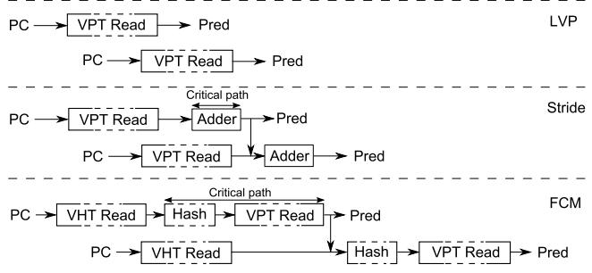 *Figure 1: Prediction flow and critical paths for different value predictors when two occurrences of an instruction are fetched in two consecutive cycles.*

- **误预测恢复策略对比**
  - 评估两类方案：
    - **Pipeline squashing at commit**：预测在前端生成，在提交阶段验证；实现简单，但单次误预测代价高。
    - **Selective reissue**：仅重放受误预测污染的相关指令；潜在代价较低，但需要复杂的执行期检测、依赖追踪与重调度机制。
  - 论文重点验证：
    - 当 FPC 将误预测率压低到极低水平后，简单的**commit-time validation + pipeline squashing**能否接近理想化 selective reissue 的性能。

- **预测器设置**

| Predictor | 主要机制 | 条目配置 | 存储规模 |
|---|---|---:|---:|
| **LVP** | Last Value Prediction | 8192 entries | 120.8 KB |
| **2D-Stride** | 二阶差分 stride prediction | 8192 entries | 251.9 KB |
| **o4-FCM** | 四阶局部值历史上下文预测 | 8192-entry VHT + 8192-entry VPT | 120.8 KB + 67.6 KB |
| **VTAGE** | 全局分支/路径历史上下文预测 | 8192-entry Base + 6×1024 tagged entries | 68.6 KB + 64.1 KB |

- **VTAGE 具体参数**

| 参数 | 配置 |
|---|---|
| Tagged components 数量 | **6** |
| Global history lengths | **2、4、8、16、32、64** |
| Tag 长度 | **12 + rank bits** |
| Useful bit | 每条目 **1 bit** |
| Confidence counter | 每条目 **3-bit** |
| Base component | 无标签 **LVP** |

- **仿真平台与工作负载**

| 项目 | 配置 |
|---|---|
| Simulator | **gem5**，x86 ISA，cycle-accurate |
| 处理器频率 | **4 GHz** |
| 前端/提交宽度 | **8-wide fetch / decode / rename / retire** |
| Issue width | **8-issue** |
| ROB / IQ | **256-entry ROB / 128-entry IQ** |
| L1I / L1D | **32 KB，4-way** |
| Unified L2 | **2 MB，16-way，12 cycles** |
| 最低分支误预测惩罚 | **20 cycles** |
| Benchmark | **SPEC CPU2000 / CPU2006** 子集，共 **19** 个程序 |
| Benchmark 构成 | **12 INT + 7 FP** |
| 仿真区间 | **50M** 指令预热 + **50M** 指令统计 |
| 区间选择 | **SimPoint 3.2** |

- **混合预测器**
  - 比较两种简单 hybrid：
    - **VTAGE + 2D-Stride**
    - **o4-FCM + 2D-Stride**
  - 选择策略：
    - 仅一个组件高置信预测时，采用该预测。
    - 两个组件均预测且结果一致时，采用预测。
    - 两个组件预测结果冲突时，放弃预测。

---

**结果**

- **VP 性能潜力**
  - Oracle predictor 能够预测全部结果时，多数程序获得明显提升，最高加速约为**3.3×**。
  - 该结果表明，在所评估的高性能处理器模型上，真实数据依赖仍然是重要性能瓶颈，VP 具有可观上限空间。

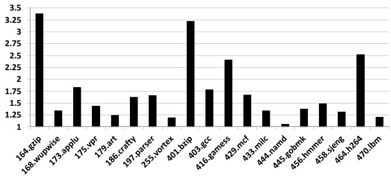

- **普通 3-bit confidence counter 不足以支持简单恢复机制**
  - 在**commit-time pipeline squashing**下，普通计数器虽然常能达到约**94%至接近100%**的准确率，但多个应用仍出现明显减速。
  - 典型原因：
    - 单次误预测恢复代价较高。
    - 正确预测的平均收益有限。
    - 少量误预测即可抵消大量正确预测带来的收益。
  - 普通计数器下，**crafty、vortex、gamess、namd、sjeng**等程序出现不同程度性能退化。

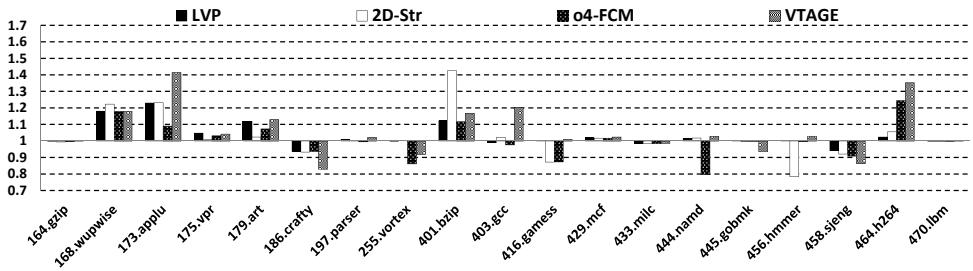

- **FPC 显著提升准确率并消除大部分性能退化**
  - 采用 FPC 后，各预测器在所有评估 benchmark 中的预测准确率均达到**高于0.997**的水平。
  - 覆盖率有所下降，尤其是在原始准确率较低的应用中，但误预测减少带来的收益明显超过覆盖率损失。
  - 在**commit-time pipeline squashing**下：
    - 几乎所有程序不再因 VP 明显减速。
    - 仅 **milc** 出现不足**1%**的轻微下降。
    - **applu**、**bzip2**、**h264ref**等程序获得显著提升。

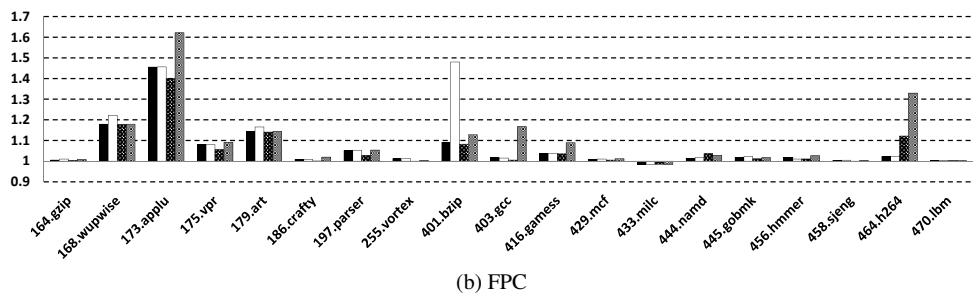

- **FPC 的 accuracy–coverage 权衡**
  - VTAGE 使用 FPC 后，低准确率应用的 coverage 下降更明显：
    - **crafty、vortex、gamess、gobmk、sjeng**属于覆盖率牺牲较大的程序。
  - 这些程序也是普通置信机制下容易发生减速的程序；FPC 通过拒绝低可靠预测，改善了实际性能。
  - Coverage 并不能直接决定性能收益：
    - **namd**的覆盖率接近**90%**，但由于其 VP 理论加速空间较低，实际收益有限。
    - **h264ref**覆盖率相对不高，但由于关键数据依赖可被有效削弱，获得较明显加速。

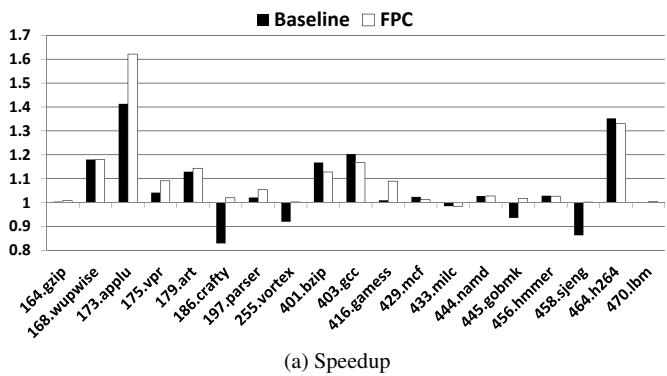

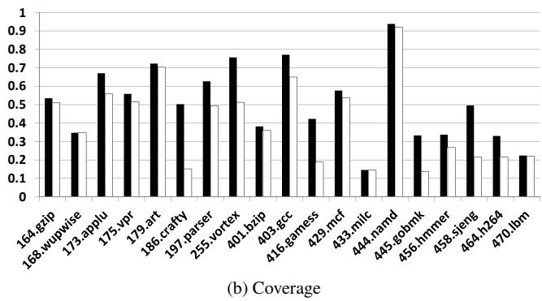

- **不同单一预测器的表现**
  - 没有一种 single-scheme predictor 在所有程序上绝对占优。
  - **2D-Stride**更擅长稳定算术递推型数值模式：
    - 在 **wupwise**、**bzip2**中表现突出。
  - **VTAGE**更擅长与控制流上下文相关的值模式：
    - 在 **applu**、**gcc**、**gamess**、**h264ref**中优于其他单一预测器或接近最优。
  - **VTAGE**整体上优于作为 context-based predictor 的 **o4-FCM**：
    - VTAGE 具有更好的实际性能。
    - VTAGE 不受 FCM 的连续实例预测关键路径限制。
    - 论文仿真中已对 o4-FCM 采用了可即时出预测的乐观假设，因此实际硬件中 VTAGE 的实现优势可能更大。

- **Commit-time squashing 与 selective reissue 的比较**
  - 在未使用 FPC 时：
    - 理想化**selective reissue**因误预测恢复代价较低，通常优于 commit-time squashing。
    - 该优势建立在高度乐观的零周期重放假设上。
  - 在使用 FPC 时：
    - 两种恢复方式的性能结果非常接近。
    - 极高准确率使误预测发生频率足够低，复杂重放机制难以带来显著额外收益。
  - 某些程序中，selective reissue 反而略差：
    - 紧密循环中的连续错误预测可能触发多次重放。
    - 保留 speculative instructions 于 IQ 中会增加资源压力。

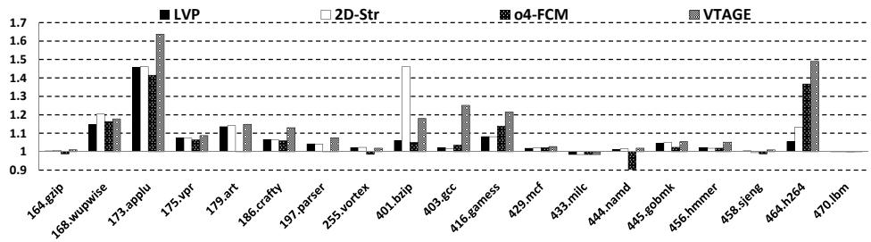

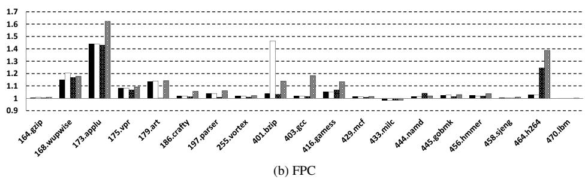

- **Hybrid predictor 的收益**
  - **VTAGE + 2D-Stride**与**o4-FCM + 2D-Stride**均通常优于或持平于其组成预测器中的最佳单体方案。
  - Hybrid coverage 普遍提高，说明：
    - **Stride-based computational prediction**与**context-based prediction**覆盖的是不同类型的可预测指令。
  - **VTAGE + 2D-Stride**优于**o4-FCM + 2D-Stride**：
    - 在 **applu**中加速约达到**1.65×**。
    - 在 **bzip2**中加速超过**1.5×**。
    - 在 **h264ref**中加速约达到**1.34×**。
  - 该 hybrid 还具有更好的实现可行性，因为 VTAGE 不引入 FCM 在紧密循环中的复杂反馈关键路径。

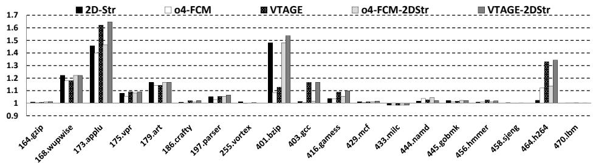

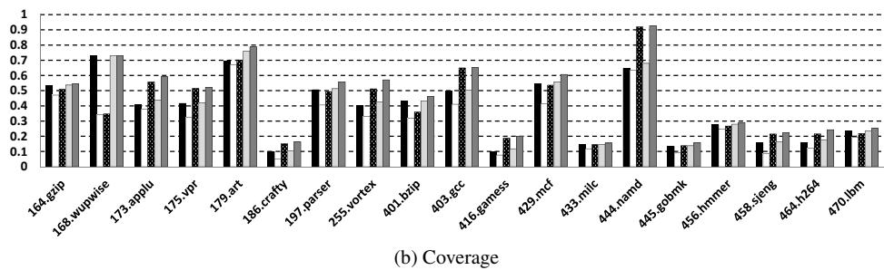

- **总体性能结果**

| 观察项 | 结果 |
|---|---|
| Oracle VP 最大性能潜力 | 最高约**3.3×** |
| FPC 后预测准确率 | 所有 benchmark 均**>99.7%** |
| 实际最佳加速 | 最高约**65%** |
| 低收益程序数量 | **19**个中有**10**个提升低于**5%** |
| 明显获益程序数量 | **19**个中有**9**个提升约为**5%至65%** |
| 最具实践价值的组合 | **VTAGE + 2D-Stride + FPC + commit-time validation** |

---

**结论**

- **Value Prediction**在面向未来高端处理器的单线程性能提升中仍具实际价值，其工程可行性的关键不是追求更高 coverage，而是将误预测率压低到能够承受简单恢复机制的水平。
- **FPC**以很低的存储与控制复杂度，将多类值预测器的有效预测准确率提升至**99.7%以上**：
  - 以适度 coverage 损失换取极低误预测成本。
  - 使**commit-time validation**和**pipeline squashing**成为具有竞争力的实现路径。
  - 显著削弱了复杂**selective reissue**机制的性能必要性。
- **VTAGE**是一种更适合硬件实现的 context-based value predictor：
  - 利用已经可由 branch prediction 子系统提供的**global branch history**与**path history**。
  - 相比局部值历史型 **FCM**，性能更好且不存在严重的 back-to-back prediction 反馈关键路径。
  - 支持预测访问跨越多个流水周期，从而允许更大规模的预测器结构。
- **VTAGE 与 2D-Stride 的 hybrid**同时覆盖控制流相关值模式和规则算术递推值模式，在简单恢复设计下实现了最高约**65%**的性能提升。
- 论文给出的实践路线是：
  - 前端执行值预测。
  - 后端提交阶段进行验证和训练。
  - 乱序执行核心仅进行有限修改，主要新增预测值写入物理寄存器相关支持。
  - 以**高置信度过滤**替代复杂误预测修复逻辑，从而在性能、复杂度与能耗之间取得更具实现价值的平衡。

---

## 2. 背景知识与核心贡献

**论文主题**

- 论文重新审视面向高性能单线程处理器的**Value Prediction（VP，值预测）**技术，目标是在现代及未来可能采用异构设计的 multicore 中，以可实现、低复杂度的方式提升单线程性能。
- 核心思路是：
  - 通过预测指令将产生的结果值，提前解除后继指令受到的**真实数据依赖（true data dependency）**约束。
  - 通过更可靠的置信度控制，将错误预测降到极低水平，使 VP 不再依赖复杂的运行时恢复机制。
  - 引入基于控制流历史的**VTAGE（Value TAgged GEometric history length predictor）**，解决传统 context-based predictor 在紧密循环中难以连续预测的问题。

---

**研究背景**

- multicore 已成为处理器发展的主流方向，但继续提升单线程性能仍然重要：
  - **Amdahl’s Law**表明，程序中不可并行部分会限制整体加速效果。
  - 软件向高度并行化迁移的速度有限，众多负载仍依赖强单线程性能。
  - homogeneous multicore 与 heterogeneous multicore 均可能需要投入更多 silicon area 构建高性能核心。

- **Value Prediction**是 1990 年代提出的提升 instruction-level parallelism 的技术：
  - 传统乱序执行虽然可以绕开部分资源和控制依赖，却不能绕开指令之间的真实数据依赖。
  - VP 预测生产者指令的输出值，使消费者指令可在真实结果产生之前投机执行，从而缩短关键依赖链。
  - 既有预测器包括：
    - **LVP（Last Value Prediction）**：预测结果等于该指令上一次产生的值。
    - **Stride / 2D-Stride predictor**：根据历史结果之间的固定增量进行预测。
    - **FCM（Finite Context Method）**：根据单条静态指令的局部 value history 模式预测结果。
    - **D-FCM、gDiff、DDISC**：利用差分历史、全局 value locality 或 dataflow 信息进一步增强预测能力。

- VP 长期未进入主流商业处理器的关键原因，不是缺少可预测值，而是**错误预测代价过高**：
  - 单次正确 value prediction 的性能收益往往较小。
  - 单次错误预测可能引发 replay 或 pipeline flush，其代价接近甚至高于 branch misprediction。
  - 因此，VP 的实际价值更依赖**极高准确率**，而非单纯追求较高 coverage。

---

**研究动机一：降低错误预测带来的恢复代价**

- 论文将 value misprediction 的总代价概括为：

| 项目 | 含义 |
|---|---|
| **Pvalue** | 每次错误预测的平均恢复代价 |
| **Nmisp** | 错误预测总次数 |
| **Trecov = Pvalue × Nmisp** | 总恢复开销 |

- 降低总恢复开销存在两条路线：
  - 降低单次错误预测的恢复延迟，例如采用**selective reissue**。
  - 大幅减少错误预测数量，即只使用置信度极高的预测结果。

- 传统恢复方案存在明显权衡：

| 恢复方式 | 工作方式 | 典型代价估计 | 硬件复杂度 |
|---|---|---:|---|
| **Selective reissue** | 仅取消并重新执行受到错误值影响的依赖链 | 约 **5 cycles** | 高，需要在乱序执行引擎中追踪和重放依赖 |
| **Pipeline squashing at execution time** | 执行阶段发现错误后 flush 后续流水线 | 约 **20 cycles** | 中高，需要执行期验证与状态恢复 |
| **Pipeline squashing at commit time** | 提交阶段统一验证，错误时重新开始执行 | 约 **40 cycles** | 低，主要影响 in-order front-end 与 back-end |

- 既有研究通常依赖较低恢复代价，或忽视恢复开销；论文认为更实用的路径是：
  - 接受**commit time validation**较高的单次错误代价。
  - 通过置信度机制将错误预测次数压到极低。
  - 由此避免在 out-of-order engine 中实现复杂、功耗较高的 selective reissue 逻辑。

- 论文给出的示例说明了准确率的重要性：

| 情景 | Coverage | Accuracy | Selective reissue | Execution-time squash | Commit-time squash |
|---|---:|---:|---:|---:|---:|
| 常见既有预测器水平 | **40%** | **95%** | 每千指令约 **+64 cycles** | 约 **-86 cycles** | 约 **-286 cycles** |
| 牺牲部分 coverage、提升准确率 | **30%** | **99.75%** | 约 **+88 cycles** | 约 **+83 cycles** | 约 **+76 cycles** |

- 该分析揭示的关键动机是：
  - 对 VP 而言，**少预测但几乎不预测错**，优于**预测覆盖高但存在几个百分点错误率**。
  - 若准确率足够高，简单的 **commit-time squash** 也能获得接近理想 selective reissue 的性能。

---

**研究动机二：传统 context-based predictor 难以处理 back-to-back prediction**

- VP 与 branch prediction 的关键差异在于：
  - value prediction 可在 Fetch 到 Dispatch 之间完成，单次预测延迟看似较宽松。
  - 但紧密循环中，同一静态指令的相邻动态实例可能在连续 cycle 被 fetch。
  - 若当前预测依赖前一次实例产生或预测出的 value，则必须形成极短的反馈路径。

- 实验背景显示：
  - 在部分 SPEC’00 / SPEC’06 workload 中，最多可有 **15.3%** 的 fetched instructions 既适合 VP，又在前一 cycle 出现过同一静态指令。
  - 几何平均也达到 **3.4%**，说明紧密循环中的连续预测是实际设计不可忽略的问题。

 *Figure 1: Prediction flow and critical paths for different value predictors when two occurrences of an instruction are fetched in two consecutive cycles.*

- 不同预测器面对连续预测时的实现难度不同：

| Predictor | 预测依据 | Back-to-back prediction 难点 | 实现可行性 |
|---|---|---|---|
| **LVP** | PC 对应的最近值 | 相邻预测查询彼此独立 | 容易实现，可使用较大表 |
| **Stride** | 最近值与 stride | 需将前一次 speculative prediction 快速旁路给下一次加法器 | 有一定关键路径，但尚可实现 |
| **FCM** | 指令局部 value history | 需维护多个 speculative values，并完成 Hash + VPT Read 的递归依赖 | 复杂，难以支持紧密循环 |
| **VTAGE** | global branch history 与 path history | 不依赖前一实例的预测值 | 可自然支持连续预测 |

- **FCM**及相关 local value history predictor 的核心限制包括：
  - 需要跟踪同一指令最近多个尚未提交、甚至尚未执行的 speculative values。
  - 第二级表索引依赖最新预测值更新后的 history hash。
  - 两个相邻实例之间必须完成**历史更新、Hash、VPT Read、预测转发**的反馈链。
  - 实际设计中只能采用更小的预测表，或放弃对紧密循环中连续实例的预测。

- 论文由此提出新的需求：
  - context-based predictor 应避免依赖局部 speculative value history。
  - 预测器应能够让查询延迟跨越多个 cycle，而不会阻断相邻实例预测。
  - 控制流历史天然已经由 branch predictor 维护，适合作为更实用的预测上下文。

---

**核心贡献一：Forward Probabilistic Counters（FPC）高置信度机制**

- 论文提出**FPC（Forward Probabilistic Counters）**，用于以极低硬件复杂度显著提高各种 value predictor 的有效准确率。
- 基本机制包括：
  - 每个 predictor entry 配置较小的 **3-bit confidence counter**。
  - 预测结果仅在 counter 达到饱和状态时才真正被处理器使用。
  - 每次预测错误时，counter 直接 reset。
  - 每次预测正确时，不是必然递增，而是按较低概率发生 forward transition。
  - 随机更新由简单的 **LFSR（Linear Feedback Shift Register）**支持。

- FPC 的本质效果是：
  - 用 3-bit probabilistic counter 近似更宽的 6-bit 或 7-bit conventional counter。
  - 要求一个 entry 经历更长、更稳定的正确序列后才允许使用其预测。
  - 主动牺牲一部分 coverage，换取极低的 misprediction rate。

- 论文采用的概率设置包括：

| 使用场景 | Forward probability vector | 近似效果 |
|---|---|---|
| **Pipeline squashing at commit** | `{1, 1/16, 1/16, 1/16, 1/16, 1/32, 1/32}` | 近似 **7-bit counter** |
| **Selective reissue** | `{1, 1/8, 1/8, 1/8, 1/8, 1/16, 1/16, 1/16}` | 近似 **6-bit counter** |

- FPC 的研究价值体现在：
  - 可直接应用于 **LVP、2D-Stride、FCM、VTAGE** 等不同类型预测器。
  - 不需要额外复杂查表，也无需引入显著预测路径延迟。
  - 将所有测试 benchmark 中的有效预测准确率提高到 **0.997 以上**。
  - 使采用简单 **commit-time squash** 的系统基本不再因 VP 出现明显性能下降。
  - 让复杂 selective reissue 的额外性能收益变得非常有限。

---

**核心贡献二：Value TAGE（VTAGE）预测器**

- 论文提出新的 context-based value predictor：**VTAGE**。
- VTAGE 从先进 branch predictor 家族中的 **TAGE / ITTAGE** 演化而来：
  - **TAGE**使用多个具有几何递增 history length 的 tagged tables 进行 branch prediction。
  - **ITTAGE**面向 indirect branch target prediction。
  - 论文观察到 indirect branch target 与 instruction result 均属于可预测的运行时 value，因此将 ITTAGE 思路迁移到 VP。

 *Figure 2: (1+N)-component VTAGE predictor. Val is the prediction, c is the hysteresis counter acting as confidence counter, u is the useful bit used by the replacement policy.*

- VTAGE 的结构特点包括：
  - 一个基于 PC 索引的 tagless **base predictor**，功能类似 **LVP**。
  - 多个 tagged components，分别使用不同长度的**global branch history**与 **path history**。
  - history length 按几何级数增长，用于同时捕获短期与长期控制流相关性。
  - 所有 components 并行访问，匹配且使用最长历史的 component 作为 **provider**。

- 每个 VTAGE tagged entry 保存的信息包括：

| 字段 | 作用 |
|---|---|
| **val** | 预测的 64-bit value |
| **tag** | 用于判断索引是否对应正确上下文 |
| **c** | confidence / hysteresis counter，用于决定预测能否使用 |
| **u** | usefulness bit，用于 replacement policy |

- 论文评估配置中的 VTAGE 参数为：

| 项目 | 配置 |
|---|---|
| Base component | **8192 entries** |
| Tagged components | **6 × 1024 entries** |
| History lengths | **2、4、8、16、32、64** |
| Tag width | **12 + rank bits** |
| Confidence counter | 每项 **3-bit** |
| Useful bit | 每个 tagged entry **1-bit** |
| 总大小 | Base **68.6 KB** + tagged tables **64.1 KB** |

- VTAGE 相比 FCM 的关键优势包括：
  - 使用 branch/path history，而不是 per-instruction speculative value history。
  - 无需跟踪同一静态指令最近多个 speculative output values。
  - 可自然预测紧密循环中连续出现的同一指令。
  - 查询过程可跨越 Fetch 到 Dispatch 的多个 cycle，因此允许采用更大的预测表。
  - 在论文实验中，作为 context-based predictor，性能优于实现条件已被理想化的 **o4-FCM**。

---

**核心贡献三：简化的 VP 微体系结构落地路径**

- 论文给出了一种更具实际实现性的 VP 集成方式：
  - 在 in-order pipeline front-end 中完成预测。
  - 将高置信度预测值提前写入 physical register file，供后续依赖指令使用。
  - 在 in-order pipeline back-end 的 commit 阶段完成验证和 predictor training。
  - 若提交时确认错误且错误值已被消费者使用，则执行 pipeline squash。

- 该方案对 out-of-order engine 的影响非常有限：
  - 无需在整个乱序执行流水线中传播并随时验证 predicted values。
  - 无需为任意预测指令建立复杂恢复 checkpoint。
  - 无需实现大规模 dependence-selective replay 机制。
  - 无需为 value misprediction 专门保存 rename table checkpoint，因为 committed rename map 可用于恢复。

- 主要硬件增量集中于 register file：
  - predicted values 需要在 Dispatch 前写入 physical registers。
  - 若简单地为所有潜在预测增加等量写端口，register file area 可能接近翻倍。
  - 论文提出可通过限制额外 prediction write ports、缓冲多余写入、register banking 与 instruction criticality 筛选降低代价。

| Register file 方案 | Area 变化趋势 | 说明 |
|---|---:|---|
| 为 VP 将写端口数量直接翻倍 | 约增加至原来的 **2 倍** | 最直接但代价过高 |
| 仅增加约 **W/2** 个预测写端口 | 显著降低开销 | 可缓冲超出带宽的预测写入 |
| 结合 banking 与 criticality selection | 进一步降低 | 仅使用最具收益的预测 |

- 论文判断：
  - register file 的能耗增量可压缩至 **25% 以下**。
  - register file 的 area 增量可控制在 **50% 以下**。
  - VP 带来的其他主要功耗开销集中于 predictor tables，而非整体乱序执行逻辑。

---

**实验验证与关键结论**

- 论文采用 **gem5** 对激进型单线程处理器进行 cycle-accurate simulation：

| 项目 | 配置 |
|---|---|
| ISA | **x86** |
| 时钟频率 | **4 GHz** |
| Pipeline | **8-wide superscalar out-of-order** |
| ROB | **256 entries** |
| Issue / Retire width | **8 / 8** |
| L1I / L1D | **32 KB / 32 KB** |
| L2 | **2 MB** |
| Branch predictor | **TAGE，15K entries** |
| 最低 branch misprediction penalty | **20 cycles** |
| Workloads | **SPEC CPU2000 / CPU2006，共 19 个 benchmark** |

- 完美 value predictor 的实验上界表明，VP 仍具有显著潜力：
  - 多个 benchmark 的性能提升空间明显。
  - 个别程序的理想加速可达约 **3.3×**。
  - 这说明真实预测器性能受限于预测准确率与覆盖率，而不是 VP 缺乏理论收益。


- 采用普通 3-bit confidence counter 时：
  - 虽然不少 benchmark 的 accuracy 已达到 **94%–接近 100%**，但在 commit-time squash 下仍可能出现明显 slowdown。
  - 原因是少量 value mispredictions 仍会触发代价很高的 pipeline recovery。


- 引入 **FPC** 后：
  - 所有测试中的 prediction accuracy 均高于 **99.7%**。
  - 虽然 coverage 有所下降，但 slowdown 基本消除。
  - 在 commit-time squash 这种简单恢复机制下，VP 开始稳定体现正向收益。


- 对比 selective reissue 与 commit-time squash：
  - 未采用 FPC 时，理想化 selective reissue 可明显减轻错误预测影响。
  - 采用 FPC 后，两种恢复机制的性能结果非常接近。
  - 这说明在极高准确率条件下，实现复杂 selective reissue 的收益不足以匹配其设计复杂度。

- VTAGE 的实验表现表明：
  - 其通常优于 **o4-FCM** 这一 local-history context-based predictor。
  - 在 **applu、gcc、gamess、h264ref** 等程序中，VTAGE 展现出明显优势。
  - **2D-Stride** 在 **wupwise、bzip2** 等程序中更具优势，证明 computational predictor 与 context-based predictor 具有互补性。

- **VTAGE + 2D-Stride** hybrid predictor 的效果最佳：
  - 使用 FPC 与 commit-time squash 时，可在多数 workload 中达到或超过单一预测器的最好结果。
  - 相比 **o4-FCM + 2D-Stride**，该组合性能更优且实现难度更低。
  - 19 个 benchmark 中：
    - **10 个**程序的收益低于 **5%**。
    - **9 个**程序获得 **5% 至 65%** 的性能提升。
    - 最高加速达到约 **65%**。


---

**核心贡献归纳**

| 核心贡献 | 解决的问题 | 关键效果 |
|---|---|---|
| **FPC confidence mechanism** | 普通 VP 准确率不足以承受高恢复代价 | 将有效准确率提高到 **99.7% 以上**，允许使用简单 commit-time squash |
| **VTAGE predictor** | FCM 等 local-history predictor 难以支持 tight loop 中连续预测 | 利用 global branch/path history，支持 back-to-back prediction，性能优于 o4-FCM |
| **Commit-time validation 架构路径** | selective reissue 实现复杂、功耗和验证成本高 | 将 VP 主要限制于 front-end、back-end 与 register file 修改 |
| **VTAGE + 2D-Stride hybrid** | 单一预测机制难以覆盖不同 value pattern | 利用 context-based 与 computational prediction 的互补性，实现最高约 **65%** 加速 |

---

**论文结论**

- 本文的核心观点是：现代处理器重新采用**Value Prediction**的关键，不在于建立更激进但容易出错的预测器，而在于以极低复杂度实现**极高可信度的预测使用策略**。
- **FPC**使 VP 能够接受简单的**commit-time validation + pipeline squash**恢复方式，避免对 out-of-order engine 的大规模侵入式改造。
- **VTAGE**以 global branch history 与 path history 取代传统 local value history，兼顾预测能力、表规模扩展性与 tight loop 下的连续预测可实现性。
- **VTAGE + 2D-Stride + FPC**构成了论文提出的实用 VP 路径：以有限硬件修改换取显著单线程性能提升，并为未来高性能核心或 heterogeneous multicore 中的高性能 core 提供设计方向。

---

## 3. 核心技术和实现细节

### 0. 技术架构概览

**整体技术架构**

- 本文提出的整体架构围绕**实用化Value Prediction(VP)**展开，目标是在未来高端乱序处理器中提升**single-thread performance**，同时避免传统VP实现中代价高昂的复杂恢复机制。
- 架构由两个核心技术支柱组成：
  - **Forward Probabilistic Counters(FPC)**：
    - 用于极高置信度的预测筛选。
    - 将值预测准确率提升到**99.5%以上**，多数实验中达到**99.7%以上**。
    - 通过牺牲部分coverage，显著降低value misprediction数量。
  - **Value TAgged GEometric predictor(VTAGE)**：
    - 基于**TAGE/ITTAGE**思想改造而来的上下文型值预测器。
    - 使用**global branch history**和**path history**预测数据值。
    - 避免传统local value history predictor在紧密循环中预测back-to-back指令时的关键路径问题。

---

**处理器级集成架构**

- 本文主张将VP硬件主要限制在处理器的**in-order front-end**和**in-order back-end**中：
  - **Front-end**：
    - 在Fetch阶段或早期流水线阶段发起值预测。
    - 对产生寄存器结果、且结果会被后续µ-ops显式使用的指令进行预测。
    - 预测值在Dispatch前写入physical register file。
  - **Out-of-order engine**：
    - 尽量保持原有乱序执行核心不变。
    - 不要求复杂的执行时预测验证逻辑。
    - 不要求完整的selective reissue机制。
    - 主要额外需求是支持预测值写入physical register file。
  - **Back-end / Commit stage**：
    - 在commit时进行预测验证。
    - 若预测错误且错误值已经被依赖指令使用，则触发pipeline squashing。
    - 若预测错误但尚未被依赖指令使用，则无需恢复，只需用真实执行结果覆盖预测值。
    - 同时在commit阶段训练value predictor和confidence counter。

| 模块 | 主要职责 | 架构特点 |
|---|---|---|
| **In-order front-end** | 生成value prediction | 预测尽早完成，可跨多个周期 |
| **Register file** | 写入预测值 | 需要额外写端口或缓冲优化 |
| **Out-of-order engine** | 使用预测值执行依赖指令 | 修改很小，不承担复杂验证 |
| **Commit stage** | 验证预测、训练预测器、触发恢复 | 使用pipeline squashing at commit |
| **FPC confidence logic** | 判断预测是否足够可信 | 只使用高置信度预测 |
| **VTAGE predictor** | 基于控制流历史生成预测 | 支持back-to-back预测 |

---

**预测与验证数据流**

- 架构中的核心执行流程为：
  - 指令在**Fetch**阶段进入前端。
  - Value predictor根据PC、µ-op编号以及历史信息生成候选预测值。
  - Confidence counter判断预测是否达到**saturated**状态。
  - 只有当confidence saturated时，预测才被标记为valid并写入寄存器文件。
  - 后续依赖指令可以读取该预测值并提前执行，从而突破true data dependency。
  - 原始生产者指令最终执行并生成真实值。
  - 在commit阶段比较真实值与预测值。
  - 若一致：
    - 正常提交。
    - 更新预测器与confidence counter。
  - 若不一致：
    - 若预测值未被使用：
      - 不触发恢复。
      - 真实值覆盖预测值。
    - 若预测值已被使用：
      - 触发pipeline squashing。
      - 从安全提交状态恢复执行。
      - confidence counter被reset。

---

**关键架构选择：Commit-time Validation**

- 本文刻意选择**commit-time validation**，而不是传统更激进的**execution-time validation**或**selective reissue**。
- 主要原因：
  - **execution-time validation**需要在乱序核心中传播预测值、维护预测状态、即时检测错误并恢复依赖链。
  - **selective reissue**虽然单次误预测恢复代价低，但硬件复杂度极高。
  - **commit-time validation**的单次误预测代价较高，但硬件实现简单。
  - 在FPC将误预测率压到极低后，高恢复代价不再是主要瓶颈。

| 恢复机制 | 平均误预测代价 | 硬件复杂度 | 本文评价 |
|---|---:|---|---|
| **Selective reissue** | 约5 cycles或更低 | 很高 | 性能潜力高，但实现复杂 |
| **Pipeline squashing at execution** | 约20 cycles | 中到高 | 仍需执行时验证逻辑 |
| **Pipeline squashing at commit** | 约40 cycles | 低 | 本文主推方案 |
| **Commit-time validation + FPC** | 单次代价高，但误预测极少 | 低 | 综合最实用 |

---

**FPC置信度架构**

- **FPC(Forward Probabilistic Counters)**是本文实用化VP的关键。
- 其作用不是直接提高预测器本身的预测能力，而是通过严格筛选只使用最可信预测。
- 设计机制：
  - 每个预测器entry配备一个**3-bit confidence counter**。
  - 预测只有在counter达到**saturated**状态时才被使用。
  - 预测正确时，counter不一定立即递增，而是以一定概率递增。
  - 预测错误时，counter直接reset。
  - 通过低概率递增，模拟更宽的6-bit或7-bit counter效果。
- 架构优势：
  - 仅需3-bit存储即可接近宽counter效果。
  - 显著减少misprediction。
  - 对所有经典value predictor均适用，包括**LVP**、**2D-Stride**、**FCM**、**VTAGE**。
  - 使**pipeline squashing at commit**成为可接受方案。

| 机制 | Counter大小 | 正确预测更新 | 错误预测更新 | 目标 |
|---|---:|---|---|---|
| 普通confidence counter | 3-bit | 每次+1 | reset | 简单但准确率不足 |
| 宽counter | 6-bit/7-bit | 每次+1 | reset | 高准确率但存储开销更大 |
| **FPC** | **3-bit** | **概率性+1** | **reset** | **低成本实现高准确率** |

---

**VTAGE预测器架构**

- **VTAGE**是本文提出的新型context-based value predictor。
- 它从**ITTAGE indirect branch predictor**改造而来，将间接分支目标预测思想迁移到数据值预测。
- 核心思想：
  - 间接分支target本质上也是一种寄存器值。
  - 因此，基于控制流历史预测indirect branch target的机制，也可用于预测普通指令结果值。
- VTAGE由一个base predictor和多个tagged components组成：
  - **VT0 / Base predictor**：
    - 类似tagless **Last Value Predictor(LVP)**。
    - 仅使用PC索引。
  - **VT1...VTN tagged components**：
    - 使用不同长度的global branch history。
    - 历史长度按几何级数增长。
    - 每个component通过PC和branch history hash索引。
    - 每个entry保存预测值、tag、confidence counter和useful bit。

 *Figure 2: (1+N)-component VTAGE predictor. Val is the prediction, c is the hysteresis counter acting as confidence counter, u is the useful bit used by the replacement policy.*

| VTAGE组成 | 内容 | 功能 |
|---|---|---|
| **Base predictor(VT0)** | value + confidence counter | 提供无历史上下文的last-value预测 |
| **Tagged component** | value + tag + confidence counter + useful bit | 基于不同长度global branch history预测 |
| **Provider component** | 匹配tag且历史最长的component | 提供最终候选预测 |
| **Confidence counter** | FPC或普通counter | 判断预测是否可用 |
| **Useful bit(u)** | 1-bit | 支持替换策略 |

---

**VTAGE预测流程**

- 预测阶段：
  - 所有components并行访问。
  - 每个tagged component使用：
    - 当前指令PC。
    - 不同长度的**global branch history**。
    - **path history**。
  - 若多个components命中tag：
    - 选择使用最长历史的命中component作为**provider component**。
  - 若provider的confidence counter saturated：
    - 输出valid prediction。
  - 若confidence不足：
    - 不使用预测。
- 更新阶段：
  - 只更新provider component。
  - 若预测正确：
    - 更新confidence counter。
    - 更新useful bit。
  - 若预测错误：
    - 若confidence为0，可替换存储值。
    - 尝试在更长历史component中分配新entry。
    - 若更长历史component没有可替换entry，则重置相关useful bit。
- 替换策略：
  - 优先选择useful bit为0的entry。
  - 新entry可随机分配到更长历史component中。

---

**Back-to-back预测架构优势**

- 本文强调，实用VP必须支持紧密循环中的**back-to-back occurrences**。
- 传统预测器存在不同关键路径：
  - **LVP**：
    - 只依赖PC。
    - 连续实例之间无数据依赖。
    - 可自然支持back-to-back预测。
  - **Stride predictor**：
    - 需要上一实例的预测值或真实值。
    - 需要forwarding到adder。
    - 可实现，但存在短关键路径。
  - **FCM / D-FCM**：
    - 依赖local value history。
    - 需要VHT读取、hash、VPT读取。
    - 连续实例之间形成复杂关键路径。
    - 很难在紧密循环中高频实现。
  - **VTAGE**：
    - 不依赖上一实例的值。
    - 仅依赖控制流历史。
    - 预测访问可跨多个周期。
    - 可像LVP一样自然支持back-to-back预测。

 *Figure 1: Prediction flow and critical paths for different value predictors when two occurrences of an instruction are fetched in two consecutive cycles.*

| Predictor | 预测依赖 | Back-to-back支持 | 关键瓶颈 |
|---|---|---|---|
| **LVP** | PC | 强 | 表访问 |
| **Stride** | previous value + stride | 中等 | adder forwarding |
| **FCM** | local value history | 弱 | VHT→hash→VPT关键路径 |
| **VTAGE** | global branch history + path history | 强 | 多表hash与mux，但可跨周期 |

---

**Hybrid Predictor架构**

- 本文还构建了简单hybrid predictor，用于结合不同预测模式：
  - **VTAGE + 2D-Stride**
  - **o4-FCM + 2D-Stride**
- Hybrid设计规则：
  - 若只有一个component高置信度预测，则采用该预测。
  - 若两个component都高置信度预测且结果一致，则采用预测。
  - 若两个component都预测但结果不一致，则不进行预测。
  - 一个component的预测结果可作为另一个component的speculative last occurrence输入。
  - 所有component在commit时使用真实值训练。
- 架构意义：
  - **VTAGE**擅长控制流相关或上下文相关值。
  - **2D-Stride**擅长规则数值序列。
  - 二者互补，coverage通常更高。
  - **VTAGE + 2D-Stride**比**o4-FCM + 2D-Stride**更实用，因为VTAGE没有FCM的back-to-back关键路径问题。


---

**硬件参数配置**

- 论文评估中使用的预测器规模相对现实，避免只讨论无限资源下的理想效果。
- 主要value predictor配置如下：

| Predictor | Entries | Tag | Size |
|---|---:|---|---:|
| **LVP** | 8192 | Full 51-bit | 120.8KB |
| **2D-Stride** | 8192 | Full 51-bit | 251.9KB |
| **o4-FCM** | 8192 VHT + 8192 VPT | Full 51-bit / none | 120.8KB + 67.6KB |
| **VTAGE** | 8192 Base + 6×1024 tagged | 12+rank bits | 68.6KB + 64.1KB |

- VTAGE具体配置：
  - 1个base predictor。
  - 6个tagged components。
  - 历史长度分别为**2、4、8、16、32、64**。
  - 每个tagged entry包含：
    - **64-bit value**
    - **partial tag**
    - **3-bit confidence counter**
    - **1-bit useful bit**

---

**目标处理器架构环境**

- 论文在gem5中模拟了较激进的高端乱序处理器：
  - **4GHz**
  - **8-wide fetch/decode/rename/issue/retire**
  - **256-entry ROB**
  - **128-entry IQ**
  - **48-entry Load Queue**
  - **48-entry Store Queue**
  - **TAGE branch predictor**
  - **32KB L1I / 32KB L1D**
  - **2MB unified L2**
  - **DDR3-1600 memory**
- 该环境用于验证VP在现代宽发射、深流水、高性能核心中的实际收益。

| 子系统 | 配置 |
|---|---|
| **Front-end** | 8-wide fetch/decode/rename，TAGE branch predictor |
| **Execution** | 8-issue，256-entry ROB，128-entry IQ |
| **Register File** | 256 INT + 256 FP physical registers |
| **Memory Disambiguation** | Store Sets |
| **L1 Cache** | 32KB I-cache + 32KB D-cache |
| **L2 Cache** | 2MB unified L2 |
| **Memory** | Single-channel DDR3-1600 |

---

**性能架构结果**

- 完美value predictor的理论上限显示VP仍有显著潜力：
  - 多个benchmark可获得明显加速。
  - 最高理论加速超过**3×**。
  - 说明数据依赖仍是现代乱序处理器中的重要性能瓶颈。


- 使用普通3-bit confidence counter时：
  - 准确率通常在**94%到接近100%**之间。
  - 但由于commit-time squash代价很高，少量误预测仍可能导致明显减速。
- 使用FPC后：
  - 准确率提升到**99.7%以上**。
  - 大多数benchmark不再出现明显性能损失。
  - commit-time validation的性能接近理想selective reissue。
- 单一预测器表现：
  - 没有单个预测器在所有benchmark上最优。
  - **2D-Stride**在规则数值模式中表现强。
  - **VTAGE**在控制流相关数据值中表现强。
  - **o4-FCM**受coverage和实现复杂度限制。
- Hybrid表现：
  - **VTAGE + 2D-Stride**通常优于单独预测器。
  - 在部分benchmark中取得显著加速。
  - 论文报告最高可达约**65% speedup**。


---

**整体架构总结**

- 本文的整体技术架构可以概括为：
  - 使用**VTAGE**提供可实现、低关键路径压力的context-based value prediction。
  - 使用**FPC**将预测使用门槛提高到极高置信度，显著减少misprediction。
  - 使用**commit-time validation**替代复杂的execution-time validation和selective reissue。
  - 将VP硬件主要限制在**in-order front-end**和**in-order back-end**。
  - 让乱序核心只需很小修改，主要承担使用预测值执行的角色。
  - 通过**VTAGE + 2D-Stride hybrid**同时覆盖控制流相关值和规则数值序列。
- 架构核心取舍：
  - 放弃追求最大coverage。
  - 优先保证极高accuracy。
  - 用低复杂度硬件获得可观single-thread加速。
  - 将Value Prediction从“理论上有效但工程复杂”推进到“未来高端处理器中可实践”的设计方向。

### 1. Forward Probabilistic Counters（FPC）置信度机制

**技术定位**

- **Forward Probabilistic Counters（FPC）**是一种面向**Value Prediction（VP）**的高精度**confidence estimation**机制。
- 它不改变值预测器生成候选值的方式，而是在候选值进入数据流之前增加严格的**可信度门控**：
  - 值预测器负责回答：**预测值是什么**。
  - FPC负责回答：**该预测值是否足够可信，可以真正使用**。
- FPC的核心目标不是最大化**coverage**，而是显著降低**value misprediction**数量，使高代价但简单的恢复机制变得可行：
  - 使用**commit-time validation**。
  - 使用**pipeline squashing at commit**恢复错误。
  - 避免复杂的**selective reissue**硬件。
- 论文给出的关键结论：
  - 普通3-bit置信度计数器下，预测准确率通常在**94%–接近100%**之间，但仍可能造成明显性能下降。
  - 使用FPC后，各类值预测器在实验中达到**高于99.7%**的准确率；论文总体结论表述为可保证**高于99.5%**的极高精度。
  - 在极高准确率下，**commit-time squashing**的性能接近理想化的**0-cycle selective reissue**。

---

**为什么值预测需要极高置信度**

- **Value Prediction**通过提前提供指令结果，打破真实数据依赖链，使后继指令提前执行。
- 正确预测的单次收益通常较小：
  - 论文示例采用平均每次正确且有效预测仅带来约**0.3 cycles**收益。
- 错误预测的单次代价可能很高：
  - **selective reissue**：示例估计约**5 cycles**。
  - **execution-time squash**：示例估计约**20 cycles**。
  - **commit-time squash**：示例估计约**40 cycles**。
- 总恢复损失可近似表示为：

| 项目 | 含义 |
|---|---|
| \(T_{recov}\) | 总错误恢复代价 |
| \(P_{value}\) | 单次值误预测平均恢复代价 |
| \(N_{misp}\) | 值误预测次数 |
| 近似关系 | \(T_{recov}=P_{value}\times N_{misp}\) |

- 该关系意味着：
  - 即使覆盖率很高，只要误预测数量偏多，VP也可能导致整体性能下降。
  - 当采用**commit-time validation**时，单次误预测代价更高，因此必须优先压低**\(N_{misp}\)**。
  - FPC的策略是接受适度的**coverage**下降，换取数量级更低的误预测风险。

---

**普通3-bit置信度计数器的局限**

- 普通置信度方案使用3-bit饱和计数器：
  - 状态范围为**0–7**。
  - 候选值预测正确时，计数器每次固定加1。
  - 候选值预测错误时，计数器直接复位为0。
  - 只有计数器达到饱和值**7**时，预测结果才被实际使用。
- 普通3-bit机制的进入高置信状态速度过快：
  - 从状态0到状态7只需连续**7次**候选预测正确。
  - 某些具有短暂稳定性、阶段性模式或周期性扰动的指令，很容易被过早判定为“可信”。
  - 一旦该预测在真正使用后发生错误，恢复代价可能远高于此前正确预测累积的收益。
- 普通计数器的本质问题：
  - 它可以过滤明显不稳定的预测。
  - 它不足以过滤“**大部分时间正确、但仍会偶发错误**”的预测。
  - 对**commit-time squash**而言，少量偶发错误依然足以抵消收益。

| 机制 | 达到可使用状态的条件 | 优点 | 主要问题 |
|---|---:|---|---|
| 普通3-bit saturating counter | 连续约7次正确 | 简单、覆盖率较高 | 置信度建立过快，误预测仍偏多 |
| 宽计数器，例如6-bit或7-bit | 需要更多正确训练 | 准确率高 | 每个预测表项增加较多状态位 |
| **FPC** | 通过低概率前向转移，等效延长训练期 | **接近宽计数器精度，仅需3-bit存储** | 覆盖率有所下降，需要伪随机源 |

---

**FPC的核心实现原理**

- FPC仍然保留一个**3-bit confidence counter**，状态为：

| 状态 | 含义 | 是否允许使用预测 |
|---:|---|---|
| 0 | 无置信或刚发生错误 | 否 |
| 1–6 | 正在积累可信度 | 否 |
| 7 | 饱和高置信状态 | **是** |

- 与普通计数器不同，FPC的正确更新不是必然前进一步，而是采用**probabilistic forward increment**：
  - 候选预测正确时：
    - 以当前状态对应的概率\(p_i\)执行\(c \leftarrow c+1\)。
    - 以概率\(1-p_i\)保持原状态不变。
  - 候选预测错误时：
    - 无条件执行\(c \leftarrow 0\)。
  - 预测是否真正注入流水线：
    - 仅当\(c=7\)时，输出的候选值才具有**Valid**资格。
- 该机制形成强烈的不对称性：
  - 建立信任非常慢。
  - 丢失信任非常快。
  - 一次错误即可清除经过大量正确事件积累的置信度。
- FPC因此适合VP：
  - VP的正确收益小、错误损失大。
  - 更应采用**conservative confidence policy**，而不是积极追求覆盖率。

---

**状态转移逻辑**

- 设：
  - \(c\)为3-bit置信度计数器，\(c\in[0,7]\)。
  - \(pred\)为预测器生成的候选值。
  - \(actual\)为指令最终计算出的真实值。
  - \(correct=(pred=actual)\)。
  - \(p_c\)为计数器当前状态对应的前向迁移概率。
- FPC更新规则可表示为：

| 条件 | 状态更新 | 对预测使用的影响 |
|---|---|---|
| \(pred \neq actual\) | \(c \leftarrow 0\) | 立即失去高置信资格 |
| \(pred = actual\)且\(c<7\)，随机事件命中\(p_c\) | \(c \leftarrow c+1\) | 逐步接近可使用状态 |
| \(pred = actual\)且\(c<7\)，随机事件未命中 | \(c \leftarrow c\) | 继续等待更多正确观测 |
| \(c=7\) | 保持饱和，直到发生错误 | 允许实际使用预测 |

- 简化伪代码如下：

```text
candidate_value = ValuePredictor.lookup(index)
valid = (confidence_counter == 7)

if valid:
    supply candidate_value to dependent execution

when actual_value becomes architecturally validated:
    correct = (candidate_value == actual_value)

    if not correct:
        confidence_counter = 0
    else if confidence_counter < 7:
        if random_event(probability[confidence_counter]):
            confidence_counter = confidence_counter + 1
```

- 实际系统中还需要区分：
  - **候选预测正确性**：即使预测尚未被使用，也可以在提交时训练置信度。
  - **误预测是否造成恢复**：只有错误预测已经被依赖指令消费，才需要执行恢复动作。

---

**论文采用的概率参数**

- 论文为不同恢复代价配置不同的FPC前向更新概率：
  - **commit-time squashing**代价更高，因此采用更严格、更慢的置信度建立过程。
  - **selective reissue**代价较低，因此可以采用相对宽松的概率设置，提高覆盖率。
- 论文明确给出的参数如下：

| 恢复机制 | FPC概率向量 | 近似模拟的普通宽计数器 | 设计倾向 |
|---|---|---|---|
| **Pipeline squashing at commit** | \(\{1,\frac{1}{16},\frac{1}{16},\frac{1}{16},\frac{1}{16},\frac{1}{32},\frac{1}{32}\}\) | **7-bit counter** | 最大化准确率 |
| **Selective reissue** | \(\{1,\frac{1}{8},\frac{1}{8},\frac{1}{8},\frac{1}{8},\frac{1}{16},\frac{1}{16},\frac{1}{16}\}\) | **6-bit counter** | 在准确率与覆盖率间折中 |

- 对**commit-time squashing**配置进行直观解释：
  - 从状态0到状态1的迁移概率为**1**，第一次正确预测即可完成初始提升。
  - 中间多个状态的迁移概率仅为**1/16**。
  - 接近饱和时迁移概率进一步降低到**1/32**。
  - 置信度越接近“可实际使用”的门槛，验证要求越严格。
- 对3-bit状态机而言，0到7通常只有7条前向迁移边：
  - 论文对**selective reissue**给出的概率向量包含8项。
  - 该处应理解为论文所报告的配置描述；其核心含义不变，即采用比commit配置更积极的概率递增策略，并近似模拟较窄的宽计数器行为。

---

**FPC为何等效于更宽的计数器**

- 普通3-bit计数器：
  - 每次正确都前进一步。
  - 达到饱和约需要**7次**成功更新。
- FPC：
  - 状态位仍然只有3-bit。
  - 但某些状态平均需要多次正确结果才能成功向前迁移。
- 对**commit-time squashing**概率向量，忽略错误复位时，从状态0到状态7所需正确观测次数的期望值约为：

| 转移区间 | 概率 | 平均需要的正确观测数 |
|---|---:|---:|
| 0 → 1 | 1 | 1 |
| 四次低速迁移 | \(1/16\) | \(4\times16=64\) |
| 两次更低速迁移 | \(1/32\) | \(2\times32=64\) |
| 合计 | — | **约129次正确观测** |

- 该行为解释了FPC的精度来源：
  - 普通3-bit机制只需短暂稳定即可进入可使用状态。
  - FPC要求预测模式在更长时间尺度上保持稳定。
  - 任一错误都会使此前积累全部清零，进一步排除偶发不稳定条目。
- 与直接使用7-bit counter相比：
  - FPC为每项仍仅存储**3-bit**置信状态。
  - 额外需求只是一个共享或分布式的简单**Linear Feedback Shift Register（LFSR）**随机源及少量概率判定逻辑。
  - 它以很低的存储成本模拟了更长的置信度建立周期。

---

**输入与输出关系**

| 模块输入 | 来源 | FPC处理方式 | 模块输出 |
|---|---|---|---|
| **候选预测值**\(pred\) | LVP、2D-Stride、o4-FCM、VTAGE等值预测器 | FPC不修改值本身，仅决定能否使用 | 被门控后的预测值 |
| **置信度状态**\(c\) | 与预测器表项关联的3-bit字段 | 判断是否饱和；更新状态 | **Valid/Invalid**信号 |
| **真实执行结果**\(actual\) | 指令执行并最终验证得到的结果 | 与候选预测值比较 | Correct/Mispredict反馈 |
| **随机事件** | LFSR生成 | 按概率决定正确情况下是否递增 | 概率前向迁移决策 |
| **恢复状态信息** | 是否已有依赖者使用预测值 | 错误但未被消费时可避免恢复 | squash或无需恢复 |

- FPC最重要的输出不是预测数值本身，而是：
  - **Prediction Valid**：当前预测值是否可以作为推测结果注入物理寄存器并唤醒依赖者。
  - **Confidence Update**：提交后应如何更新对应表项的置信状态。
  - **Recovery Trigger Qualification**：错误预测是否已经影响执行，需要触发恢复。

---

**在值预测器中的嵌入方式**

- FPC是通用置信度层，可以附加到不同类型的预测器：
  - **LVP（Last Value Predictor）**。
  - **2D-Stride**。
  - **o4-FCM（order-4 Finite Context Method）**。
  - **VTAGE（Value TAgged GEometric history length predictor）**。
- 不同预测器负责发现不同模式：
  - **LVP**捕获重复出现的相同值。
  - **2D-Stride**捕获稳定差分或步长模式。
  - **o4-FCM**利用局部值历史上下文。
  - **VTAGE**利用global branch history与path history。
- FPC对这些预测器采取相同原则：
  - 每个可提供预测的表项维护置信度字段。
  - 候选值即使生成，也只有在关联计数器饱和时才能被流水线消费。
  - 实际值提交后，用于训练预测内容与置信度。
- 对**VTAGE**而言：
  - Base predictor与tagged components中的表项均含有置信度字段\(c\)。
  - 匹配最长历史的component成为**provider component**。
  - provider提供候选值。
  - 只有provider的\(c\)饱和时，该值才被标记为有效预测。

 *Figure 2: (1+N)-component VTAGE predictor. Val is the prediction, c is the hysteresis counter acting as confidence counter, u is the useful bit used by the replacement policy.*

- 图中与FPC直接相关的关键数据路径：
  - 各component输出候选**val**与置信字段**c**。
  - 最长历史匹配表项提供最终**Prediction**。
  - **sat?**逻辑检查置信度是否达到饱和。
  - 只有饱和时输出**Valid**，使预测值真正参与推测执行。

---

**在处理器流水线中的工作流程**

| 阶段 | FPC及VP行为 | 关键硬件作用 |
|---|---|---|
| **Fetch / Front-end** | 依据PC、history等查询值预测器，产生候选值及置信度 | 预测器表、FPC状态读取 |
| **Prediction Gating** | 判断置信度是否饱和 | 饱和检查逻辑 |
| **Rename / Dispatch之前** | 若Valid，将预测值写入对应physical register | 为依赖指令提前提供源操作数 |
| **Out-of-Order Execution** | 依赖指令可基于预测值提前执行 | 打破真实数据依赖 |
| **原指令执行完成** | 得到真实值，替换预测值 | 修正寄存器内容 |
| **Commit / Back-end** | 比较候选值与真实值，更新预测器和FPC | 训练与最终验证 |
| **错误且已被使用** | 触发pipeline squash并从正确状态重新开始 | 简单恢复机制 |
| **错误但尚未被使用** | 不需要恢复，仅更新置信度与预测器 | 避免无意义flush |

- FPC带来的架构边界变化：
  - **预测逻辑**主要位于in-order front-end。
  - **验证与训练逻辑**主要位于in-order back-end。
  - Out-of-order engine不必实现复杂的逐指令值验证与依赖链重放机制。
- 仍然需要的主要结构修改：
  - 将高置信预测值提前写入**physical register file**。
  - 为预测值写入提供额外端口、缓冲或banking优化。
- 不再必须承担的复杂功能：
  - 每个值预测指令的执行期checkpoint。
  - 执行期大规模预测验证网络。
  - 复杂的依赖链**selective reissue**控制。

---

**FPC与恢复机制的耦合关系**

| 置信度机制 | 恢复方式 | 典型结果 |
|---|---|---|
| 普通3-bit counter | Commit-time squash | 误预测过多，多个benchmark发生明显降速 |
| 普通3-bit counter | 理想化selective reissue | 错误代价降低，性能有所改善，但硬件假设过于乐观 |
| **FPC** | **Commit-time squash** | **准确率极高，普遍获得收益，硬件最简单** |
| **FPC** | 理想化selective reissue | 性能与commit-time squash非常接近，额外复杂度收益有限 |

- 该结果反映了FPC的系统价值：
  - 它不是仅提升一个局部预测指标。
  - 它改变了VP实现中“必须采用低延迟复杂恢复”的传统假设。
  - 当误预测已极少发生时，进一步优化单次恢复延迟的价值迅速降低。

---

**实验配置中FPC作用的观察依据**

- 论文使用的评测平台包括：
  - **gem5** cycle-accurate simulator。
  - **x86 ISA**。
  - **4GHz、8-wide superscalar、out-of-order**处理器。
  - **256-entry ROB**、**128-entry IQ**。
  - **SPEC CPU2000 / CPU2006**的19个benchmark。
  - 每个slice预热**50M instructions**，再统计**50M instructions**。
- 比较的预测器包括：

| 预测器 | 模式类型 | 论文表中规模 |
|---|---|---:|
| **LVP** | Last-value / context-light | 120.8 KB |
| **2D-Stride** | Computational stride-based | 251.9 KB |
| **o4-FCM** | Local value history context-based | 120.8 KB + 67.6 KB |
| **VTAGE** | Global control-flow context-based | 68.6 KB + 64.1 KB |

- 所有被比较的预测器均使用：
  - 3-bit置信度存储。
  - 仅在计数器饱和时使用预测。
  - 分别测试普通计数器与FPC两种更新策略。

---

**普通计数器与FPC的性能差异**

- 使用**commit-time squashing**时，普通计数器产生的风险非常明显：
  - 多个benchmark出现低于基线的性能。
  - 例如**crafty**、**vortex**、**gobmk**、**sjeng**等，对低准确率尤其敏感。
- 使用FPC后：
  - 所有benchmark的准确率均提升到**0.997以上**。
  - 绝大多数benchmark不再发生性能下降。
  - **milc**仅有低于**1%**的轻微下降，被论文认为可接受。
  - 高收益应用仍保留可观加速，例如**applu**、**bzip2**、**h264ref**等。


- 上图对应普通置信计数器：
  - 某些预测器在部分程序中出现严重负收益。
  - 说明“看似较高”的准确率仍不足以支撑昂贵的commit-time recovery。


- 上图对应FPC：
  - 负收益基本消失。
  - 某些应用的提升达到显著水平。
  - 说明FPC成功将VP从“高风险投机”转化为“低频失败的保守投机”。

---

**Accuracy与Coverage的交换关系**

- FPC不是免费提高准确率：
  - 更慢的置信度建立过程会减少进入饱和状态的表项数量。
  - 一部分原本可以使用的预测被主动抑制。
  - 因此**coverage**下降是预期行为。
- 该代价具有明确的选择性：
  - 原本较稳定的应用，coverage只发生小幅下降。
  - 原本错误较多的应用，coverage下降更明显。
  - 被削减的主要是最容易引发昂贵恢复的低可靠预测。
- 对VTAGE的观察结果：
  - **crafty**、**vortex**、**gamess**、**gobmk**、**sjeng**的baseline准确率较低。
  - FPC在这些应用上显著压低coverage。
  - 相应地，原有的降速现象大幅缓解或消失。
- Coverage与speedup并不存在简单正相关：
  - **namd**具有约**90%**的高coverage，但speedup很有限，因为该程序本身可由VP缩短的关键路径较少。
  - **h264ref**coverage相对较小，却能实现显著加速，因为被预测的值更可能位于关键依赖路径上。


| 观察维度 | 普通计数器 | FPC |
|---|---|---|
| **Accuracy** | 在部分程序中不足以抵消错误代价 | **所有实验程序高于0.997** |
| **Coverage** | 较高 | 有意识降低，尤其针对不稳定模式 |
| **Commit-time squash适用性** | 经常导致降速 | **基本可行** |
| **恢复硬件需求** | 倾向依赖复杂selective reissue | **允许采用简单squash** |
| **系统策略** | 激进地使用预测 | 保守地只使用极可信预测 |

---

**FPC与Selective Reissue的对比含义**

- 论文还使用理想化的**selective reissue**进行对照：
  - 错误发现后，可立即重新调度依赖指令。
  - 该机制接近**0-cycle repair**，明显高估现实硬件可获得的性能。
- 未使用FPC时：
  - Selective reissue因降低了每次错误代价，通常优于commit-time squash。
  - 这反映的是置信度不足，而不是selective reissue天然必要。
- 使用FPC时：
  - 两种恢复机制的speedup非常接近。
  - 因为误预测事件已极少，恢复延迟不再主导总体性能。
- 某些情况下，理想化selective reissue反而略差：
  - 紧密循环中，同一静态指令可能存在多个in-flight动态实例。
  - 第一个误预测尚未提交并抑制对应表项之前，后续实例可能继续误预测。
  - 这会产生连续reissue与额外IQ压力。


| 比较项目 | Commit-time squash + FPC | Ideal selective reissue + FPC |
|---|---|---|
| 恢复复杂度 | **低** | 高 |
| 对Out-of-Order engine修改 | 有限 | 显著 |
| 性能 | 与理想reissue接近 | 改善非常有限 |
| 现实可实现性 | **较高** | 论文中属于过于乐观模型 |
| FPC后的主要价值判断 | **推荐方向** | 额外复杂度缺乏充分收益 |

---

**硬件实现成本**

- 每个预测器表项中的FPC状态只需要：
  - **3-bit confidence counter**。
- 概率递增需要：
  - 一个简单的**LFSR**作为伪随机数生成器。
  - 针对\(1/8\)、\(1/16\)、\(1/32\)等概率的位模式检测逻辑。
- 典型概率判定可通过非常简单的逻辑完成：

| 目标概率 | 可行的LFSR判定示例 | 硬件复杂度 |
|---:|---|---|
| \(1/8\) | 检查3个随机位是否为指定模式 | 很低 |
| \(1/16\) | 检查4个随机位是否为指定模式 | 很低 |
| \(1/32\) | 检查5个随机位是否为指定模式 | 很低 |

- 与直接扩大计数器位宽相比：
  - 直接7-bit confidence counter需要每项额外保存更多状态位。
  - FPC复用3-bit状态和共享随机逻辑，适合大容量预测表。
- 与SAg等更复杂confidence方案相比：
  - FPC不需要第二级confidence table查询。
  - 不需要额外历史索引链路。
  - 不显著增加预测访问延迟。
- FPC还有扩展空间：
  - 运行时动态调整递增概率。
  - 按指令关键性设置不同概率。
  - 对高代价关键路径指令采用更严格门槛。
  - 对恢复成本较低或性能收益明显的指令采用稍宽松配置。

---

**FPC对VTAGE与混合预测器的价值**

- **VTAGE**与**2D-Stride**捕获的模式具有互补性：
  - VTAGE偏向由控制流上下文决定的结果。
  - 2D-Stride偏向稳定步长变化。
- FPC使两者可以安全组合：
  - 只有单个组件具有高置信时，选择该预测。
  - 两个组件都高置信且结果一致时，使用该预测。
  - 两个组件都高置信但结果冲突时，不进行预测。
- 混合预测器中，FPC的意义更突出：
  - 多个来源提高coverage。
  - 置信度门控防止覆盖率增加同时引入过多误预测。
- 论文结果显示：
  - **VTAGE + 2D-Stride + FPC**通常达到或超过单一预测器的最佳性能。
  - 它优于**o4-FCM + 2D-Stride**，同时更容易实现。
  - 在19个benchmark中，有9个应用获得约**5%到65%**的加速。


---

**算法行为的关键理解**

- FPC不是提高候选值生成能力的预测算法：
  - 它不能让VTAGE学习新的控制流相关模式。
  - 它不能让Stride发现新的步长。
  - 它不能直接扩大predictor coverage。
- FPC是一个严格的**admission control**机制：
  - 只让经过长期验证的候选预测进入推测执行路径。
  - 主动放弃不够稳定但偶尔正确的预测机会。
- FPC采用的是适用于高错误代价场景的策略：
  - **False Negative**：拒绝了一些本可正确使用的预测，损失有限潜在收益。
  - **False Positive**：允许错误预测进入执行路径，可能触发几十cycle恢复。
  - 在VP中，后者代价远高于前者，因此策略应明显偏向保守。
- FPC最重要的系统作用：
  - 将设计优化目标从“预测尽可能多的值”转变为“只使用几乎不会错的值”。
  - 将VP恢复机制从复杂的执行期局部修复，转向简单的提交期统一恢复。
  - 使**Value Prediction**更接近可实现的高性能处理器技术，而不只是依赖理想化恢复假设的模拟机制。

---

**实现要点归纳**

| 维度 | FPC设计选择 | 直接效果 |
|---|---|---|
| 状态存储 | 每项**3-bit counter** | 低存储开销 |
| 正确反馈 | 按状态概率递增 | 极慢建立信任 |
| 错误反馈 | **立即复位到0** | 快速淘汰不稳定预测 |
| 使用条件 | **仅饱和时Valid** | 极高预测准确率 |
| 随机支持 | 简单**LFSR** | 小幅组合逻辑开销 |
| 精度目标 | **>99.5%**；实验中**>99.7%** | 支撑高误预测代价恢复 |
| 代价 | Coverage下降 | 用较少投机换取安全性 |
| 整体架构收益 | 支持**commit-time validation** | 避免复杂selective reissue |
| 适配范围 | LVP、Stride、FCM、VTAGE及hybrid | 通用confidence层 |

---

**核心结论**

- **FPC的本质是用概率化的慢速正反馈与立即负反馈，在仅3-bit存储的条件下模拟宽计数器的严格置信度筛选能力。**
- **FPC的输入是候选预测值、实际结果、当前置信状态与伪随机事件；输出是预测能否被实际使用的Valid决策，以及新的置信状态。**
- **FPC不直接提升值预测器的模式发现能力，而是显著提高被实际消费预测的可靠性。**
- **FPC通过牺牲部分coverage，将实验中的有效预测准确率提升到0.997以上，使commit-time pipeline squashing成为可接受的恢复方案。**
- **FPC因此承担了连接预测算法与实际处理器实现的关键角色：它让VTAGE、Stride及其hybrid在不依赖复杂selective reissue的前提下获得可观单线程性能收益。**

### 2. 提交阶段验证与流水线清空恢复机制

**核心定位**

- **提交阶段验证与流水线清空恢复机制**是本文将**Value Prediction, VP**工程化的关键设计之一。
- 其核心思想是：
  - 在**有序流水线前端**进行值预测。
  - 将预测值写入目标物理寄存器，使依赖指令可以提前执行。
  - 在**乱序执行核心**中尽量不引入复杂验证逻辑。
  - 在**有序提交阶段**统一验证预测值并训练预测器。
  - 若发现误预测，则采用类似分支误预测的**pipeline squashing**，清空错误路径上的指令并从正确状态恢复。
- 该机制牺牲了一部分误预测恢复延迟，但换取了显著更简单的硬件实现。
- 论文的关键判断是：
  - 若值预测器通过**Forward Probabilistic Counters, FPC**将误预测率压到极低水平，例如**准确率高于99.5%或99.7%**，则高昂的单次清空代价可以被接受。
  - 在这种条件下，复杂的**selective reissue**带来的额外性能收益很小，不值得其硬件复杂度。

---

**整体数据流与控制流**

- 值预测的基本输入：
  - **PC**或经处理后的微操作索引。
  - 对于部分预测器，还包括：
    - **global branch history**
    - **path history**
    - 预测器表项中的历史值、stride、tag、confidence counter等。
- 值预测的基本输出：
  - 一个预测的数据值，通常是**64-bit value**。
  - 一个有效标志，表示该预测是否被允许使用。
  - 有效性主要由**confidence counter是否饱和**决定。
- 在流水线中的角色划分：
  - **Front-end**
    - 访问值预测器。
    - 产生预测值。
    - 决定是否使用预测。
  - **Rename/Dispatch前后**
    - 将预测值写入分配到的物理寄存器。
    - 依赖该寄存器的后续指令可被唤醒或提前调度。
  - **Out-of-order execution engine**
    - 正常乱序执行。
    - 不需要为每条值预测指令建立复杂的选择性回滚链。
  - **Commit stage**
    - 将真实执行结果与预测值比较。
    - 更新和训练值预测器。
    - 若误预测且误预测已影响后续执行，则触发流水线清空。

---

**关键机制分解**

- **预测阶段**
  - 发生在**Fetch阶段**或前端较早阶段。
  - 预测器对每个会产生寄存器结果且该结果会被后续微操作使用的µ-op尝试预测。
  - 分支本身不作为值预测对象，但 feeding branch 的数据值可以被预测。
  - 论文中的实现假设：
    - 每个Fetch周期可为多个µ-op提供预测。
    - 预测器可以在Dispatch之前交付预测结果。
    - 预测可被写入物理寄存器，随后由真实执行结果覆盖。

- **使用阶段**
  - 若预测器给出高置信度预测：
    - 预测值被写入目标物理寄存器。
    - 依赖该值的指令可以不等待生产者真实执行完成。
    - 真数据依赖被临时“打断”，形成数据推测执行。
  - 若预测器没有足够置信度：
    - 不使用预测。
    - 指令按普通数据依赖执行。
  - 关键点：
    - **值预测不是强制性的**， unlike branch prediction。
    - 只有在置信度足够高时才启用预测。

- **验证阶段**
  - 真实生产者指令执行完成后，其真实结果会存在于流水线中。
  - 但本文重点讨论的是将验证推迟到**Commit stage**。
  - 在提交阶段：
    - 比较预测值与真实值。
    - 若一致：
      - 指令正常提交。
      - 预测器被正向训练。
    - 若不一致：
      - 判断该误预测是否已经被后续依赖指令使用。
      - 若没有依赖指令在真实值生成前使用错误预测：
        - 不需要恢复。
        - 用真实值覆盖预测值即可。
      - 若错误预测已被使用：
        - 触发**pipeline squash**。
        - 清空错误推测路径上的后续指令。
        - 从正确架构状态重新取指和执行。

- **训练阶段**
  - 训练也放在**Commit stage**完成。
  - 这样可以保证：
    - 训练使用的是已知正确的架构顺序结果。
    - 避免乱序执行阶段对预测器状态进行复杂的投机更新和恢复。
  - 对于FPC：
    - 正确预测时，以概率方式推进confidence counter。
    - 误预测时，将confidence counter重置。
    - 只有counter达到饱和时才允许预测被使用。

---

**与selective reissue的差异**

| 机制 | 验证位置 | 恢复粒度 | 硬件复杂度 | 单次误预测代价 | 本文评价 |
|---|---:|---:|---:|---:|---|
| **Selective reissue** | Execution time | 仅重发错误依赖链 | 高 | 低，论文示例约**5 cycles** | 性能理想但实现复杂 |
| **Pipeline squashing at execution time** | Execution time | 清空后续流水线 | 中到高 | 中，论文示例约**20 cycles** | 仍需乱序核心内验证 |
| **Pipeline squashing at commit time** | Commit time | 清空后续流水线 | 低 | 高，论文示例约**40 cycles** | 本文主张的实用方案 |

- **Selective reissue**需要：
  - 在执行阶段尽早验证预测值。
  - 追踪所有使用错误预测值的依赖指令。
  - 取消并重发依赖链。
  - 在IQ、LSQ、调度器中加入复杂搜索与重放逻辑。
  - 保留更多指令状态以支持重发。
- **Commit-time squashing**避免这些复杂逻辑：
  - 不需要在乱序核心中即时发现和修复错误依赖链。
  - 不需要复杂的依赖链回溯和选择性重调度。
  - 不需要为任意预测指令建立细粒度恢复点。
  - 可依赖已有的分支误预测式清空框架。

---

**为什么提交阶段验证可行**

- 传统观点认为：
  - 值预测误预测代价高。
  - 单个正确预测的收益通常有限。
  - 若准确率只有**95%**左右，即使coverage较高，也容易因为误预测恢复代价而亏损。
- 本文的关键转折是：
  - 使用**FPC**将误预测率大幅降低。
  - 通过降低coverage换取极高accuracy。
  - 当误预测极少时，单次误预测即使需要**commit-time squash**，总体成本仍可接受。
- 论文给出的简化模型：
  - 总恢复成本：
    - **T_recov=P_value×N_misp**
  - 其中：
    - **P_value**是单次值误预测恢复代价。
    - **N_misp**是误预测次数。
  - commit-time squashing的**P_value**较高。
  - FPC的作用是极大降低**N_misp**。
- 示例对比：
  - 若coverage约**40%**、accuracy约**95%**：
    - selective reissue可能仍有收益。
    - commit-time squashing可能显著亏损。
  - 若coverage降低到约**30%**、accuracy提高到约**99.75%**：
    - 即使使用commit-time squashing也能保持正收益。

---

**FPC在该机制中的作用**

- **FPC, Forward Probabilistic Counters**是commit-time validation能够成立的前提。
- 其作用不是提高预测器原始预测能力，而是控制哪些预测被真正使用。
- 工作方式：
  - 每个预测器表项维护一个**3-bit confidence counter**。
  - 预测正确时，不是每次都递增，而是按概率递增。
  - 预测错误时，counter直接重置。
  - 只有counter达到饱和状态，预测才被使用。
- 论文中的概率设置：
  - 对于**pipeline squashing at commit**：
    - 使用概率向量近似**7-bit counter**行为。
    - 概率向量：
      - **{1, 1/16, 1/16, 1/16, 1/16, 1/32, 1/32}**
  - 对于**selective reissue**：
    - 使用概率向量近似**6-bit counter**行为。
    - 概率向量：
      - **{1, 1/8, 1/8, 1/8, 1/8, 1/16, 1/16, 1/16}**
- 设计含义：
  - commit-time squashing代价更高，因此需要更保守的置信度机制。
  - selective reissue代价较低，因此可以稍微放宽。
- 实现代价：
  - 仍只需要**3-bit counter**。
  - 额外需要简单的伪随机数生成器，例如**Linear Feedback Shift Register, LFSR**。
  - 相比真正使用6-bit或7-bit saturating counter，存储开销更低。

---

**提交阶段验证的硬件路径**

- 前端新增或扩展：
  - 值预测器访问逻辑。
  - confidence判断逻辑。
  - 预测值传递到寄存器写入路径。
- Rename/Dispatch附近需要支持：
  - 为预测结果分配目标物理寄存器。
  - 在真实执行结果产生前，将预测值写入对应物理寄存器。
- 乱序核心基本保持原有机制：
  - 正常调度。
  - 正常执行。
  - 正常写回真实结果。
  - 不需要在执行阶段进行复杂预测值验证。
- 提交阶段新增：
  - 保存或获得预测值。
  - 比较真实值与预测值。
  - 更新预测器表项。
  - 触发流水线清空控制信号。
- 恢复依赖：
  - 由于提交阶段是有序的，处理器可以依赖**committed rename map**恢复。
  - 不需要像执行阶段验证那样为每个预测指令checkpoint rename table。
  - 这是commit-time validation降低复杂度的重要原因。

---

**物理寄存器文件影响**

- 该方案对乱序核心的主要硬件压力来自：
  - 预测值需要在Dispatch之前写入物理寄存器。
  - 这可能增加寄存器文件写端口需求。
- 最直观但昂贵的方案：
  - 若每条目标寄存器都可能被预测并写入，则写端口数可能接近翻倍。
  - 寄存器文件面积近似与以下表达式相关：
    - **(R+W)×(R+2W)**
  - 其中：
    - **R**为读端口数。
    - **W**为写端口数。
  - 若假设**R=2W**：
    - 无VP时面积比例约为**12W²**。
    - 写端口翻倍后约为**24W²**。
    - 面积接近翻倍。
- 论文提出的缓解方式：
  - 限制每周期可写入预测值的额外端口数量。
  - 将多余预测写入缓冲。
  - 因为预测在Dispatch前数个周期即可知道，可以提前排队写入。
  - 使用约**W/2**个额外预测写端口时：
    - 面积约为**35W²/2**。
    - 相比翻倍方案节省约一半额外开销。
  - 使用寄存器文件banking：
    - 将连续指令分配到不同register file bank。
    - 降低单个bank的端口压力。
  - 结合criticality estimation：
    - 只对更关键的指令使用预测。
    - 减少无效或低收益预测写入。
- 本文结论：
  - 寄存器文件能耗和面积开销可以被控制。
  - 主要开销集中在register file和predictor table。
  - 不会显著污染整个乱序执行引擎设计。

---

**恢复流程细化**

- 正确预测路径：
  - 前端预测目标值。
  - confidence saturated，预测被使用。
  - 预测值写入物理寄存器。
  - 依赖指令提前执行。
  - 生产者真实执行完成。
  - 到达Commit stage。
  - 比较真实值与预测值。
  - 二者一致。
  - 提交该指令。
  - 更新预测器：
    - confidence counter按规则前进。
    - 预测表项保持或强化。
  - 后续指令继续提交。

- 未使用预测路径：
  - 前端可能产生预测，但confidence未饱和。
  - 预测不写入或不作为有效值使用。
  - 指令按普通依赖执行。
  - 提交阶段仍可训练预测器。
  - 该路径有助于预测器学习，但不承担误预测风险。

- 错误预测但未造成影响路径：
  - 预测值错误。
  - 但在真实值产生之前，没有依赖指令使用该预测值并发射执行。
  - 真实结果覆盖预测值。
  - 不触发pipeline squash。
  - 提交阶段更新预测器并重置confidence。
  - 该优化避免了不必要的清空。

- 错误预测且已造成影响路径：
  - 预测值错误。
  - 一个或多个依赖指令已经基于错误值执行。
  - 生产者到达Commit stage时检测到不匹配。
  - 触发pipeline squash。
  - 清空该指令之后的错误推测状态。
  - 使用已提交状态恢复rename map和架构状态。
  - 从正确位置重新执行。
  - 更新预测器：
    - confidence counter重置。
    - 对应预测值可能被替换或重新训练。

---

**输入输出关系**

| 模块 | 输入 | 输出 | 作用 |
|---|---|---|---|
| **Value Predictor** | PC、µ-op编号、history、predictor table状态 | predicted value、confidence | 提供可投机使用的数据值 |
| **Confidence Logic** | confidence counter、FPC概率更新状态 | use/no-use决策 | 控制误预测率 |
| **Register Rename/Dispatch** | 预测值、目标物理寄存器编号 | 预测值写入请求 | 让依赖指令提前看到结果 |
| **Out-of-order Engine** | 预测写入后的物理寄存器状态 | 提前执行的依赖指令结果 | 利用值预测缩短数据依赖链 |
| **Commit Validation** | 预测值、真实执行值、提交顺序 | correct/mispredict判断 | 保证架构状态正确 |
| **Recovery Control** | mispredict信号、提交状态 | pipeline squash、重新取指 | 从误预测中恢复 |
| **Predictor Training** | 真实值、预测结果、是否正确 | 更新后的预测器表项和counter | 提升后续预测质量 |

---

**与前端预测器设计的耦合**

- commit-time validation要求预测足够早到达。
- 本文强调值预测不同于branch prediction：
  - branch prediction必须在Fetch附近立即给出控制流方向。
  - value prediction只需在Dispatch前可用即可。
- 因此：
  - 预测器访问可跨多个周期。
  - 大表项、多component设计更可行。
  - 这也是**VTAGE**适合该机制的原因。
- VTAGE只依赖：
  - **PC**
  - **global branch history**
  - **path history**
- 它不依赖同一静态指令的最近真实值作为下一次预测输入。
- 因此在紧密循环中，VTAGE可以像LVP一样处理back-to-back occurrences。
- 对比不同预测器的关键路径：

 *Figure 1: Prediction flow and critical paths for different value predictors when two occurrences of an instruction are fetched in two consecutive cycles.*

- 该图体现：
  - **LVP**只依赖PC查表，连续实例之间无强关键路径。
  - **Stride**需要将前一次预测结果快速旁路给adder。
  - **FCM**需要VHT read、hash、VPT read，连续实例存在更长关键路径。
  - commit-time validation并不直接解决FCM关键路径，但它允许像VTAGE这类前端多周期预测器更自然地工作。

---

**VTAGE与提交阶段验证的配合**

- VTAGE结构包括：
  - 一个base predictor。
  - 多个tagged components。
  - 每个tagged entry包含：
    - **val**
    - **confidence counter c**
    - **tag**
    - **useful bit u**
- 预测时：
  - 多个component并行访问。
  - 找到tag匹配且使用最长history的provider。
  - 只有provider的confidence counter饱和时，预测才有效。
- 提交阶段：
  - 使用真实值更新provider。
  - 正确预测时推进confidence。
  - 误预测时重置confidence，并可能替换val或分配新entry。
- VTAGE结构如下：

 *Figure 2: (1+N)-component VTAGE predictor. Val is the prediction, c is the hysteresis counter acting as confidence counter, u is the useful bit used by the replacement policy.*

- 与commit-time validation的匹配点：
  - VTAGE可以在前端较早发起访问。
  - 预测结果到Dispatch前可用即可。
  - 验证与训练放在commit，避免乱序核心深度参与。
  - FPC控制confidence，使commit-time squash的风险可控。

---

**参数设置与仿真假设**

| 项目 | 设置 |
|---|---:|
| 处理器频率 | **4GHz** |
| 前端宽度 | **8-wide fetch/decode/rename** |
| 提交宽度 | **8-wide retire** |
| ROB | **256 entries** |
| Issue Queue | **128 entries** |
| Load Queue / Store Queue | **48 / 48 entries** |
| 整数/浮点物理寄存器 | **256 / 256** |
| 分支误预测最小惩罚 | **20 cycles** |
| commit-time value misprediction示例惩罚 | **40 cycles** |
| selective reissue示例惩罚 | **5 cycles** |
| predictor confidence | **3-bit saturating/FPC counter** |
| FPC目标 | 将accuracy推高到**>99.5%**或接近**>99.7%** |

- 论文中的恢复机制对比仿真包括：
  - **pipeline squashing at commit**
  - 理想化的**0-cycle selective reissue**
- 关键假设：
  - 即使使用selective reissue，也保留了过于乐观的实现。
  - 若commit-time squashing在这种对比下性能接近selective reissue，说明其工程价值更高。

---

**性能现象**

- 没有FPC时：
  - 普通3-bit confidence counter的准确率常在**94%到接近100%**。
  - 但对commit-time squashing仍不够。
  - 若误预测率达到几个百分点，流水线清空代价会导致明显性能下降。
- 使用FPC后：
  - accuracy显著提高。
  - coverage下降。
  - commit-time squashing下大多数benchmark获得收益或避免明显亏损。
- 相关结果：


- 关键解读：
  - baseline counters下，commit-time squashing可能因误预测导致性能下降。
  - FPC下，误预测减少，性能更稳定。
  - 少量coverage牺牲换来了更可靠的整体收益。

---

**与selective reissue性能对比**

- 使用selective reissue时：
  - 单次误预测恢复代价显著降低。
  - 不使用FPC也更容易获得收益。
  - 但这建立在复杂硬件和论文中理想化实现之上。
- 使用FPC后：
  - commit-time squashing与selective reissue的性能差距很小。
  - 说明当accuracy足够高时，恢复机制的低延迟优势不再关键。
- 相关结果：


- 论文由此得出：
  - **高准确率比复杂恢复机制更重要**。
  - 若FPC能将误预测控制到极低水平，commit-time validation是更实用的设计点。

---

**覆盖率、准确率与性能之间的关系**

- coverage高不一定带来高speedup。
  - 若程序片段本身缺乏值预测加速潜力，即使预测很多值，收益也有限。
  - 例如论文中提到**namd** coverage很高但speedup有限。
- coverage低也可能带来显著speedup。
  - 若预测命中关键路径上的值，少量预测即可带来较大收益。
  - 例如**h264**表现较明显。
- FPC的本质权衡：
  - 降低coverage。
  - 显著提高accuracy。
  - 使commit-time squashing从不可接受变为可行。
- VTAGE在FPC前后的speedup和coverage关系如下：


---

**在整体架构中的作用**

- 该机制使VP从理论性能优化转向更接近工程实现：
  - 避免大规模修改乱序核心。
  - 避免复杂的execution-time validation。
  - 避免复杂的selective reissue依赖链追踪。
  - 将主要复杂度集中在front-end predictor和commit training。
- 它把值预测问题拆成两个更可控的问题：
  - **预测器如何给出高质量候选值**。
  - **confidence机制如何只允许极可靠预测进入执行流**。
- 对高端处理器的意义：
  - 在多核数量增长受Amdahl’s Law限制时，提高单线程性能仍有价值。
  - VP可突破部分true data dependence。
  - commit-time validation降低采用门槛。
- 对微架构设计的意义：
  - 适合与复杂branch predictor共享历史信息。
  - 适合与VTAGE等多周期、大容量预测器配合。
  - 支持在不重构乱序核心的情况下探索值推测。

---

**关键优点**

- **硬件复杂度低**
  - 预测在有序前端。
  - 验证与训练在有序后端。
  - 乱序核心仅需有限修改。
- **恢复机制复用性强**
  - 可复用类似branch misprediction的pipeline squash机制。
  - 不需要全新的细粒度依赖链恢复框架。
- **架构状态恢复简单**
  - 提交阶段天然有序。
  - committed rename map可作为恢复基础。
  - 不需要为每个值预测点保存rename checkpoint。
- **可与高置信度机制强耦合**
  - FPC显著降低误预测数量。
  - 高单次恢复成本被低误预测频率抵消。
- **工程可扩展性好**
  - 复杂度主要在预测表和寄存器写端口。
  - 可通过端口限制、buffering、banking、criticality filtering降低成本。

---

**主要代价与限制**

- **单次误预测惩罚高**
  - commit-time validation可能直到指令提交时才发现错误。
  - 错误路径上可能已有大量指令进入流水线。
  - 清空成本高于execution-time validation。
- **强依赖confidence质量**
  - 若accuracy无法维持在极高水平，commit-time squashing会快速亏损。
  - 低准确率、高coverage的预测器不适合该机制。
- **寄存器文件压力增加**
  - 预测值需要提前写入物理寄存器。
  - 可能增加写端口、面积和能耗。
- **预测收益不均衡**
  - 对关键路径值预测收益大。
  - 对非关键值预测可能几乎无收益。
  - 需要结合criticality estimation进一步优化。
- **错误传播窗口更长**
  - 因为验证较晚，错误预测可能影响更多后续指令。
  - 这进一步要求极低误预测率。

---

**简化伪流程**

- 前端预测：
  - 对当前fetch group中的每个候选µ-op：
    - 计算predictor index。
    - 读取预测器表项。
    - 检查tag匹配。
    - 检查confidence counter是否饱和。
    - 若饱和，输出预测值并标记为valid。
    - 若不饱和，不使用预测。

- 写入与执行：
  - 若预测valid：
    - 将预测值写入目标物理寄存器。
    - 依赖消费者可提前执行。
  - 若预测invalid：
    - 按普通数据依赖等待生产者。

- 提交验证：
  - 当生产者到达commit：
    - 读取真实执行结果。
    - 读取或重构对应预测值。
    - 比较二者。
    - 若相等：
      - 正常提交。
      - FPC按概率推进。
    - 若不等：
      - 重置confidence。
      - 更新预测器值或分配新entry。
      - 若错误预测已被使用：
        - 触发pipeline squash。
        - 从正确提交状态恢复。
      - 若未被使用：
        - 不清空，仅用真实值覆盖。

---

**结论性判断**

- **提交阶段验证与流水线清空恢复机制**的价值不在于降低误预测延迟，而在于降低VP落地的硬件复杂度。
- 该机制成立的必要条件是：
  - 值预测必须高度准确。
  - confidence机制必须极其保守。
  - 误预测数量必须远低于传统VP研究中常见水平。
- **FPC**提供了这一条件：
  - 用很低硬件代价将accuracy推高。
  - 牺牲部分coverage但保住整体性能。
- 在此基础上：
  - **selective reissue**的复杂性难以被其边际收益证明合理。
  - **commit-time validation + pipeline squashing**成为更现实的高端处理器VP实现路径。

### 3. VTAGE全局控制流上下文值预测器

**VTAGE的核心定位**

- **VTAGE**全称为**Value TAgged GEometric history length predictor**，是论文提出的全局控制流上下文值预测器。
- 它由**ITTAGE**演化而来：
  - **ITTAGE**用于**Indirect Branch Target Prediction**，预测间接跳转目标地址。
  - **VTAGE**将类似思想迁移到**Value Prediction**，预测普通指令产生的寄存器值。
- VTAGE的关键思想是：
  - 指令结果不仅可能与该指令自身历史值有关，也可能与程序此前经历的**控制流路径**有关。
  - 因此，VTAGE不使用传统**local value history**作为主要上下文，而使用：
    - **PC**
    - **global branch history**
    - **path history**
  - 多个预测表使用不同长度的全局历史进行索引。
  - 若多个表命中，则由使用**最长历史**且标签匹配的组件提供预测。

 *Figure 2: (1+N)-component VTAGE predictor. Val is the prediction, c is the hysteresis counter acting as confidence counter, u is the useful bit used by the replacement policy.*

---

**为什么需要VTAGE**

- 传统值预测器存在两个主要实现障碍：
  - **误预测恢复代价高**
    - 如果使用pipeline squashing at commit，单次误预测代价可能达到**40到50 cycles**。
    - 因此值预测必须具备极高准确率。
  - **back-to-back prediction难以实现**
    - tight loop中，同一静态指令可能连续周期被fetch。
    - 依赖本地值历史的预测器需要上一实例的预测值或实际值，形成复杂关键路径。
- VTAGE解决的是第二类问题：
  - 预测只依赖**控制流历史**，不依赖上一实例产生的值。
  - 因此可以像**LVP**一样支持连续实例预测。
  - 表访问可以跨越多个周期，从**Fetch**到**Dispatch**之间完成。
- 与**FCM**相比，VTAGE避免了本地值历史预测器的关键路径问题。

 *Figure 1: Prediction flow and critical paths for different value predictors when two occurrences of an instruction are fetched in two consecutive cycles.*

---

**VTAGE与传统预测器的结构差异**

| 预测器 | 上下文来源 | 是否依赖上一值 | 是否适合back-to-back预测 | 主要瓶颈 |
|---|---:|---:|---:|---|
| **LVP** | **PC** | 否 | 是 | 只能捕获last value locality |
| **Stride / 2D-Stride** | **PC + last value + stride** | 是 | 部分可行 | 需要追踪上一动态实例 |
| **FCM** | **per-instruction local value history** | 是 | 困难 | VHT读取、hash、VPT读取形成关键路径 |
| **VTAGE** | **PC + global branch history + path history** | 否 | 是 | 多表hash与标签匹配，但可多周期完成 |

- VTAGE的根本优势：
  - 不需要等待上一实例执行完成。
  - 不需要维护每条指令的最近n个投机值。
  - 不需要将上一预测值快速旁路到下一次预测索引计算。
  - 更适合宽发射、深流水、高频处理器。

---

**VTAGE整体结构**

- VTAGE采用**1+N component**结构：
  - **1个base predictor**
    - 类似tagless **LVP**。
    - 仅使用**PC**索引。
  - **N个tagged components**
    - 每个组件使用不同长度的全局分支历史。
    - 历史长度按照几何级数增长。
- 论文实验中使用：
  - **1个base component**
  - **6个tagged components**
  - 记作**VT0, VT1, ..., VT6**

| 组件 | 类型 | 索引信息 | 标签 | 作用 |
|---|---|---|---|---|
| **VT0** | base predictor | **PC** | 无标签 | 提供无上下文last-value式预测 |
| **VT1** | tagged component | **PC + 短global branch history + path history** | 有标签 | 捕获短控制流相关性 |
| **VT2** | tagged component | **PC + 更长history** | 有标签 | 捕获更复杂上下文 |
| **VT3-VT6** | tagged component | **PC + 几何增长history** | 有标签 | 捕获长距离控制流相关性 |

---

**表项字段设计**

- **base predictor**表项包含：
  - **val**
    - 预测值。
    - 论文中按**64-bit value**建模。
  - **c**
    - confidence counter。
    - 用于判断预测是否可信。
- **tagged component**表项包含：
  - **val**
    - 预测值。
  - **c**
    - confidence / hysteresis counter。
    - 饱和时才允许使用预测。
  - **tag**
    - 部分标签。
    - 用于确认当前PC与历史上下文是否真正匹配。
  - **u**
    - useful bit。
    - 替换策略使用。
    - 表示该表项是否近期有用。

| 字段 | 所属组件 | 含义 | 关键作用 |
|---|---|---|---|
| **val** | base与tagged | 预测的寄存器值 | 直接输出给流水线 |
| **c** | base与tagged | 置信度计数器 | 判断预测是否可用 |
| **tag** | tagged | 部分标签 | 降低aliasing错误 |
| **u** | tagged | useful bit | 指导替换与分配 |

---

**参数设置**

- 论文中的VTAGE配置如下：

| 参数 | 设置 |
|---|---:|
| **base predictor entries** | **8192** |
| **tagged components数量** | **6** |
| **每个tagged component entries** | **1024** |
| **历史长度** | **2, 4, 8, 16, 32, 64** |
| **tag长度** | **12 + rank bits** |
| **rank范围** | **1到6** |
| **confidence counter** | **3-bit** |
| **useful counter** | **1-bit u** |
| **base size** | **68.6 KB** |
| **tagged tables总size** | **64.1 KB** |

- 历史长度采用**geometric series**：
  - 短历史组件更容易学习简单模式。
  - 长历史组件可捕获更远距离的控制流相关性。
  - 多长度并存避免单一历史长度对所有指令都不合适的问题。
- 标签长度随rank增加：
  - 更长历史空间更大，更容易发生aliasing。
  - 因此长历史表使用更长tag提高区分能力。

---

**输入与输出关系**

- VTAGE的输入：
  - **PC**
    - 当前待预测µ-op或指令的地址。
    - 论文中为避免同一x86 macro-op内多个µ-op映射到同一项，索引使用：
      - **x86 instruction PC左移2位**
      - 与**µ-op number**进行XOR
  - **global branch history**
    - 最近分支方向历史。
    - 不同组件使用不同长度前缀。
  - **path history**
    - 控制流路径信息。
    - 用于区分相同分支方向序列但路径不同的情况。
  - **实际执行结果**
    - 在更新阶段使用。
  - **预测是否正确**
    - 在commit或执行后验证阶段用于更新confidence与替换状态。
- VTAGE的输出：
  - **Prediction**
    - 预测的64-bit寄存器结果值。
  - **Valid**
    - 预测是否可使用。
    - 只有provider的confidence counter达到饱和时，预测才被认为有效。

| 阶段 | 输入 | 输出 | 作用 |
|---|---|---|---|
| **Fetch** | PC、global branch history、path history | 候选预测值 | 发起多表并行查找 |
| **Dispatch前** | provider选择结果、confidence状态 | Valid + Prediction | 若高置信则写入物理寄存器 |
| **Execute / Commit** | 实际值、预测值 | 正确/错误信号 | 验证预测 |
| **Update** | 实际值、provider状态 | 更新val、c、u、分配新项 | 学习新模式 |

---

**预测流程**

- 预测在**in-order front-end**中发起。
- 对每条产生寄存器结果且后续会被显式使用的µ-op进行预测。
- VTAGE执行以下操作：
  - 使用**PC**访问base predictor。
  - 使用**PC + 不同长度global branch history + path history hash**并行访问多个tagged components。
  - 每个tagged component读取候选表项。
  - 比较候选表项中的**tag**与当前计算出的tag。
  - 找出所有tag匹配的组件。
  - 选择使用**最长历史**的匹配组件作为**provider component**。
  - 若没有tagged component命中，则使用**base predictor**作为provider。
  - 检查provider的**confidence counter c**是否饱和。
  - 若饱和：
    - 输出**Valid = true**
    - 输出provider表项中的**val**
  - 若未饱和：
    - 输出**Valid = false**
    - 不使用预测值

---

**provider选择逻辑**

- **provider component**是VTAGE预测中的核心概念。
- 选择规则：
  - tagged components并行查找。
  - 所有tag命中的组件中，使用**最长global history**的组件优先。
  - 长历史代表更具体的上下文。
  - 更具体上下文通常比短历史或PC-only上下文更有判别力。
- 例子：
  - 若VT2、VT4、VT5均tag匹配：
    - provider = **VT5**
  - 若没有tagged component匹配：
    - provider = **VT0 base predictor**
- 这种规则继承自**TAGE / ITTAGE**：
  - 短历史负责泛化。
  - 长历史负责特化。
  - 预测系统在泛化与特化之间动态平衡。

---

**索引与标签生成**

- 每个tagged component都有独立的hash函数逻辑。
- 对第i个组件：
  - 使用**PC**
  - 使用长度为**L(i)**的global branch history
  - 使用path history
  - 计算：
    - **index_i = hash(PC, global_branch_history[0:L(i)], path_history)**
    - **tag_i = hash_tag(PC, global_branch_history[0:L(i)], path_history)**
- 历史长度为：
  - **L(1)=2**
  - **L(2)=4**
  - **L(3)=8**
  - **L(4)=16**
  - **L(5)=32**
  - **L(6)=64**
- 这样设计的意义：
  - 控制流相关的数据值可由分支历史区分。
  - 同一PC在不同控制流路径下可能产生不同值。
  - VTAGE通过不同history length捕获不同时间尺度的相关性。

---

**更新流程**

- 当指令执行完成并最终进入验证/提交阶段后，VTAGE使用实际结果更新。
- 更新对象通常是**provider component**。
- 更新规则包括：
  - 若预测正确：
    - 增强或保持confidence counter。
    - 更新useful状态。
  - 若预测错误：
    - 降低或重置confidence counter。
    - 在某些条件下替换provider中的val。
    - 可能在更长历史组件中分配新表项。
- 论文描述的关键更新策略：
  - 只有provider被常规更新。
  - 发生误预测时：
    - 若provider的**c=0**，则用真实值替换其**val**。
    - 尝试在比provider历史更长的组件中分配新项。
    - 查找upper components中**u=0**的表项。
    - 若存在不可用项，则随机选择一个合适组件进行分配。
    - 若不存在可替换项，则重置upper components中匹配项的**u**，但不立即分配。
- 这种策略继承TAGE思想：
  - 不轻易污染长历史表。
  - 只有短历史无法解释或预测错误时，才尝试引入更长上下文。
  - **u bit**用于保护有用表项，避免被过早替换。

---

**confidence机制与FPC结合**

- VTAGE本身负责产生候选预测。
- 是否真正使用预测由confidence机制决定。
- 论文中强调：
  - 值预测不同于分支预测。
  - 分支预测几乎必须给出方向。
  - 值预测可以选择“不预测”。
  - 因此可以牺牲部分coverage换取极高accuracy。
- VTAGE与**FPC**结合后效果更稳定：
  - **FPC**为**Forward Probabilistic Counters**。
  - 使用3-bit counter，但forward increment按概率发生。
  - 误预测时重置。
  - 只有counter饱和时才使用预测。
- 对commit-time squashing，论文使用概率向量：
  - **{1, 1/16, 1/16, 1/16, 1/16, 1/32, 1/32}**
- 设计意图：
  - 模拟更宽的6-bit或7-bit置信计数器。
  - 以较小硬件代价获得极高置信门控。
  - 将accuracy提升到**99.7%以上**。
- 对VTAGE而言，FPC非常关键：
  - 没有FPC时，部分benchmark会因误预测恢复代价过高而降速。
  - 使用FPC后，coverage下降但accuracy显著提升，整体性能更稳。

---

**VTAGE在流水线中的作用**

- VTAGE工作位置：
  - **预测阶段**
    - 位于in-order front-end。
    - 通常在Fetch后开始访问。
  - **使用阶段**
    - 在Dispatch前若预测有效，将预测值写入物理寄存器。
  - **验证阶段**
    - 在执行完成或commit时比较真实值与预测值。
  - **训练阶段**
    - 使用提交结果更新预测器。
- 在论文主张的实现中：
  - 预测在前端。
  - 验证与训练在in-order后端。
  - out-of-order engine只需有限修改。
- VTAGE输出的预测值作用：
  - 提前打破真实数据依赖。
  - 让依赖指令不必等待生产者真正执行完成。
  - 缩短critical path。
  - 提升ILP。
- 若预测错误：
  - 论文推荐使用**pipeline squashing at commit**。
  - 因为结合FPC后误预测极少，复杂的selective reissue收益有限。

---

**与FCM的关键差异**

| 维度 | **FCM** | **VTAGE** |
|---|---|---|
| 上下文 | 每条指令的local value history | global branch history + path history |
| 依赖上一动态实例 | 是 | 否 |
| back-to-back预测 | 困难 | 自然支持 |
| 表访问 | VHT读取后hash再访问VPT | 多组件并行访问 |
| 关键路径 | VHT Read → Hash → VPT Read | Hash + 多表读 + tag match，可跨周期 |
| 适合tight loop | 较差 | 较好 |
| 表容量扩展 | 受延迟限制 | 更容易扩展 |
| 控制流相关值 | 间接捕获 | 直接利用控制流上下文捕获 |

- FCM需要知道当前指令最近n次产生的值。
- 在tight loop中，上一实例可能尚未执行，甚至尚未完成预测链路。
- VTAGE只依赖控制流历史：
  - 分支预测器本来就维护global branch history。
  - VTAGE复用这类信息。
  - 不需要维护复杂的per-instruction speculative value history。

---

**VTAGE能够预测哪些模式**

- 适合预测：
  - **控制流决定的数据值**
    - 例如不同分支路径导致同一指令产生不同常量或地址。
  - **路径相关的load结果**
    - 若load值与此前路径高度相关。
  - **短周期模式**
    - 即使不是控制流本质决定，只要模式能被近期branch history区分。
  - **last-value-like行为**
    - base predictor可捕获PC-only的稳定值。
- 不擅长预测：
  - 纯数值递推且与控制流无关的长stride序列。
  - 高熵数据。
  - 需要复杂数据流关系才能推断的值。
- 因此论文建议将VTAGE与**2D-Stride**混合：
  - VTAGE负责控制流上下文模式。
  - 2D-Stride负责计算型stride模式。
  - 二者覆盖的指令集合具有互补性。

---

**混合预测中的VTAGE作用**

- 论文构建了**VTAGE + 2D-Stride** hybrid predictor。
- 选择策略非常保守：
  - 只有一个预测器高置信：
    - 使用该预测器结果。
  - 两个预测器都高置信且结果一致：
    - 使用预测。
  - 两个预测器都高置信但结果不同：
    - 不预测。
- 这种策略牺牲部分coverage，但提高accuracy。
- 混合结构的收益：
  - VTAGE补足Stride无法处理的控制流相关值。
  - Stride补足VTAGE空间效率不高的数值递推模式。
  - 实验中**VTAGE-2DStr**通常优于**o4-FCM-2DStr**。


---

**性能表现**

- 单一预测器结果：
  - VTAGE并非在所有benchmark上绝对领先。
  - 但作为context-based predictor，它总体优于论文中的**o4-FCM**实现。
  - 在**applu, gcc, gamess, h264**等benchmark中表现突出。
- 使用FPC后：
  - VTAGE准确率显著提升。
  - coverage有所下降。
  - 由于误预测代价被大幅压低，整体速度提升更稳定。
- 关键观察：
  - 高coverage不一定带来高speedup。
  - 若程序本身缺少可由值预测加速的critical path，即使coverage很高也可能收益有限。
  - 小coverage也可能带来明显加速，只要预测命中关键依赖链。


---

**VTAGE与误预测恢复机制的关系**

- 论文比较了两种恢复机制：
  - **pipeline squashing at commit**
  - **selective reissue**
- 没有高精度confidence时：
  - selective reissue因误预测代价低，通常表现更好。
- 使用FPC后：
  - 误预测数量大幅下降。
  - 两种恢复方式性能差距很小。
  - 复杂的selective reissue收益有限。
- 这对VTAGE实现非常重要：
  - 可避免在out-of-order engine中加入复杂重放逻辑。
  - 预测器主要集中在前端和提交后端。
  - 更符合实际高端处理器工程约束。

---

**关键算法伪流程**

- 预测阶段：
  - 输入：
    - **PC**
    - **global branch history**
    - **path history**
  - 操作：
    - 访问base predictor。
    - 并行访问所有tagged components。
    - 对每个tagged component进行tag match。
    - 选择最长历史匹配项作为provider。
    - 若无tag匹配，provider为base。
    - 检查provider.c是否饱和。
  - 输出：
    - 若饱和：
      - **Valid = true**
      - **Prediction = provider.val**
    - 否则：
      - **Valid = false**

- 验证阶段：
  - 输入：
    - **Prediction**
    - **actual value**
  - 操作：
    - 比较预测值与真实值。
    - 若相等，标记正确。
    - 若不等，标记误预测。
  - 输出：
    - 正确/错误信号。
    - 触发恢复或正常提交。

- 更新阶段：
  - 正确预测：
    - 增强provider.c。
    - 更新provider.u。
  - 错误预测：
    - 重置或降低provider.c。
    - 若provider.c为0，可替换provider.val。
    - 尝试在更长历史组件分配新项。
    - 使用u bit决定是否允许替换。

---

**实现意义**

- VTAGE的最大价值不是单纯提高某个benchmark的预测率，而是使**context-based value prediction**更接近可实现。
- 它绕开了FCM类预测器最棘手的问题：
  - 本地值历史维护复杂。
  - 连续实例预测存在长关键路径。
  - 大表难以在一个周期内完成VHT-hash-VPT链路。
- VTAGE将复杂性转移到更可控的结构：
  - 多表并行访问。
  - tag匹配。
  - 已有branch predictor类似的global history维护。
  - 可跨多个流水级完成预测。
- 在整体处理器中，VTAGE承担的角色是：
  - 用控制流上下文识别可预测值。
  - 在高置信时提前生成寄存器结果。
  - 打破依赖链，提高单线程性能。
  - 与FPC结合后，使commit-time validation成为可接受方案。

### 4. VTAGE表项组织与更新替换策略

**VTAGE表项组织的核心定位**

- **VTAGE**是从**ITTAGE**间接分支预测器派生出的**context-based value predictor**。
- 它不依赖某条指令过去产生的局部值序列，而是使用：
  - **PC**
  - **global branch history**
  - **path history**
- 其核心目标是：
  - 用控制流上下文预测当前指令的结果值。
  - 避免**FCM**类局部值历史预测器在连续迭代、紧密循环、back-to-back prediction场景中的关键路径问题。
  - 允许预测访问跨越多个流水级，从**Fetch**阶段发起，到**Dispatch**前给出预测即可。

 *Figure 2: (1+N)-component VTAGE predictor. Val is the prediction, c is the hysteresis counter acting as confidence counter, u is the useful bit used by the replacement policy.*

---

**整体结构：1+N个组件**

- **VTAGE**采用**(1+N)-component**结构：
  - 1个**base predictor**，记作**VT0**。
  - N个带标签的历史组件表，记作**VT1...VTN**。
- 论文实验中使用的配置为：
  - 1个**base component**。
  - 6个**tagged components**。
  - 总体结构为**1+6 VTAGE**。

| 组件 | 索引来源 | 是否带标签 | 表项主要内容 | 作用 |
|---|---|---:|---|---|
| **VT0 / Base predictor** | **PC** | 否 | **val、c** | 提供无历史上下文的基础预测，类似**tagless LVP** |
| **VT1** | **PC + 短global branch history** | 是 | **val、c、tag、u** | 捕获短控制流相关模式 |
| **VT2...VTN** | **PC + 更长global branch history** | 是 | **val、c、tag、u** | 捕获更长控制流上下文下的值模式 |

---

**带标签组件表项组织**

- 每个**tagged component**表项包含四类字段：
  - **val**
    - 完整的**64-bit预测值**。
    - 表示该上下文下预测出的指令结果值。
  - **c**
    - **confidence / hysteresis counter**。
    - 用作置信度判断。
    - 只有当**c达到饱和状态**时，该预测才会真正被流水线使用。
  - **tag**
    - **partial tag**。
    - 用于判断当前**PC + history context**是否命中该表项。
    - 避免不同上下文映射到同一index后产生严重别名干扰。
  - **u**
    - **useful bit**。
    - 用于替换策略。
    - 表示该表项近期是否被认为有用。
    - 论文配置中每个tagged entry使用**1-bit u**。

| 字段 | 位宽/形式 | 所属组件 | 功能 |
|---|---:|---|---|
| **val** | **64-bit** | Base与Tagged | 存储预测值 |
| **c** | **3-bit**，可结合**FPC** | Base与Tagged | 判断预测是否高置信 |
| **tag** | **12+rank bits** | Tagged | 校验上下文匹配 |
| **u** | **1-bit** | Tagged | 替换策略中的有用性标记 |

---

**Base predictor表项组织**

- **Base predictor**是一个无标签的**LVP-like predictor**。
- 它只使用**PC**索引。
- 表项包含：
  - **val**
    - 保存该PC最近学习到的预测值。
  - **c**
    - 保存该预测值的置信度。
- 它不包含：
  - **tag**
  - **u**
- 它的作用是：
  - 在没有任何tagged component命中时提供默认预测。
  - 作为较长历史组件的后备预测来源。
  - 降低冷启动阶段完全无预测的概率。

---

**实验中的关键参数设置**

| 参数 | 论文配置 |
|---|---:|
| **Base predictor entries** | **8192** |
| **Tagged components数量** | **6** |
| **每个Tagged component entries** | **1024** |
| **历史长度序列** | **2、4、8、16、32、64** |
| **Tagged component tag宽度** | **12+rank bits** |
| **val宽度** | **64-bit** |
| **c宽度** | **3-bit** |
| **u宽度** | **1-bit** |
| **预测使用条件** | **provider的c饱和** |
| **Tagged components总容量** | 约**64.1KB** |
| **Base容量** | 约**68.6KB** |

- **rank**表示tagged component的序号：
  - **VT1**的rank为1。
  - **VT6**的rank为6。
- 因此tag宽度随历史长度增加而增加：
  - **VT1：13-bit tag**
  - **VT2：14-bit tag**
  - ...
  - **VT6：18-bit tag**
- 这种设计体现了典型**TAGE**思想：
  - 短历史组件更容易命中，但区分能力较弱。
  - 长历史组件更精确，但学习更慢、覆盖较低。
  - 用多个几何级历史长度同时覆盖不同相关性尺度。

---

**索引与标签生成逻辑**

- 每个tagged component使用不同长度的**global branch history**。
- 对于第i个组件：
  - 使用历史长度**L(i)**。
  - 将**PC**与**h[0:L(i)]**通过hash函数组合。
- 生成两个关键信息：
  - **index**
    - 用于访问对应组件表项。
  - **partial tag**
    - 用于与表项中的**tag**字段比较。
- 所有组件通常可以并行访问：
  - **VT0**直接用PC访问。
  - **VT1...VTN**分别用不同历史长度hash访问。
- 这种并行访问降低了多组件结构的预测延迟压力。

---

**预测流程**

- 输入：
  - 当前微操作或指令的**PC**。
  - 当前处理器维护的**global branch history**。
  - 当前**path history**。
- 并行访问：
  - **Base predictor**根据PC读出一个候选预测。
  - 每个**tagged component**根据对应历史长度计算index并读表。
  - 每个tagged component同时计算partial tag并与表项tag比较。
- 命中判断：
  - 如果某个tagged component的tag匹配，则该组件是候选provider。
  - 如果多个tagged components命中，则选择使用**最长历史长度**的组件。
- Provider选择：
  - 命中的最长历史组件称为**provider component**。
  - 如果没有任何tagged component命中，则**Base predictor**作为provider。
- 置信度判断：
  - 只有当provider表项中的**c饱和**时，预测才被标记为有效。
  - 若**c未饱和**，即使表项命中，也不会向流水线提交该值预测。
- 输出：
  - **Valid**
    - 表示该预测是否可用。
  - **Prediction**
    - 即provider给出的**64-bit val**。
- 在整体流水线中的作用：
  - 预测值在前端产生。
  - 若高置信，则写入目标物理寄存器。
  - 依赖该结果的后续指令可以提前执行。
  - 实际结果在执行完成后产生，但论文主张可延迟到**commit time validation**进行最终验证与训练。

---

**Provider选择规则**

- **Provider**不是简单的第一个命中项，而是：
  - 在所有tag匹配的tagged components中选择**使用最长历史长度**的组件。
- 设计动机：
  - 长历史上下文通常表示更具体的控制流状态。
  - 更具体上下文下的值预测更可能精确地区分不同路径。
- 若无tagged component命中：
  - 使用**Base predictor**。
- 这种选择方式符合**TAGE**系列预测器的核心原则：
  - 短历史提供覆盖。
  - 长历史提供精度。
  - 动态学习让表项逐渐迁移到更适合的历史长度层级。

---

**更新流程：正确预测时**

- 当指令最终提交或被验证时，获得真实结果值。
- 如果provider预测正确：
  - 更新provider的**c**：
    - 普通计数器方案中，通常向饱和方向增加。
    - 使用**FPC**时，向前增加是概率性的。
  - 更新provider的**u**：
    - 若该表项被证明有用，可将**u**置为有用状态或保持有用状态。
  - **val**通常保持不变。
- 正确预测的核心效果：
  - 增强该上下文下该值的置信度。
  - 提高后续相同上下文中预测被实际使用的概率。
  - 增强该entry在替换策略中的生存能力。

---

**更新流程：误预测时**

- 当provider预测错误：
  - 更新provider的**c**。
    - 论文描述中，误预测会更新**c**。
    - 在使用传统置信度机制时，常见策略是将counter重置或向低置信方向移动。
    - 在本文的高准确性方案中，误预测会显著降低置信，使该entry短期内不再被使用。
  - 更新provider的**u**。
    - 误预测说明该entry在当前上下文下不可靠。
    - 可降低其有用性。
  - 如果**c等于0**：
    - 用真实结果替换provider中的**val**。
  - 尝试在更长历史组件中分配新entry：
    - 只在**比当前provider使用更长历史**的组件中寻找分配位置。
    - 目标是让更具体的上下文捕获当前provider无法区分的值模式。

---

**误预测后的新表项分配策略**

- 触发条件：
  - 当前provider发生**misprediction**。
- 分配范围：
  - 只考虑比provider更靠上的组件，即使用**更长history length**的组件。
  - 若provider是**VT2**，则只考虑**VT3...VTN**。
  - 若provider是**Base predictor**，则可考虑所有tagged components。
- 候选entry筛选：
  - 对所有更长历史组件中当前index对应的entry进行检查。
  - 若entry的**u=0**，表示该entry不被认为有用，可作为替换候选。
- 分配决策：
  - 如果存在至少一个**u=0**的候选entry：
    - 随机选择其中一个组件进行分配。
    - 写入新的**tag**。
    - 写入真实结果作为新的**val**。
    - 初始化**c**。
    - 初始化或清空**u**，等待未来使用证明其价值。
  - 如果没有任何**u=0**的候选entry：
    - 不分配新entry。
    - 将这些更长历史组件中匹配位置的**u**清零。
    - 为后续误预测创造可替换空间。
- 该策略的思想：
  - 不立即破坏所有看似有用的长历史entry。
  - 通过**u位老化/清零**逐步释放空间。
  - 让真正有用的entry保留，让长期无贡献entry最终被替换。

---

**替换策略中的u位含义**

- **u**是替换策略的轻量级状态。
- 它不是置信度，不直接决定预测是否使用。
- 它回答的问题是：
  - “这个entry是否值得保留？”
- 与**c**的区别：

| 字段 | 关注问题 | 直接影响预测使用 | 直接影响替换 |
|---|---|---:|---:|
| **c** | 这个预测值是否可信 | 是 | 间接影响 |
| **u** | 这个entry是否值得保留 | 否 | 是 |
| **tag** | 当前上下文是否匹配entry | 是 | 否 |
| **val** | 预测出的数据值是什么 | 是 | 否 |

- **c饱和**表示该entry的预测可以被使用。
- **u=1**表示该entry近期表现有价值，不应轻易替换。
- **u=0**表示该entry是可替换候选。

---

**为什么误预测时向更长历史组件分配**

- 当前provider误预测通常意味着：
  - 当前历史长度不足以区分不同执行上下文。
  - 同一PC在相同短历史下可能产生多个不同值。
- 向更长历史组件分配entry可以：
  - 使用更精细的控制流上下文区分值。
  - 将原本冲突的模式拆分到不同长历史entry中。
  - 提升后续类似路径上的预测准确性。
- 这体现了**TAGE**类预测器的核心机制：
  - 短历史负责覆盖常见简单模式。
  - 长历史负责修正短历史无法区分的复杂模式。

---

**为什么只更新provider**

- 论文中描述：
  - 更新时只更新**provider**。
- 原因包括：
  - 避免多个组件同时学习同一结果导致冗余。
  - 降低更新复杂度。
  - 保持层级化学习逻辑。
  - 让最长匹配历史组件承担主要责任。
- 若provider出错，则通过向更长历史组件分配新entry完成“细化学习”。
- 若provider正确，则增强该provider的置信度和有用性。

---

**置信度c与FPC的关系**

- 每个entry都带有**c**。
- 论文中所有预测器都使用**3-bit saturating counters**作为基础置信度计数器。
- 但普通3-bit计数器准确率仍不足以支撑**commit-time squashing**。
- 因此论文提出**Forward Probabilistic Counters，FPC**：
  - 仍然保留较小的3-bit硬件状态。
  - 正确预测时，不是每次都递增，而是按概率递增。
  - 误预测时重置或大幅降低置信。
  - 只有计数器饱和时才使用预测。
- 对VTAGE而言：
  - **c**既是表项字段，也是FPC机制的承载对象。
  - 使用FPC后，VTAGE可以达到极高准确率。
  - 代价是覆盖率下降，但整体性能更稳定。

| 机制 | 普通3-bit counter | FPC |
|---|---|---|
| 正确预测后 | 通常每次递增 | 按概率递增 |
| 误预测后 | 重置或降低 | 重置或显著降低 |
| 硬件成本 | 低 | 低，仅需简单伪随机源 |
| 准确率 | 约94%到接近100%，但不稳定 | 通常高于**99.7%** |
| 覆盖率 | 较高 | 略低 |
| 对commit-time validation适配性 | 不足 | 强 |

---

**输入输出关系**

- 输入侧：
  - **PC**
    - 标识当前待预测的静态指令或微操作。
  - **global branch history**
    - 表示最近分支方向序列。
  - **path history**
    - 提供路径级控制流信息。
  - **真实执行结果**
    - 在更新阶段输入，用于训练entry。
  - **预测是否正确**
    - 由验证逻辑在执行后或提交时得出。
- 输出侧：
  - **prediction value**
    - 64-bit预测值。
  - **valid bit**
    - 表示是否达到高置信条件。
  - **更新请求**
    - 修改provider的**val/c/u**。
    - 必要时在更长历史组件中分配新entry。
- 在处理器整体中的作用：
  - 前端预测数据值。
  - 后端验证数据值。
  - 乱序执行核心只需支持预测值写入物理寄存器。
  - 避免复杂的执行期选择性重发机制成为必要条件。

---

**VTAGE与FCM表项组织差异**

 *Figure 1: Prediction flow and critical paths for different value predictors when two occurrences of an instruction are fetched in two consecutive cycles.*

| 维度 | **FCM** | **VTAGE** |
|---|---|---|
| 上下文来源 | 局部value history | global branch history + path history |
| 表项匹配 | 由局部值历史hash索引 | PC+历史hash索引，并用partial tag确认 |
| back-to-back预测 | 困难，需要前序预测值参与下一次索引 | 容易，不依赖前序数据值 |
| 表项字段 | 预测值、局部历史相关状态 | **val、c、tag、u** |
| 替换策略 | 依实现而定 | 基于**u位**和长历史分配 |
| 预测延迟容忍度 | 较低 | 较高，可跨多个周期 |
| 适合场景 | 数据值模式显著 | 控制流相关值模式、路径相关值模式 |

---

**算法流程压缩版**

- **Prediction**
  - 输入**PC**、**global branch history**、**path history**。
  - 并行访问**Base**和所有**tagged components**。
  - 对tagged components执行**tag match**。
  - 选择命中的最长历史组件作为**provider**。
  - 若无tagged hit，则使用**Base**。
  - 检查provider的**c是否饱和**。
  - 若饱和，输出**valid prediction**。
  - 若未饱和，不使用该预测。

- **Correct Update**
  - 输入真实值。
  - 若provider预测正确：
    - 增强**c**。
    - 更新**u**为有用或保持有用。
    - 保留**val**。

- **Misprediction Update**
  - 若provider预测错误：
    - 降低或重置**c**。
    - 更新**u**。
    - 若**c=0**，用真实值替换provider的**val**。
    - 在更长历史组件中查找**u=0**的entry。
    - 若找到，随机选择一个组件分配新entry。
    - 若找不到，清零更长历史候选entry的**u**，本次不分配。

---

**设计收益**

- **降低关键路径压力**
  - VTAGE不需要前一个动态实例的预测值参与当前索引。
  - 对紧密循环中的连续同一指令预测更友好。
- **增强上下文区分能力**
  - 多个几何历史长度组件可覆盖短期和长期控制流相关性。
- **替换策略简单**
  - 仅用**1-bit u**实现轻量级有用性管理。
- **准确率可被FPC显著抬高**
  - 预测只在**c饱和**时使用。
  - 适合论文主张的**commit-time validation**。
- **硬件修改集中**
  - 主要新增逻辑在前端预测表与后端验证训练。
  - 乱序执行核心不需要大规模重构。

---

**关键结论**

- **VTAGE表项组织的关键不是单个entry存什么，而是entry如何被不同历史长度的组件分层管理。**
- **val**负责给出数据预测，**tag**负责确认上下文，**c**负责限制低置信预测，**u**负责保护有用entry。
- 误预测时向**更长历史组件**分配新entry，是VTAGE从粗粒度上下文逐步迁移到细粒度上下文的核心学习机制。
- 该设计让VTAGE同时具备：
  - **高准确性潜力**
  - **较强路径敏感性**
  - **低back-to-back预测压力**
  - **简单可实现的替换策略**
  - **适合现代宽发射乱序处理器的工程可行性**

### 5. 面向紧密循环的连续实例预测能力

**核心观点**

- **面向紧密循环的连续实例预测能力**指的是：当同一条静态指令在紧密循环中以极短间隔反复进入流水线时，Value Predictor仍能为每一次动态实例及时给出预测。
- **VTAGE**具备这一能力的关键原因是：
  - 预测输入只依赖**PC**、**global branch history**和**path history**。
  - 不依赖同一条指令上一实例刚刚产生的**data value**。
  - 因此，不需要等待前一实例执行、提交或预测结果回传。
  - 表访问可以从**Fetch**阶段开始，并跨越多个周期，只要在**Dispatch/Rename**前完成即可。
- 这使得**VTAGE**比基于局部值历史的**FCM**、**D-FCM**、部分数据流型预测器更适合硬件实现，尤其适合**tight loops**中的背靠背预测场景。

---

**问题背景：为什么紧密循环会制造预测困难**

- 在高端乱序处理器中，Fetch宽度可能达到**8-wide**，同一循环体可能在连续周期内被反复取指。
- 如果循环体很短，同一条静态指令的多个动态实例可能以如下形式进入前端：
  - Cycle N：取到指令I的第k次动态实例。
  - Cycle N+1：又取到指令I的第k+1次动态实例。
  - Cycle N+2：继续取到指令I的第k+2次动态实例。
- 对Value Prediction而言，预测值通常要在**Dispatch**前可用，因为预测值需要写入目标物理寄存器，使依赖指令可以提前执行。
- 如果预测器需要上一实例的真实结果或预测结果作为输入，就会形成很短的硬件关键环路：
  - 上一实例预测值生成。
  - 预测值被写入或旁路。
  - 下一实例读取该值或更新局部历史。
  - 再次访问预测表。
- 该环路必须在**1个周期左右**完成，才能支持连续周期内出现的同一指令实例。
- 对大型预测表、复杂hash、多级表结构而言，这通常不现实。

 *Figure 1: Prediction flow and critical paths for different value predictors when two occurrences of an instruction are fetched in two consecutive cycles.*

---

**不同预测器在背靠背实例上的硬件依赖差异**

| 预测器 | 预测输入 | 是否依赖上一实例的值 | 背靠背预测难度 | 主要瓶颈 |
|---|---:|---:|---:|---|
| **LVP** | **PC** | 否 | 低 | 单表读取延迟 |
| **Stride / 2D-Stride** | **PC + last value + stride** | 是 | 中 | 上一预测值到下一加法器的旁路 |
| **FCM** | **PC + local value history** | 是 | 高 | VHT读取、history hash、VPT读取形成连续关键路径 |
| **D-FCM** | **PC + local value difference history** | 是 | 高 | 与FCM类似的两级历史依赖 |
| **DDISC** | 预测数据流上下文 | 通常依赖其他预测值 | 高 | 需要可用的speculative dataflow |
| **VTAGE** | **PC + global branch history + path history** | 否 | 低 | 多表并行访问和provider选择 |

---

**LVP为什么可以支持连续实例预测**

- **LVP**只使用**PC**索引Value Prediction Table。
- 对同一条指令的两个连续动态实例：
  - 第k次实例访问VPT。
  - 第k+1次实例也访问VPT。
  - 两次访问之间没有数据依赖。
- 只要VPT读取能在Fetch到Dispatch之间完成，就可以支持背靠背实例。
- 局限在于：
  - 只能学习“最近一次值”。
  - 对值序列、控制流相关值、周期性模式的表达能力有限。
  - 覆盖率和泛化能力弱于复杂context-based predictor。

---

**Stride预测器的连续实例关键路径**

- **Stride predictor**通常保存：
  - **last value**
  - **stride**
  - **confidence counter**
  - 可能还包括tag和状态位
- 预测公式为：
  - **predicted value = last value + stride**
- 对连续实例，问题出现在：
  - 第k次实例的预测值可能还没有提交。
  - 第k+1次实例需要把第k次实例的预测值作为新的**last value**。
- 因此硬件需要：
  - 跟踪同一静态指令最近的speculative instance。
  - 将第k次实例的预测值旁路给第k+1次实例。
  - 在一个很短窗口内完成加法器结果回传。
- 论文认为该路径虽然存在，但相对可实现，因为核心操作只是一个**Adder**。
- 但对于高频、宽发射、深流水处理器，这仍会带来设计压力。

---

**FCM为什么难以支持紧密循环**

- **FCM**属于local value history predictor。
- 它的典型结构是两级表：
  - **VHT**：Value History Table，保存某条静态指令最近n次产生的值。
  - **VPT**：Value Prediction Table，用局部值历史hash后索引，保存预测值。
- 对order-4 FCM，预测流程可以抽象为：
  - 用**PC**读取VHT。
  - 得到最近4个值构成的local value history。
  - 对history进行folding/hash。
  - 用hash结果访问VPT。
  - 得到预测值。
- 连续实例下，FCM会产生更严重的问题：
  - 第k+1次实例的history必须包含第k次实例的预测值或真实值。
  - 第k次实例的预测值必须先生成。
  - 然后更新或旁路到history。
  - 再重新hash。
  - 再访问VPT。
- 这意味着两个连续实例之间的关键路径包括：
  - **VPT Read → Pred → History Update/Bypass → Hash → VPT Read**
- 这条路径比Stride复杂得多。
- 如果要在一个周期内完成：
  - VPT必须很小。
  - Hash必须很简单。
  - 多级表访问必须极快。
- 这会牺牲容量、降低覆盖率、增加冲突。
- 如果不支持这种旁路：
  - 紧密循环中的后续实例无法及时预测。
  - 预测器对大量循环热点失效。
- 论文中特别指出：SPEC子集里最多可有**15.3%**的fetched instructions属于VP候选，且上一实例在前一周期就被取到；算术平均约**3.4%**。这说明背靠背预测不是边缘问题。

---

**VTAGE的核心实现原理**

- **VTAGE**从**ITTAGE**间接分支预测器派生而来。
- 核心思想是把“值预测”转化为一种“基于控制流上下文的目标预测”：
  - 间接分支目标本质上也是一个寄存器值。
  - 程序值也可能与近期控制流高度相关。
- **VTAGE**使用多个Tagged Tables，每个表使用不同长度的global branch history。
- 历史长度按几何级数增长：
  - **2**
  - **4**
  - **8**
  - **16**
  - **32**
  - **64**
- 每个component用：
  - **PC**
  - 对应长度的**global branch history**
  - **path history**
  - Hash结果
- 来索引表项。
- 预测时所有component并行访问。
- 命中tag且使用最长history的component成为**provider component**。
- 只有provider的confidence counter达到饱和时，预测才被使用。

 *Figure 2: (1+N)-component VTAGE predictor. Val is the prediction, c is the hysteresis counter acting as confidence counter, u is the useful bit used by the replacement policy.*

---

**VTAGE表结构与参数设置**

| 组件 | 作用 | 索引输入 | 是否带tag | 表项内容 |
|---|---|---|---|---|
| **Base predictor / VT0** | 后备LVP | **PC** | 否 | **val + confidence counter** |
| **VT1** | 短历史预测 | **PC + 2-bit branch history + path history** | 是 | **val + c + tag + u** |
| **VT2** | 短中历史预测 | **PC + 4-bit branch history + path history** | 是 | **val + c + tag + u** |
| **VT3** | 中历史预测 | **PC + 8-bit branch history + path history** | 是 | **val + c + tag + u** |
| **VT4** | 中长历史预测 | **PC + 16-bit branch history + path history** | 是 | **val + c + tag + u** |
| **VT5** | 长历史预测 | **PC + 32-bit branch history + path history** | 是 | **val + c + tag + u** |
| **VT6** | 最长历史预测 | **PC + 64-bit branch history + path history** | 是 | **val + c + tag + u** |

| 参数 | 论文设置 |
|---|---:|
| Base predictor entries | **8192** |
| Tagged components数量 | **6** |
| 每个tagged component entries | **1024** |
| 历史长度 | **2, 4, 8, 16, 32, 64** |
| Tagged component tag长度 | **12 + rank bits** |
| value宽度 | **64-bit** |
| useful bit | **1-bit u** |
| confidence counter | **3-bit c**，可配合**FPC** |
| 总体大小 | Base约**68.6KB**，tagged components约**64.1KB** |

---

**VTAGE预测流程**

- 输入：
  - 当前µ-op对应的**PC**。
  - µ-op编号，用于区分同一x86 macro-op内不同µ-op。
  - 当前speculative **global branch history**。
  - 当前**path history**。
- 索引生成：
  - Base predictor直接用PC索引。
  - 每个tagged component使用PC与不同长度的branch history进行hash。
- 并行访问：
  - VT0、VT1、VT2、…、VTN同时读取。
- Tag匹配：
  - 对tagged components检查partial tag是否匹配。
- Provider选择：
  - 在所有tag匹配的component中，选择使用**最长历史**的component。
  - 若没有tagged component命中，则使用Base predictor。
- Confidence检查：
  - 只有provider entry中的**confidence counter c**达到饱和，预测才被标记为valid。
- 输出：
  - **Valid bit**
  - **Predicted value**
  - Provider相关元数据，用于后续更新和训练。

---

**VTAGE更新流程**

- 更新发生在指令真实结果可知后，论文方案中可在**commit time**完成验证和训练。
- 若预测正确：
  - 增强provider的confidence counter。
  - 更新useful bit，使该entry更不易被替换。
- 若预测错误：
  - 降低或重置confidence counter。
  - 当confidence较低时，用真实值替换entry中的val。
  - 尝试在比provider使用更长history的component中分配新entry。
- 分配逻辑：
  - 检查更高component中是否存在**u=0**的entry。
  - 若存在，随机选择一个可替换component进行分配。
  - 若不存在，则清除相关entry的useful bit，但本次不分配。
- 这种机制继承了**TAGE**思想：
  - 短历史component捕获简单模式。
  - 长历史component捕获复杂控制流相关模式。
  - useful bit抑制无效替换。
  - tag减少aliasing。

---

**VTAGE为何天然适配背靠背预测**

- 对同一条静态指令的连续动态实例，VTAGE不需要读取上一实例的预测值。
- 第k次实例和第k+1次实例的预测输入分别是：
  - 第k次实例：
    - **PC**
    - 当前global branch history
    - 当前path history
  - 第k+1次实例：
    - 同一**PC**
    - 后续控制流状态下的global branch history
    - 后续path history
- 两者之间没有如下依赖：
  - 不依赖第k次实例的真实结果。
  - 不依赖第k次实例的预测结果。
  - 不依赖第k次实例更新后的local value history。
  - 不需要把第k次实例的value旁路给第k+1次实例。
- 因此，VTAGE的连续实例预测是**control-flow driven**，不是**data-value driven**。
- 表访问可以流水化：
  - Cycle N开始为第k次实例访问表。
  - Cycle N+1开始为第k+1次实例访问表。
  - 两次访问可以在不同流水级中重叠。
- 只要预测结果在Dispatch前到达即可。
- 这允许VTAGE使用更大表、更复杂hash、更长历史，而不被单周期局部值反馈环路限制。

---

**关键区别：VTAGE消除了局部值历史反馈环路**

| 维度 | Local value history predictor，例如FCM | **VTAGE** |
|---|---|---|
| 上下文来源 | 同一指令过去产生的值 | **global branch history + path history** |
| 是否需要上一实例value | 是 | **否** |
| 是否需要speculative value history | 是 | **否** |
| 背靠背实例是否形成关键环路 | 是 | **否** |
| 表访问是否可跨周期 | 很受限 | **可以** |
| 是否适合大表 | 受限 | **适合** |
| 是否适合tight loops | 实现困难 | **天然支持** |
| 硬件复杂度 | 高，需要追踪多个in-flight instances | 较低，复用分支预测相关历史 |

---

**输入输出关系**

- VTAGE输入侧：
  - **PC**：
    - 标识当前需要预测的静态指令或µ-op。
  - **µ-op number**：
    - 论文中用PC左移后与µ-op编号XOR，避免同一macro-op内多个µ-op映射到同一entry。
  - **global branch history**：
    - 记录近期分支方向。
    - 用于捕获值与控制路径之间的相关性。
  - **path history**：
    - 记录近期控制流路径。
    - 用于增强区分能力，降低不同路径aliasing。
  - predictor状态：
    - 表项中的**val**、**tag**、**confidence counter c**、**useful bit u**。
- VTAGE输出侧：
  - **prediction valid**：
    - 由confidence counter是否饱和决定。
  - **predicted value**：
    - provider component输出的64-bit value。
  - **provider identity**：
    - 用于后续更新、分配和替换。
- 在整体处理器中的作用：
  - 在**Fetch/front-end**阶段启动预测。
  - 在**Dispatch/Rename**前将高置信预测写入目标物理寄存器。
  - 依赖该值的后续指令可提前执行，打破真实数据依赖。
  - 在**Commit/back-end**阶段验证预测并训练预测器。
  - 若预测错误且已被依赖指令使用，则通过pipeline squash恢复。

---

**VTAGE在流水线中的位置**

- 预测阶段：
  - 放在**in-order front-end**。
  - 可以从Fetch阶段开始访问。
  - 不要求在一个周期内完成。
- 使用阶段：
  - 在Dispatch前，若预测valid，将预测值写入目标物理寄存器。
  - 后续消费者指令读取该预测值。
- 执行阶段：
  - 指令正常执行，产生真实结果。
  - 真实结果会覆盖预测值。
- 验证阶段：
  - 在commit阶段比较预测值与真实值。
  - 若一致，正常提交并训练。
  - 若不一致，触发恢复。
- 这种设计降低了对out-of-order engine的侵入：
  - 不需要复杂的执行时验证网络。
  - 不需要selective reissue作为必要条件。
  - 不需要为每个预测点维护复杂checkpoint。
  - 主要增加预测表、confidence逻辑和寄存器文件预测写端口压力。

---

**为什么“表访问跨越多个周期”很重要**

- 大型高性能预测器通常需要：
  - 更大容量以减少冲突。
  - 更长历史以捕获复杂模式。
  - 更复杂hash以降低aliasing。
  - 多表并行访问和多路选择。
- 这些都会增加访问延迟。
- 如果预测器必须在一个周期内完成：
  - 表容量必须变小。
  - hash必须简化。
  - 多表结构难以实现。
  - 频率和面积代价显著增加。
- VTAGE的预测结果只需在Dispatch前可用：
  - Fetch到Dispatch之间通常有多个流水级。
  - 论文建模的前端较深，Fetch到后端之间有充足延迟窗口。
- 这使VTAGE可以把预测过程拆成多个流水级：
  - 索引计算。
  - 多表读取。
  - tag比较。
  - provider选择。
  - confidence检查。
  - value输出。
- 背靠背实例之间不需要等待彼此，因此多周期访问不会破坏连续预测能力。

---

**紧密循环中的示例流程**

- 假设循环体极短，指令I每个周期都被Fetch一次。
- Cycle 0：
  - Fetch I₀。
  - VTAGE用PC(I)和当前branch/path history生成索引。
  - 启动多表访问。
- Cycle 1：
  - Fetch I₁。
  - VTAGE再次用PC(I)和新的branch/path history启动访问。
  - I₀的访问仍可处于后续流水级。
- Cycle 2：
  - Fetch I₂。
  - VTAGE继续启动第三次访问。
  - I₀可能完成tag匹配和provider选择。
- Cycle 3或之后：
  - I₀预测值到达Dispatch前。
  - I₁、I₂预测请求也在预测流水线中推进。
- 关键点：
  - I₁不需要I₀的预测值。
  - I₂不需要I₁的预测值。
  - 预测请求可以像普通流水线操作一样连续发起。
- 对FCM而言，同样场景会要求：
  - I₀预测值更新I₁的local value history。
  - I₁预测值更新I₂的local value history。
  - 形成连续串行依赖，难以流水化。

---

**算法视角：VTAGE预测伪流程**

- 对每条待预测µ-op：
  - 生成预测索引：
    - `base_idx = hash(PC)`
    - `idx_i = hash(PC, global_history[0:L(i)], path_history)`
    - `tag_i = tag_hash(PC, global_history[0:L(i)], path_history)`
  - 并行读取：
    - 读取Base predictor。
    - 读取所有tagged components。
  - 匹配component：
    - 对每个tagged component检查`stored_tag == tag_i`。
  - 选择provider：
    - 从匹配项中选取history length最长者。
    - 若无匹配项，选择Base predictor。
  - 判断置信度：
    - 若`confidence counter == saturated`，输出valid prediction。
    - 否则不使用预测。
  - 输出：
    - `valid`
    - `predicted value`
    - `provider id`

---

**算法视角：连续实例下VTAGE为何无环**

- 对连续实例I₀、I₁、I₂：
  - `Pred(I₀) = f(PC, GBH₀, PH₀)`
  - `Pred(I₁) = f(PC, GBH₁, PH₁)`
  - `Pred(I₂) = f(PC, GBH₂, PH₂)`
- 不存在：
  - `Pred(I₁) = f(Pred(I₀), ...)`
  - `Pred(I₂) = f(Pred(I₁), ...)`
- 因此硬件关系是并行/流水关系，而不是串行反馈关系。
- 对Stride：
  - `Pred(I₁) = Pred(I₀) + stride`
- 对FCM：
  - `Pred(I₁) = VPT[hash(..., Pred(I₀), ...)]`
- 差异本质在于：
  - **VTAGE依赖控制上下文**
  - **FCM/Stride依赖值上下文**

---

**与FPC的配合**

- VTAGE解决的是**能否及时预测紧密循环中的连续实例**。
- **FPC**解决的是**预测是否足够可靠以承受高恢复代价**。
- 二者配合后形成实用方案：
  - VTAGE负责扩大可实现的context-based预测覆盖。
  - FPC负责把misprediction rate压到极低水平。
  - commit-time validation负责简化乱序核心改造。
- 论文中使用的FPC策略：
  - 仍使用**3-bit confidence counter**。
  - 正确预测时不总是递增，而是按概率递增。
  - 错误预测时重置counter。
  - 只有counter饱和时才使用预测。
- 面向commit-time squash的概率向量：
  - **{1, 1/16, 1/16, 1/16, 1/16, 1/32, 1/32}**
- 面向selective reissue的概率向量：
  - **{1, 1/8, 1/8, 1/8, 1/8, 1/16, 1/16, 1/16}**
- 效果：
  - 减少低置信连续实例造成的连锁错误。
  - 允许使用简单的pipeline squash at commit。
  - 弱化selective reissue的必要性。

---

**在整体Value Prediction系统中的作用**

- **性能层面**：
  - 打破真实数据依赖。
  - 缩短critical path。
  - 让依赖链后续指令提前执行。
  - 对tight loops中的高频指令尤其重要。
- **实现层面**：
  - 避免local value history predictor的连续实例关键环路。
  - 允许预测表访问跨多个周期。
  - 支持更大容量、更长历史、更复杂索引。
- **架构层面**：
  - 预测在前端完成。
  - 验证在后端commit阶段完成。
  - out-of-order engine只需有限修改。
- **预测能力层面**：
  - 捕获与控制路径相关的值模式。
  - 也能学习短周期控制流无关模式。
  - 与**2D-Stride**互补，可组成hybrid predictor。

---

**性能与覆盖观察**

| 观察点 | 结论 |
|---|---|
| 单一预测器比较 | 没有单一方案在所有benchmark上绝对领先 |
| VTAGE相对FCM | **VTAGE通常是更实用、更强的context-based predictor** |
| VTAGE优势来源 | 不依赖local value history，支持背靠背实例，访问可跨周期 |
| 2D-Stride优势 | 对规则数值步进模式更高效 |
| Hybrid优势 | **VTAGE + 2D-Stride**通常优于**o4-FCM + 2D-Stride** |
| FPC影响 | 大幅提升accuracy，牺牲部分coverage |
| commit-time squash可行性 | 在FPC高精度下，性能接近理想selective reissue |

---

**面向紧密循环的关键实现收益**

- **消除数据反馈关键路径**
  - 不需要从上一实例预测值回传到下一实例预测输入。
- **降低旁路网络复杂度**
  - 不需要为每条被预测指令维护复杂的speculative local value chain。
- **避免多实例追踪**
  - FCM需要跟踪最近n个speculative occurrences。
  - VTAGE只依赖全局控制流历史，不需要维护每条指令的局部值队列。
- **允许深度预测流水线**
  - 多表访问、tag比较、provider选择可拆分到多个周期。
- **支持大容量预测器**
  - 更适合未来高端处理器利用额外晶体管提升单线程性能。
- **提高真实可实现性**
  - 论文虽在仿真中假设预测即时可得，但VTAGE的结构特性使多周期实现不破坏功能正确性和紧密循环覆盖。

---

**局限与注意点**

- VTAGE并不是对所有值模式都最优：
  - 对简单线性递增模式，**Stride / 2D-Stride**更空间高效。
  - VTAGE可能需要多个entry表示一个值序列。
- VTAGE依赖控制流相关性：
  - 如果值主要由纯数据流决定，而与branch history弱相关，预测收益有限。
- 多表结构仍有硬件成本：
  - 多端口或多bank访问。
  - 多路tag比较。
  - provider选择逻辑。
- 高覆盖不必然带来高加速：
  - 若程序瓶颈在memory、fetch、branch或结构资源，值预测收益有限。
- 背靠背预测能力解决的是“能及时预测”的问题，不保证“预测一定正确”：
  - 仍必须依赖**confidence estimation**，尤其是**FPC**。

---

**结论**

- **VTAGE面向紧密循环的连续实例预测能力**来自一个核心设计选择：用**global branch history/path history**替代**local value history**作为预测上下文。
- 这一选择切断了连续动态实例之间的值依赖反馈环路，使预测请求可以像分支预测一样流水化发起。
- 对硬件实现而言，最重要的收益是：
  - **背靠背实例可预测**
  - **表访问可跨周期**
  - **大表和长历史可实现**
  - **无需复杂追踪同一指令的多个in-flight value**
- 在论文框架中，VTAGE与**FPC**和**commit-time validation**结合，构成了一个更接近实际处理器可落地的Value Prediction方案。

### 6. VTAGE与2D-Stride的混合预测器

**核心定位**

- **VTAGE与2D-Stride的混合预测器**是论文中用于提升**Value Prediction**实用性的组合方案。
- 该混合预测器的核心思想是：
  - **VTAGE**负责捕获**控制流相关的值模式**。
  - **2D-Stride**负责捕获**规则步长变化的值模式**。
  - 二者通过一个保守的选择策略组合，以维持**极高预测准确率**，避免昂贵的值误预测恢复成本。
- 论文中的混合策略不是复杂的 meta-predictor，而是一个**对称、保守、低复杂度的双组件混合器**：
  - 只有一个组件高置信时，采用该组件预测。
  - 两个组件都高置信且预测值一致时，采用预测。
  - 两个组件都高置信但预测值冲突时，放弃预测。
- 该设计与论文的主张高度一致：
  - 通过**Forward Probabilistic Counters, FPC**将值预测准确率推到极高水平。
  - 允许使用更简单的**commit-time validation**和**pipeline squashing at commit**。
  - 避免实现复杂、功耗高、设计风险大的**selective reissue**。

---

**单组件能力互补**

| 组件 | 主要捕获模式 | 输入上下文 | 优势 | 局限 |
|---|---|---|---|---|
| **VTAGE** | 控制流相关值、路径相关值、短模式值 | **PC**、**global branch history**、**path history** | 可处理 tight loop 中 back-to-back occurrence；表访问可跨多个周期；比 FCM 更易实现 | 对纯数值递推模式的空间效率不如 Stride |
| **2D-Stride** | 规则步长、二阶步长、递推型数值序列 | **PC**、上次值、上次 stride、二阶 stride 状态 | 对数组索引、循环计数器、地址递增、线性/近线性序列高效 | 需要跟踪 speculative last occurrence；对控制流条件化值不敏感 |
| **Hybrid VTAGE+2D-Stride** | 控制流模式 + 步长模式 | 两个组件各自输入 | 覆盖率更高，性能通常不低于单组件最佳者 | 冲突时放弃预测，牺牲部分覆盖率换准确率 |

- **VTAGE**与**2D-Stride**的互补性来自预测依据不同：
  - **VTAGE**不依赖同一静态指令的最近值，而依赖**global branch history**。
  - **2D-Stride**强依赖同一静态指令的值序列演化。
- 二者覆盖的指令集合并不完全重合：
  - 论文中指出，混合后 coverage 通常增加，说明**computational predictor**与**context-based predictor**确实预测了不同类型的指令。
- 混合预测器的收益不是来自激进地提高覆盖率，而是来自：
  - 保留**高置信预测**。
  - 放弃**不一致预测**。
  - 在保持极高准确率的前提下增加可用预测数量。

---

**VTAGE组件实现原理**

 *Figure 2: (1+N)-component VTAGE predictor. Val is the prediction, c is the hysteresis counter acting as confidence counter, u is the useful bit used by the replacement policy.*

- **VTAGE**源自 **ITTAGE**，本质是将面向间接分支目标预测的 **TAgged GEometric history length** 思想迁移到**数据值预测**。
- VTAGE由一个 base predictor 和多个 tagged components 组成：
  - **VT0**：基础组件，类似 tagless **Last Value Predictor, LVP**。
  - **VT1 到 VTN**：带 tag 的历史组件。
- 每个 tagged component 使用不同长度的历史：
  - 历史长度按几何级数增长。
  - 论文配置中使用 6 个 tagged tables。
  - 历史长度分别为 **2、4、8、16、32、64**。
- 每个 tagged entry包含：
  - **val**：预测值，论文中为完整 **64-bit value**。
  - **c**：confidence/hysteresis counter，用于判断预测是否高置信。
  - **tag**：部分标签，用于减少别名冲突。
  - **u**：useful bit，用于替换策略。
- 预测时：
  - 所有 VTAGE components 并行访问。
  - 每个 component 用 **PC** 与对应长度的 **global branch history/path history** 哈希生成 index。
  - tagged component 还会比较 tag。
  - 命中的 component 中，使用历史最长者作为 **provider component**。
  - 仅当 provider 的 confidence counter 饱和时，预测才被认为有效。
- 更新时：
  - 通常只更新 provider。
  - 若预测正确：
    - 提升 confidence。
    - 更新 useful 信息。
  - 若预测错误：
    - 若 confidence 已降至 0，可替换 val。
    - 在更长历史的 component 中尝试分配新 entry。
    - 若没有可用 entry，则清除 upper components 的 useful bit，为后续分配创造空间。
- VTAGE的关键优势：
  - 预测不依赖同一指令前几次的值结果。
  - 可以自然处理 tight loop 中连续出现的相同指令。
  - 表访问允许从 Fetch 到 Dispatch 跨多个周期完成。
  - 避免 FCM 类局部值历史预测器中的 critical path。

---

**2D-Stride组件实现原理**

- **2D-Stride**属于 **computational value predictor**。
- 它基于同一静态指令的历史输出值，预测当前输出值。
- 相比普通 Stride predictor，**2D-Stride**不仅跟踪值变化，还跟踪 stride 的变化。
- 典型状态包括：
  - **last value**：上一次该指令产生的值。
  - **last stride**：上一次值差。
  - **second-order delta** 或相关二阶状态：stride 的变化趋势。
  - **confidence counter**：判断该预测是否可用。
- 简化预测逻辑可理解为：
  - 普通 Stride：
    - `pred = last_value + stride`
  - 2D-Stride：
    - `new_stride = last_stride + delta_stride`
    - `pred = last_value + new_stride`
- 适合预测：
  - 循环计数器。
  - 数组下标。
  - 地址递增序列。
  - 规则数值迭代。
  - 部分二阶变化序列。
- 实现挑战：
  - 若同一指令在 tight loop 中 back-to-back 出现，需要追踪**speculative last occurrence**。
  - 对连续预测场景，需要将前一次预测值旁路给下一次预测。
  - 论文认为该复杂度相对 FCM 可接受，因为关键路径主要是一次加法器链路。

 *Figure 1: Prediction flow and critical paths for different value predictors when two occurrences of an instruction are fetched in two consecutive cycles.*

- 图中展示了不同预测器在 back-to-back occurrence 下的关键路径差异：
  - **LVP/VTAGE**：预测只依赖 PC 或控制流历史，连续实例之间没有值依赖。
  - **Stride/2D-Stride**：需要将前一次预测值用于下一次预测，存在 adder bypass。
  - **FCM**：需要值历史、hash、二级表访问，连续预测时 critical path 最重。

---

**混合预测器的选择规则**

- 论文采用非常保守的 symmetric hybrid selection。
- 对于同一条待预测的 µ-op：
  - 同时查询 **VTAGE** 和 **2D-Stride**。
  - 两个组件各自输出：
    - `valid`：是否高置信。
    - `value`：预测值。
- 选择逻辑如下：

| VTAGE状态 | 2D-Stride状态 | 两者预测值关系 | Hybrid输出 |
|---|---|---|---|
| 高置信 | 低置信/无预测 | 不适用 | 使用 **VTAGE** 预测 |
| 低置信/无预测 | 高置信 | 不适用 | 使用 **2D-Stride** 预测 |
| 高置信 | 高置信 | 值一致 | 使用该一致预测 |
| 高置信 | 高置信 | 值冲突 | 放弃预测 |
| 低置信/无预测 | 低置信/无预测 | 不适用 | 不预测 |

- 该策略的关键特性：
  - 不需要训练一个额外的 chooser。
  - 不需要维护复杂的 per-PC winner 状态。
  - 冲突时直接放弃预测，优先保证准确率。
  - 两者一致时，相当于获得了额外确认，预测可信度更高。
- 这种策略特别适合论文目标：
  - 论文希望在**commit-time validation**下使用 value prediction。
  - commit-time validation 的误预测代价高。
  - 因此宁可减少 coverage，也要降低 misprediction rate。

---

**算法流程**

- 输入：
  - 当前 fetch group 中每条产生寄存器结果的 µ-op。
  - µ-op 对应的预测索引：
    - 论文中使用 `x86 instruction PC << 2 XOR µ-op number`。
  - 当前 **global branch history**。
  - 当前 **path history**。
  - 2D-Stride中该 PC 对应的历史值状态。
- 查询阶段：
  - **VTAGE查询**：
    - 使用 PC 与不同长度 branch history 计算多个 index。
    - 并行访问 base predictor 与 tagged components。
    - 选择最长历史匹配项作为 provider。
    - 若 provider 的 confidence counter 饱和，则输出 `VTAGE.valid = true`。
  - **2D-Stride查询**：
    - 使用 PC 访问 stride table。
    - 根据 last value、stride、二阶变化状态计算预测值。
    - 若 confidence counter 饱和，则输出 `Stride.valid = true`。
- 选择阶段：
  - 若只有 VTAGE valid：
    - `Hybrid.pred = VTAGE.value`
  - 若只有 2D-Stride valid：
    - `Hybrid.pred = Stride.value`
  - 若二者均 valid 且值相等：
    - `Hybrid.pred = VTAGE.value = Stride.value`
  - 若二者均 valid 但值不同：
    - `Hybrid.valid = false`
  - 若二者均 invalid：
    - `Hybrid.valid = false`
- 使用阶段：
  - 若 Hybrid valid：
    - 将预测值写入目标物理寄存器。
    - 后续依赖指令可在真实值产生前读取该预测值。
  - 若 Hybrid invalid：
    - 不进行 value speculation。
    - 指令按普通数据依赖执行。
- 执行阶段：
  - 指令真实执行后产生 non-speculative result。
  - 若预测值已写入寄存器，真实值会替换预测值。
- 验证阶段：
  - 论文重点支持 **commit-time validation**。
  - 在 commit 时比较预测值与真实结果。
  - 若错误且已有依赖指令使用了错误预测：
    - 触发 pipeline squash。
    - 从正确 architectural state 重新开始。
  - 若错误但没有依赖指令使用该预测：
    - 可避免恢复。
- 更新阶段：
  - 指令 retire 时，用真实值训练两个组件。
  - VTAGE和2D-Stride都接收 committed value。
  - 即使某一组件本次未被 hybrid 选择，也可以被更新。
  - confidence counter 根据预测正确性更新。
  - 使用 **FPC** 时，正确预测不一定每次递增，而是按概率递增。

---

**FPC在混合预测器中的作用**

- **Forward Probabilistic Counters, FPC**是混合预测器可实用化的关键。
- 论文不依赖复杂恢复机制，而是通过 FPC 把错误预测数量压低。
- FPC的核心机制：
  - counter 在预测正确时不是每次递增。
  - counter 按给定概率向饱和状态前进。
  - 一旦预测错误，counter 被 reset。
  - 只有 counter 饱和时才允许预测被使用。
- 对 commit-time squashing，论文使用的概率向量为：
  - `{1, 1/16, 1/16, 1/16, 1/16, 1/32, 1/32}`
- 对 selective reissue，论文使用的概率向量为：
  - `{1, 1/8, 1/8, 1/8, 1/8, 1/16, 1/16, 1/16}`
- FPC带来的效果：
  - 准确率可提升到 **99.7% 以上**。
  - coverage 会下降。
  - 但由于误预测代价极高，整体性能更稳定。
- 对混合预测器而言，FPC与冲突放弃策略共同形成双重过滤：
  - **组件内部过滤**：只有高置信组件输出预测。
  - **组件间过滤**：两个高置信组件冲突时不预测。

---

**参数设置**

| 参数项 | VTAGE | 2D-Stride | Hybrid |
|---|---:|---:|---:|
| 预测器类型 | context-based | computational | symmetric hybrid |
| 主要上下文 | PC + global branch history + path history | PC + last value/stride 状态 | 两者并行 |
| 表项数量 | base 8192 entries + 6×1024 tagged entries | 8192 entries | 两套组件同时存在 |
| 历史长度 | 2、4、8、16、32、64 | 不适用 | 沿用 VTAGE |
| tag | tagged component 为 12+rank bit | full tag 51 bit | 各组件独立 |
| confidence | 3-bit counter + FPC | 3-bit counter + FPC | 仅采用高置信输出 |
| 预测值宽度 | 64-bit | 64-bit | 64-bit |
| 恢复机制 | commit-time squash 或 selective reissue | commit-time squash 或 selective reissue | 论文重点展示 commit-time squash |
| 冲突处理 | 不适用 | 不适用 | 两者高置信但值不同则放弃 |

- 论文中各单组件大小：
  - **VTAGE**：
    - base predictor：约 **68.6 KB**。
    - tagged components：约 **64.1 KB**。
  - **2D-Stride**：
    - 8192 entries。
    - 约 **251.9 KB**。
- Hybrid不是共享表结构，而是组合两个完整预测器：
  - 硬件成本高于任一单组件。
  - 但实现逻辑相对简单，不需要复杂仲裁器。
- 论文更关注：
  - 预测方法是否互补。
  - 在高准确率约束下是否仍有性能收益。
  - 是否适合实际高端 out-of-order core。

---

**输入输出关系**

- 输入侧：
  - 来自 front-end 的 µ-op stream。
  - 每条 µ-op 的预测索引。
  - branch predictor 已维护的 global branch history。
  - path history。
  - 每个组件内部表状态。
  - retire 阶段返回的真实执行结果。
- 输出侧：
  - `Hybrid.valid`：
    - 表示是否允许使用 value prediction。
  - `Hybrid.value`：
    - 预测的目标寄存器值。
  - predictor update 信息：
    - 正确/错误。
    - 实际值。
    - provider 信息。
    - confidence更新。
    - VTAGE entry分配/替换信息。
- 在流水线中的位置：
  - prediction 在**in-order front-end**附近发起。
  - 预测值在 Dispatch 前写入 physical register file。
  - validation 和 training 在**in-order back-end/commit**执行。
  - out-of-order engine 仅需有限修改。

---

**在整体处理器中的作用**

- 混合预测器的目标不是替代 branch prediction，而是突破**true data dependency**。
- 当某条指令的结果被预测后：
  - 依赖该结果的后续指令可以提前发射。
  - critical path 被缩短。
  - instruction-level parallelism 增加。
- 在高端 out-of-order core 中，它主要缓解：
  - 长依赖链。
  - 循环携带依赖。
  - 地址生成依赖。
  - 分支条件计算前的值依赖。
- 与论文整体架构主张的关系：
  - **front-end**：完成预测。
  - **physical register file**：写入预测值。
  - **out-of-order engine**：几乎按普通方式执行，只是可能消费预测值。
  - **commit stage**：验证预测并训练预测器。
- 该方案降低了传统 value prediction 的最大障碍：
  - 不要求 execution-time validation。
  - 不要求复杂 selective reissue。
  - 不要求 out-of-order engine 深度重构。

---

**性能表现**


- 图中比较了：
  - **2D-Stride**
  - **o4-FCM**
  - **VTAGE**
  - **o4-FCM-2DStr**
  - **VTAGE-2DStr**
- 关键现象：
  - **VTAGE-2DStr**通常达到或超过两个单组件中的较优者。
  - 在部分 benchmark 中，Hybrid收益明显。
  - 在很多 benchmark 中，提升有限，但通常不会显著恶化。
- 典型高收益场景：
  - **173.applu**：
    - VTAGE本身表现强。
    - VTAGE-2DStr进一步保持高性能，接近或达到最高。
  - **401.bzip2**：
    - 2D-Stride表现突出。
    - Hybrid吸收其优势。
  - **464.h264ref**：
    - VTAGE和o4-FCM类上下文预测有明显收益。
    - Hybrid能保持较高收益。
- 覆盖率方面：


- 混合后 coverage 通常提升：
  - 表明 VTAGE 与 2D-Stride 捕获的是不同预测机会。
  - 组合并非简单冗余。
- coverage提升不必然等价于 speedup显著提升：
  - 若预测的指令不在 critical path 上，性能收益有限。
  - 若 benchmark 的 oracle value prediction 上限本身较低，实际收益也有限。
  - 若覆盖率增加但冲突或低置信过滤较多，最终可用预测仍受限制。

---

**与o4-FCM+2D-Stride的对比**

- 论文也比较了 **o4-FCM+2D-Stride**。
- **VTAGE+2D-Stride**通常更有实现优势：
  - VTAGE能自然处理 back-to-back occurrence。
  - o4-FCM需要局部值历史，连续实例预测存在严重 critical path。
  - o4-FCM需要追踪同一指令最近多个 speculative values。
  - VTAGE只依赖控制流历史，不需要复杂的 per-instruction value history forwarding。
- 在性能上：
  - **VTAGE+2D-Stride**整体优于或不弱于 **o4-FCM+2D-Stride**。
  - 论文认为 VTAGE是比 FCM 更实际的 context-based component。
- 在实现风险上：
  - o4-FCM在论文实验中被理想化处理，假设可以即时预测。
  - 真实硬件中 o4-FCM更难达到实验条件。
  - VTAGE访问可跨多个周期，更适合大表实现。

---

**为什么冲突时放弃预测**

- value prediction 与 branch prediction 不同：
  - branch prediction几乎必须给出方向或目标。
  - value prediction不是必须使用。
- 放弃预测的代价：
  - 失去一次潜在加速机会。
- 错误预测的代价：
  - 可能触发 pipeline squash。
  - commit-time validation 下代价尤其高。
  - 论文估计 commit-time squash 平均误预测代价可达 **40–50 cycles**。
- 冲突时放弃预测体现了论文的核心取舍：
  - 用 coverage 换 accuracy。
  - 用保守策略换简单恢复机制。
  - 用更低硬件复杂度换实际可实现性。

---

**关键设计优点**

- **准确率优先**
  - FPC + 高置信筛选 + 冲突放弃，使混合预测器适合高误预测代价环境。
- **模式互补**
  - VTAGE覆盖控制流相关值。
  - 2D-Stride覆盖规则递推值。
- **实现路径清晰**
  - 不需要复杂 chooser。
  - 不需要深度改造 issue/replay 逻辑。
- **适合 tight loop**
  - VTAGE无 local value history critical loop。
  - 2D-Stride虽然需要 speculative forwarding，但比 FCM简单。
- **与commit-time validation匹配**
  - 高准确率让简单 squash机制可接受。
  - 避免 selective reissue 的复杂性。

---

**主要代价与限制**

- **硬件存储成本较高**
  - Hybrid保留两套预测器结构。
  - 2D-Stride本身表项状态较多。
- **寄存器文件写端口压力**
  - 预测值需在 Dispatch 前写入 physical register。
  - 若每周期预测过多，可能增加 write port需求。
  - 论文建议通过限制预测写入数、buffer、banking、criticality selection降低开销。
- **覆盖率被保守策略限制**
  - 两个组件冲突时直接放弃。
  - FPC饱和门槛高，也会减少可用预测。
- **性能依赖criticality**
  - 高coverage不一定高speedup。
  - 若被预测指令不在关键路径，收益有限。
- **2D-Stride仍需处理speculative state**
  - 对 tight loop 中连续实例，需要跟踪预测值作为后续预测输入。
  - 实现复杂度高于VTAGE。

---

**简化伪代码**

```text
for each fetched µ-op producing a register:

    vt_valid, vt_value = VTAGE.predict(pc, branch_history, path_history)
    st_valid, st_value = Stride2D.predict(pc)

    if vt_valid and not st_valid:
        hybrid_valid = true
        hybrid_value = vt_value

    else if st_valid and not vt_valid:
        hybrid_valid = true
        hybrid_value = st_value

    else if vt_valid and st_valid:
        if vt_value == st_value:
            hybrid_valid = true
            hybrid_value = vt_value
        else:
            hybrid_valid = false

    else:
        hybrid_valid = false

    if hybrid_valid:
        write predicted value into destination physical register
        mark instruction as value-speculative
```

```text
at commit:

    real_value = executed result

    VTAGE.update(pc, branch_history, path_history, real_value)
    Stride2D.update(pc, real_value)

    if instruction was value-speculative:
        if predicted_value != real_value and prediction_was_used:
            squash pipeline
            restart from correct committed state
```

---

**技术结论**

- **VTAGE+2D-Stride**是论文中最符合“实用 value prediction”目标的组合：
  - **VTAGE**解决传统 FCM 在 back-to-back prediction 上的实现瓶颈。
  - **2D-Stride**补足 VTAGE对规则数值递推模式空间效率不足的问题。
  - **FPC**把误预测率压到足够低，使 commit-time validation 成为可接受方案。
- 该混合预测器的核心价值不是单纯追求最高 coverage，而是实现：
  - **较高覆盖率**
  - **极高准确率**
  - **有限OoO核心改动**
  - **可接受硬件复杂度**
- 论文实验显示：
  - 在不少 benchmark 上收益小于 **5%**。
  - 在部分 benchmark 上收益显著，最高可达到约 **65% speedup**。
  - Hybrid通常能达到或超过单个组件的最佳表现，是比单一 predictor 更稳健的设计。


---

## 4. 实验方法与实验结果

**实验设置**

- **研究目标**
  - 评估 **Value Prediction, VP** 在现代高端乱序处理器上的实际可行性。
  - 重点验证三个问题：
    - **高精度置信机制**是否能让 VP 在不依赖复杂 **selective reissue** 的情况下获得收益。
    - 新提出的 **VTAGE** 是否优于传统 context-based predictor，例如 **o4-FCM**。
    - **VTAGE + 2D-Stride** hybrid predictor 是否能进一步提升覆盖率和性能。

---

**处理器与仿真平台**

- 使用 **gem5 cycle-accurate simulator**，目标 ISA 为 **x86**。
- 模拟对象是一个较激进的高端单核乱序处理器：
  - **4GHz**
  - **8-wide fetch/decode/rename/issue/retire**
  - **256-entry ROB**
  - **128-entry IQ**
  - **48/48-entry LQ/SQ**
  - **TAGE branch predictor**
  - **32KB L1I / 32KB L1D**
  - **2MB unified L2**
  - **DDR3-1600 memory**

| 模块 | 关键配置 |
|---|---|
| Front-end | 8-wide fetch/decode/rename，TAGE 1+12 components，15K entries，最小 branch misprediction penalty 20 cycles |
| OoO Core | 256-entry ROB，128-entry IQ，8-issue，8 ALU，4 load/store |
| Register File | 256 INT / 256 FP physical registers |
| L1D | 32KB，4-way，2 cycles，4 load ports |
| L2 | 2MB，16-way，12 cycles |
| Memory | DDR3-1600，读延迟约 75–185 cycles |
| Retire | 8-wide retire |

- 该配置的意义：
  - **足够宽、足够深**，能暴露 true data dependency 对性能的限制。
  - Branch predictor、cache、ROB、IQ 等资源较强，使 VP 的收益更容易体现为关键路径缩短。
  - Front-end 较慢、back-end 较快，使 branch/value misprediction penalty 更接近实际高端处理器。

---

**Benchmark 设置**

- 使用 **SPEC CPU2000 + SPEC CPU2006** 子集。
- 共 **19 个 benchmark**：
  - **12 个 Integer**
  - **7 个 Floating Point**
- 每个程序使用 **SimPoint 3.2** 选取代表性区间。
- 仿真流程：
  - **50M instructions warm-up**
  - **50M instructions statistics collection**

| 类型 | Benchmark |
|---|---|
| INT | 164.gzip, 175.vpr, 186.crafty, 197.parser, 255.vortex, 401.bzip2, 403.gcc, 429.mcf, 445.gobmk, 456.hmmer, 458.sjeng, 464.h264ref |
| FP | 168.wupwise, 173.applu, 179.art, 416.gamess, 433.milc, 444.namd, 470.lbm |

---

**Value Predictor 设置**

- 论文比较了四类 single-scheme predictor：
  - **LVP**
    - Last Value Predictor。
    - 只基于 PC 预测上一次值。
  - **2D-Stride**
    - 代表 computational predictor。
    - 捕获 stride / delta pattern。
  - **o4-FCM**
    - 代表传统 context-based predictor。
    - 使用每条指令的 local value history。
  - **VTAGE**
    - 本文提出的新 predictor。
    - 使用 **global branch history + path history**。

| Predictor | Entries | Tag | Size |
|---|---:|---:|---:|
| LVP | 8192 | Full 51-bit | 120.8 KB |
| 2D-Stride | 8192 | Full 51-bit | 251.9 KB |
| o4-FCM | 8192 VHT + 8192 VPT | Full 51-bit / none | 120.8 KB + 67.6 KB |
| VTAGE | 8192 base + 6×1024 tagged | 12+rank bit | 68.6 KB + 64.1 KB |

- **VTAGE 结构**
  - 包含：
    - 一个 **base predictor**
      - tagless LVP。
    - 六个 tagged components。
      - 历史长度为 **2, 4, 8, 16, 32, 64**。
  - 每个 tagged entry 包含：
    - **val**
    - **confidence counter c**
    - **partial tag**
    - **useful bit u**
  - prediction 时：
    - 所有表并行访问。
    - 选择匹配且使用最长 history 的 component 作为 **provider**。
    - 仅当 confidence counter 饱和时才使用预测值。

 *Figure 2: (1+N)-component VTAGE predictor. Val is the prediction, c is the hysteresis counter acting as confidence counter, u is the useful bit used by the replacement policy.*

---

**关键实验假设**

- 所有 predictor 都假设可以在 Fetch 到 Dispatch 之间及时给出预测。
- 对 **o4-FCM**，论文承认该假设偏乐观：
  - o4-FCM 实际需要：
    - VHT read
    - hash
    - VPT read
  - 若同一指令在 tight loop 中 back-to-back 出现，预测路径存在严重 critical path。
  - 因此实验中 o4-FCM 的性能可能被高估。

 *Figure 1: Prediction flow and critical paths for different value predictors when two occurrences of an instruction are fetched in two consecutive cycles.*

- 图中体现的实现差异：
  - **LVP**
    - 只依赖 PC。
    - back-to-back prediction 没有关键路径问题。
  - **Stride**
    - 需要上一实例的 speculative value。
    - adder forwarding 构成短 critical path。
  - **FCM**
    - 需要 local value history 生成 hash。
    - hash 与 VPT read 构成长 critical path。
  - **VTAGE**
    - 只依赖控制流历史。
    - 不依赖上一实例的 data value。
    - 更适合 tight loop 和大表实现。

---

**Misprediction Recovery 设置**

- 比较两种恢复机制：
  - **pipeline squashing at commit**
    - 在 commit 阶段验证预测。
    - 发现错误后 flush pipeline。
    - 硬件简单，但 penalty 高。
  - **selective reissue**
    - 在执行阶段发现错误后只重发依赖链。
    - penalty 低，但硬件复杂。
    - 本文实现是理想化版本，甚至假设 **0-cycle reissue**。

| Recovery 机制 | 优点 | 缺点 | 论文定位 |
|---|---|---|---|
| Squashing at commit | OoO engine 改动小，实现简单 | 单次错误代价高 | 本文主推 |
| Selective reissue | 错误恢复代价低 | 逻辑复杂、功耗高、设计侵入性强 | 作为理想上界对比 |

- 重要设计判断：
  - 如果 **confidence scheme** 能把错误率压到极低，则复杂的 selective reissue 收益很小。
  - 本文核心论点是：
    - 用 **FPC** 将 accuracy 提升到 **>99.5%**。
    - 允许使用更简单的 **commit-time validation**。

---

**消融实验设计**

- 论文的消融主要围绕三组变量展开：

| 消融维度 | 对比对象 | 目的 |
|---|---|---|
| Confidence mechanism | baseline 3-bit counter vs **FPC** | 验证高精度置信机制是否关键 |
| Recovery mechanism | commit squashing vs selective reissue | 验证是否需要复杂恢复机制 |
| Predictor architecture | LVP / 2D-Stride / o4-FCM / VTAGE / hybrid | 验证 VTAGE 与 hybrid 的价值 |

---

**消融一：baseline counter vs FPC**

- baseline confidence counter：
  - 使用普通 **3-bit saturating counter**。
  - 正确预测时 +1。
  - 错误预测时 reset。
  - counter 饱和时才使用预测。
- **FPC, Forward Probabilistic Counters**
  - 仍使用 3-bit counter。
  - 但 forward transition 不是每次都发生，而是按概率发生。
  - 错误预测时 reset。
  - 目标是用小硬件模拟更宽 counter，例如 6-bit 或 7-bit counter。
- FPC 的核心效果：
  - 大幅提高 accuracy。
  - 牺牲一部分 coverage。
  - 使 commit-time squashing 也能接受。

| Counter 类型 | Accuracy | Coverage | 性能影响 |
|---|---|---|---|
| Baseline 3-bit | 通常 94%–接近 100% | 较高 | 多个 benchmark 出现 slowdown |
| FPC | 通常 >99.7% | 有所下降 | 基本消除 slowdown，带来稳定 speedup |


- 结果解读：
  - baseline counter 下，commit-time squashing 会让一些 benchmark 变慢：
    - **186.crafty**
    - **255.vortex**
    - **416.gamess**
    - **445.gobmk**
    - **458.sjeng**
  - 变慢原因：
    - accuracy 看似较高，但 **value misprediction penalty** 很大。
    - 少量错误预测足以抵消大量正确预测收益。
  - 使用 FPC 后：
    - 错误预测数量大幅减少。
    - 大部分 slowdown 消失。
    - 只剩 **433.milc** 有极小幅 slowdown，论文认为低于 1%，可接受。

---

**消融二：commit squashing vs selective reissue**

- 使用 baseline counter 时：
  - **selective reissue** 明显优于 commit squashing。
  - 原因是 baseline counter 错误率仍偏高。
  - 较低 misprediction penalty 可以掩盖 accuracy 不足。
- 使用 FPC 时：
  - 两种恢复机制的性能非常接近。
  - 说明在 **极高 accuracy** 条件下，复杂恢复机制边际收益很低。


| 条件 | Commit squashing | Selective reissue | 结论 |
|---|---|---|---|
| Baseline counter | 容易因错误预测变慢 | 通常更稳 | recovery penalty 影响显著 |
| FPC | 性能明显改善 | 与 commit squashing 接近 | 高 accuracy 比复杂恢复更关键 |

- 重要观察：
  - 即使 selective reissue 是理想化的 **0-cycle repair**，在 FPC 下也没有显著领先。
  - 部分情况下 selective reissue 甚至更差，例如某些 o4-FCM 场景。
  - 原因：
    - tight loop 中同一指令多个实例同时 in-flight。
    - 一个错误预测可能导致连续多个实例错误。
    - selective reissue 会触发多次重放，增加 IQ/LSQ 压力。

---

**消融三：不同 predictor 架构对比**

- Single-scheme predictor 的性能没有绝对赢家：
  - **2D-Stride** 在 stride pattern 明显的程序中较强。
  - **VTAGE** 在控制流相关 value pattern 中较强。
  - **o4-FCM** 理论上能捕获 local value context，但受学习速度、覆盖率和实现关键路径限制。
  - **LVP** 简单，但表达能力有限。

| Predictor | 优势 | 劣势 | 典型表现 |
|---|---|---|---|
| LVP | 简单、无 back-to-back critical path | 只能预测 last value locality | 部分 benchmark 有收益，但整体有限 |
| 2D-Stride | 擅长 stride pattern | 需要追踪上一实例 speculative value | 401.bzip2、168.wupwise 表现强 |
| o4-FCM | 捕获 local value history pattern | 实现复杂，tight loop critical path 长 | coverage 偏低，性能不稳定 |
| VTAGE | 利用 global branch history，易支持 tight loop | 对纯算术 stride pattern 不如 Stride 空间高效 | 173.applu、403.gcc、416.gamess、464.h264ref 表现强 |

- 关键结论：
  - **VTAGE 是更实用的 context-based predictor**。
  - 它不仅性能优于 o4-FCM，而且实现路径更合理。
  - o4-FCM 在实验中已被乐观假设，真实硬件中相对 VTAGE 可能更弱。

---

**性能上界实验**

- 论文先评估完美 value predictor 的理论上界。
- oracle predictor 预测所有结果，且完全正确。
- 结果显示：
  - 多数 benchmark 存在显著 VP 潜力。
  - 最高 speedup 可达约 **3.3×**。
  - 说明 true data dependency 仍是高端乱序处理器的重要瓶颈。


- 典型高潜力 benchmark：
  - **164.gzip**
    - oracle speedup 约 **3.3×**。
  - **401.bzip2**
    - oracle speedup 约 **3.2×**。
  - **464.h264ref**
    - oracle speedup 约 **2.5×**。
  - **416.gamess**
    - oracle speedup 约 **2.4×**。
- 低潜力 benchmark：
  - **444.namd**
    - oracle speedup 接近 **1.0×**。
    - 即使 coverage 很高，实际性能也难提升。
  - **470.lbm**
    - oracle speedup 较低。
    - 可能更多受 memory bandwidth 或其他瓶颈限制。

---

**VTAGE 的 speedup 与 coverage 分析**


- FPC 对 VTAGE 的影响：
  - 对低 accuracy benchmark：
    - coverage 明显下降。
    - speedup 反而提升或 slowdown 消失。
  - 对高 accuracy benchmark：
    - coverage 只小幅下降。
    - speedup 基本保留。
- 典型案例：
  - **173.applu**
    - baseline VTAGE speedup 已较高。
    - FPC 后 speedup 进一步升至约 **1.6×**。
  - **186.crafty**
    - baseline 出现明显 slowdown。
    - FPC 后接近 baseline，避免性能灾难。
  - **458.sjeng**
    - baseline slowdown。
    - FPC 后接近 1.0。
  - **464.h264ref**
    - baseline 和 FPC 都有明显 speedup。
    - FPC 后略有下降，但仍保持高收益。

- coverage 与 speedup 不完全相关：
  - **444.namd**
    - coverage 接近 **90%**。
    - speedup 很小。
    - 原因是 oracle 上界本身很低，VP 不在关键瓶颈上。
  - **464.h264ref**
    - coverage 不算最高。
    - speedup 很明显。
    - 原因是预测命中了关键依赖链。
  - 说明仅报告 coverage 不足以评价 VP，必须结合：
    - **accuracy**
    - **criticality**
    - **misprediction penalty**
    - **oracle upper bound**

---

**Hybrid predictor 实验**

- 论文评估两种 hybrid：
  - **o4-FCM + 2D-Stride**
  - **VTAGE + 2D-Stride**
- 选择规则非常保守：
  - 只有一个 predictor 高置信时，使用该预测。
  - 两个 predictor 都高置信且预测相同，使用该预测。
  - 两个 predictor 都高置信但预测不同，不预测。
- 所有 component 在 retire 时用 committed value 更新。


- hybrid 的主要结果：
  - 通常至少达到两个 component 中较好的性能。
  - 对部分 benchmark 有额外收益。
  - 整体提升幅度不大，但更稳定。
- **VTAGE + 2D-Stride** 优于 **o4-FCM + 2D-Stride**：
  - 性能更好。
  - 覆盖率更合理。
  - 实现复杂度更低。
  - 没有 o4-FCM 的 back-to-back critical path 问题。

| Hybrid | 优点 | 问题 | 论文评价 |
|---|---|---|---|
| o4-FCM + 2D-Stride | 结合 local context 与 stride | FCM 实现复杂，coverage 偏低 | 不如 VTAGE hybrid 实用 |
| VTAGE + 2D-Stride | 结合 control-flow context 与 stride | 仍需更多 selection 优化 | 最推荐方案 |

- 典型收益：
  - **173.applu**
    - VTAGE 本身很强，hybrid 仍可保持约 **1.6×** 以上 speedup。
  - **401.bzip2**
    - 2D-Stride 很强，hybrid 继承其优势。
  - **403.gcc**
    - VTAGE/VTAGE-2DStr 明显优于纯 Stride。
  - **464.h264ref**
    - VTAGE 与 hybrid 都有显著收益。

---

**实验结果总结**

| 结论 | 证据 |
|---|---|
| **VP 在现代高端 OoO core 上仍有潜力** | oracle predictor 在多个 benchmark 上达到 2×–3.3× speedup |
| **普通 3-bit confidence 不够** | commit squashing 下多个 benchmark slowdown |
| **FPC 是关键贡献之一** | accuracy 提升到 >99.7%，基本消除 slowdown |
| **commit-time validation 可行** | FPC 下 commit squashing 与理想 selective reissue 性能接近 |
| **VTAGE 优于传统 context-based FCM** | 性能更好，且避免 back-to-back critical path |
| **VTAGE + 2D-Stride 是更实用 hybrid** | 结合 control-flow pattern 与 stride pattern，性能和实现复杂度平衡最好 |

---

**对实验设计的评价**

- 优点：
  - 使用 **cycle-accurate gem5**，比只报告 accuracy/coverage 更有说服力。
  - 同时评估：
    - speedup
    - coverage
    - confidence mechanism
    - recovery mechanism
    - predictor architecture
  - 将 **硬件实现复杂度** 纳入讨论，而不是只比较预测率。
  - 对 selective reissue 使用理想化设置，反而强化了结论：
    - 即使给 selective reissue 很大优势，FPC + commit squashing 仍然接近。

- 局限：
  - o4-FCM 被假设为 instant prediction，实际硬件中可能更差。
  - predictor 读端口、写端口、能耗没有完整建模。
  - 预测值写入 physical register file 的端口压力只做定性讨论。
  - benchmark 数量有限，且只选取 SimPoint 片段。
  - hybrid selection 策略较简单，没有探索动态选择器。
  - 未评估 **gDiff**、**DDISC** 与 VTAGE 的组合。

---

**消融实验的核心启示**

- **FPC 消融**说明：
  - VP 的关键不是单纯追求 coverage。
  - 在高 penalty 恢复机制下，**accuracy 优先级高于 coverage**。
  - 少量 coverage 损失可以换来大幅 performance stability。

- **Recovery 消融**说明：
  - 过去 VP 研究依赖 selective reissue，是因为 predictor accuracy 不够高。
  - 当 FPC 将错误率压低后，复杂 recovery 的收益不足以抵消实现代价。
  - **commit-time validation** 是更现实的设计点。

- **Predictor 消融**说明：
  - computational predictor 与 context-based predictor 具有互补性。
  - **2D-Stride** 擅长数值规律。
  - **VTAGE** 擅长控制流相关规律。
  - **VTAGE + 2D-Stride** 是本文最具实践价值的组合。

- **Back-to-back prediction 分析**说明：
  - 传统 FCM 类 predictor 在 tight loop 中存在硬件 critical path。
  - VTAGE 不依赖上一实例的 value history。
  - 因此 VTAGE 更适合宽发射、高频现代处理器。

---

**最终判断**

- 论文最重要的实验结论是：
  - **高精度 confidence estimation 比复杂 recovery 更重要**。
  - **FPC** 让 VP 从“理论上有效但硬件代价高”变成“可以用简单 commit-time validation 实现”。
  - **VTAGE** 解决了传统 local value history predictor 的实现瓶颈。
  - **VTAGE + 2D-Stride + FPC + commit squashing** 是本文提出的最现实、最均衡方案。
- 实验显示：
  - 10/19 个 benchmark 的收益低于 **5%**。
  - 其余 9 个 benchmark 获得约 **5% 到 65%** speedup。
  - VP 不是通用大幅加速技术，但对部分关键 workload 具有显著价值。

---

