# The XOR Cache: A Catalyst for Compression 图表详解

### Figure 1: High-level overview. Unlike a conventional cache, XOR Cache stores the bitwise XOR of line pairs.

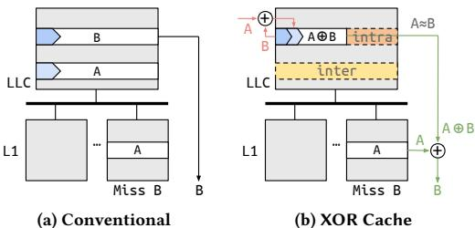

- **图片定位**
  - 该图是论文的 **Figure 1: High-level overview**，用于直观对比 **Conventional cache** 与 **XOR Cache** 在 LLC/L1 层级中的数据存放与访问方式。
  - 核心信息是：**传统 LLC 直接存储 cache line 原值，而 XOR Cache 在 LLC 中存储两个 cache line 的 bitwise XOR 结果，即 A⊕B**。
  - 图中展示了一个访问场景：处理器在 L1 中发生 **Miss B**，需要从 LLC 获取 cache line B。

- **整体结构对比**

| 子图 | 架构 | LLC 中存储内容 | L1 中状态 | Miss B 时的数据路径 |
|---|---|---|---|---|
| **(a)** | **Conventional** | 直接存储 **A** 和 **B** | 某个 L1 已有 **A** | LLC 直接返回 **B** |
| **(b)** | **XOR Cache** | 存储 **A⊕B**，而不是分别存储 A 和 B | 某个 L1 已有 **A** | LLC 返回 **A⊕B**，L1 用本地 **A** 恢复 **B** |

- **左图：Conventional cache 的含义**
  - 左侧子图标注为 **(a) Conventional**。
  - LLC 中分别存放两条独立 cache line：
    - **B**
    - **A**
  - 下方是多个 L1 cache，其中右侧 L1 中已经缓存了 **A**。
  - 当该 L1 发生 **Miss B** 时：
    - 请求向 LLC 发起。
    - LLC 中存在完整的 **B**。
    - LLC 直接把 **B** 返回给 L1。
  - 该设计的问题是：
    - **A 同时存在于 L1 和 LLC 中**。
    - 这种 inclusion/private caching 带来了 **数据冗余**。
    - LLC 需要为 A 和 B 分别占用两个 cache line 存储槽。

- **右图：XOR Cache 的含义**
  - 右侧子图标注为 **(b) XOR Cache**。
  - LLC 不再分别存储 **A** 和 **B**。
  - 它将两个 cache line 做 bitwise XOR：
    - **A⊕B**
  - 然后只在 LLC 中存储 **A⊕B**。
  - 由于某个 L1 中已经有 **A**，因此当需要访问 **B** 时：
    - LLC 返回 **A⊕B**。
    - L1 使用本地已有的 **A** 与收到的 **A⊕B** 再做一次 XOR。
    - 根据 XOR 的自反性质：
      - **A⊕(A⊕B)=B**
    - 最终恢复出目标数据 **B**。

- **图中符号解释**

| 图中元素 | 含义 |
|---|---|
| **A** | 一个已经存在于 L1 中的 cache line |
| **B** | 当前请求访问、在 L1 中 miss 的 cache line |
| **A⊕B** | A 和 B 的 bitwise XOR 结果 |
| **⊕** | XOR 运算 |
| **A≈B** | A 与 B 的值相似 |
| **inter** | inter-line compression，跨 cache line 压缩 |
| **intra** | intra-line compression，单条 XOR 后数据内部进一步压缩 |
| **Miss B** | L1 缺失 B，需要从 LLC 获取 |
| **绿色箭头** | 利用已有 A 和 A⊕B 恢复 B 的路径 |
| **粉色箭头** | A 与 B 被 XOR 形成 A⊕B 的过程 |

- **关键机制：XOR 的可逆性**
  - XOR Cache 能工作的数学基础是 **XOR 自反可逆**：
    - **A⊕B⊕A = B**
    - **A⊕B⊕B = A**
  - 因此，只要系统中至少还能获得 A 或 B 中的一个原始副本，就可以从 **A⊕B** 恢复另一个。
  - 这也是论文中提出 **minimum sharer invariant** 的原因：
    - **一个 XORed line pair 至少要有一条原始 line 在 higher-level cache 中存在 sharer**。
    - 否则 LLC 中只有 A⊕B，无法单独恢复 A 或 B。

- **图中 inter-line compression 的含义**
  - 右图中黄色区域标注 **inter**。
  - 它表示 **A 和 B 两条 cache line 被压缩到一个 LLC 数据槽中**。
  - 传统 LLC：
    - 存储 A 需要一个 line slot。
    - 存储 B 需要一个 line slot。
    - 总共需要两个 slot。
  - XOR Cache：
    - 只存储 **A⊕B**。
    - 总共只需要一个 slot。
  - 因此，理想情况下可实现：
    - **2:1 inter-line compression ratio**
    - 即两条 line 用一条 line 的空间表示。

- **图中 intra-line compression 的含义**
  - 右图中虚线区域标注 **intra**。
  - 它表示 XOR 后的结果 **A⊕B** 可能更容易被传统 intra-line compression 算法继续压缩。
  - 图中标注 **A≈B**，表示 A 和 B 的值相似。
  - 如果 A 和 B 很相似：
    - 它们多数 bit 相同。
    - XOR 后相同 bit 会变成 0。
    - **A⊕B 会包含大量 0 或低熵模式**。
  - 这样可以提升后续压缩算法，例如：
    - **BΔI**
    - **BPC**
    - **Thesaurus**
  - 因此 XOR Cache 不只是节省一个 line，还能作为其他压缩算法的 **catalyst**。

- **Conventional 与 XOR Cache 的访问流程对比**

| 步骤 | Conventional | XOR Cache |
|---|---|---|
| 1 | L1 中已有 A，访问 B miss | L1 中已有 A，访问 B miss |
| 2 | 请求发送到 LLC | 请求发送到 LLC |
| 3 | LLC 找到完整 B | LLC 找到压缩值 A⊕B |
| 4 | LLC 直接返回 B | LLC 返回 A⊕B |
| 5 | L1 获得 B | L1 计算 A⊕(A⊕B)=B |
| 6 | 不需要额外计算 | 需要一次 XOR 恢复 |

- **图中体现的设计思想**
  - **传统视角**：
    - Inclusion 导致 LLC 和 L1 重复保存 A。
    - 这种重复被认为是浪费有效容量。
  - **XOR Cache 视角**：
    - 这种重复不是纯粹浪费，而是可利用的恢复依据。
    - 既然 L1 已经有 A，LLC 就没必要完整保存 A。
    - LLC 可以保存 **A⊕B**，用 L1 中的 A 辅助恢复 B。
  - 因此，XOR Cache 将 **cache hierarchy redundancy** 转化为 **compression opportunity**。

- **图中的绿色恢复路径**
  - 绿色箭头从 L1 中的 **A** 出发，经过 XOR 单元，与 LLC 返回的 **A⊕B** 结合。
  - 最终输出 **B**。
  - 这对应论文中的一种 decompression 情况：
    - **local recovery**
  - 即 requestor 本地已经拥有 XOR partner A，因此可在本地恢复 B。

- **图中的粉色压缩路径**
  - 粉色箭头表示 LLC 在插入或组织数据时，将 **A** 和 **B** 做 XOR。
  - 结果是 **A⊕B** 存入 LLC。
  - 该过程发生在 LLC 层，而不是 L1 层。
  - 图中也强调：
    - **L1 中的 line 不被 XORed**。
    - 因此 L1 hit 不会引入额外访问延迟。

- **该图对应论文的两个核心贡献**

| 图中概念 | 对应贡献 | 作用 |
|---|---|---|
| **A⊕B 替代 A 和 B** | **inter-line XOR compression** | 减少 LLC 数据阵列容量 |
| **A≈B → A⊕B 低熵** | **synergy with intra-line compression** | 提升 BΔI/BPC/Thesaurus 等压缩效果 |
| **L1 中已有 A** | 利用 private caching redundancy | 支持恢复 B |
| **LLC 与 L1 数据重复** | 利用 inclusion redundancy | 将冗余转化为压缩机会 |

- **该图隐含的硬件要求**
  - LLC tag 需要知道：
    - 当前 line 是否是 **XORed**。
    - XOR partner 是谁。
    - 真实数据位置在哪里。
  - coherence protocol 需要保证：
    - A 或 B 至少有一个可恢复来源。
    - 当 A 或 B 被修改、驱逐、失去最后 sharer 时，需要执行 **unXORing**。
  - 需要额外的 XOR 硬件：
    - 对 64B cache line，通常是 **512-bit XOR gate array**。
    - 论文指出该硬件非常简单，延迟很低。

- **图片传达的性能含义**
  - 在 L1 hit 情况下：
    - XOR Cache 不影响访问，因为 L1 中存的是原始 line。
  - 在 LLC hit 且 line 是 XORed 时：
    - 可能需要额外 XOR 运算。
    - 可能需要 cache-to-cache forwarding。
  - 但论文认为该开销较小：
    - XOR 运算可在同一周期完成。
    - 主要代价来自 forwarding 和 coherence 复杂度。
  - 换来的收益是：
    - **LLC data array 大幅缩小**
    - **面积下降**
    - **泄漏功耗下降**
    - **整体 EDP 改善**

- **图片的关键结论**
  - **Conventional cache 存储完整 B，因此简单但冗余。**
  - **XOR Cache 存储 A⊕B，因此节省 LLC 空间。**
  - **只要 L1 中保留 A，就能通过 A⊕B 恢复 B。**
  - **当 A≈B 时，A⊕B 更低熵，可进一步增强 intra-line compression。**
  - 该图用一个最小例子说明了 XOR Cache 的本质：
    - **用 higher-level cache 中已有的数据作为解码钥匙。**
    - **用 XOR 将两条 LLC line 合并为一条存储。**
    - **把 inclusion/private caching 的冗余变成压缩资源。**

### Figure 2: Compression ratio from LLC profiling. (a) shows compression ratio of XOR with BΔI; (b) shows compression ratio of XOR with BPC; (c) shows compression ratio of XOR with Thesaurus. A cache line can randomly XOR with another from the same bank (randBank), or search the entire set/bank to find the best candidate that minimizes data storage (idealSet/idealBank).

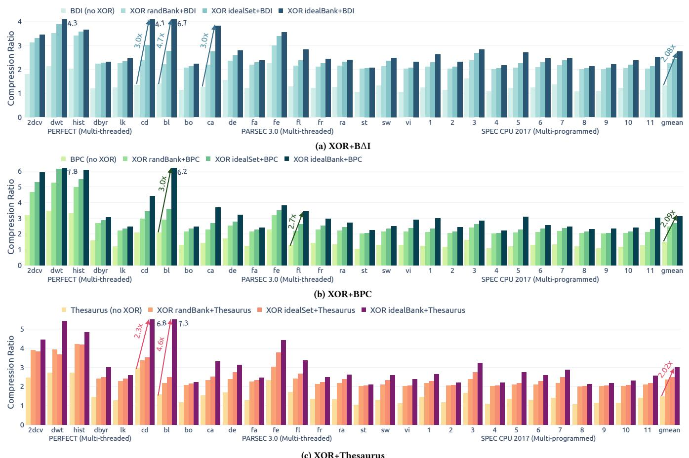

- 这张图是论文 Figure 2，核心用途是展示 **XOR Cache 与三种基线压缩方案的协同效应**：  
  - (a) **XOR + BΔI**
  - (b) **XOR + BPC**
  - (c) **XOR + Thesaurus**
- 图中纵轴是 **Compression Ratio**，横轴是不同 workload，分为三组：  
  - **PERFECT（Multi-threaded）**
  - **PARSEC 3.0（Multi-threaded）**
  - **SPEC CPU 2017（Multi-programmed）**
- 每个 workload 下有四根柱子，对应四种 XOR policy：  
  - **no XOR**：原始 baseline 压缩  
  - **randBank**：在同 bank 内随机选择 XOR 对象  
  - **idealSet**：在同 set 内搜索最优 XOR 对象  
  - **idealBank**：在整个 bank 内搜索最优 XOR 对象  

- 这张图想证明的不是“XOR 单独压缩能力”，而是 **XOR 作为 catalyst（催化剂）是否能进一步提升已有压缩器的效果**。结论很清楚：**能，而且选择策略越智能，提升越大。**

- 从整体趋势看：
  - **idealBank > idealSet > randBank > no XOR**，几乎在所有子图和 workload 上成立。
  - 说明 **“找相似 line 再 XOR”** 比随机 XOR 更有效。
  - 同时也说明 **search scope 越大，找到更相似 pair 的概率越高**，所以 idealBank 最强。
  - 但这也隐含了硬件代价问题：**idealBank 是上界，不是实际可直接落地方案**。

- 三个子图的含义差异如下：

| 子图 | baseline 压缩器 | 压缩机制类型 | XOR 的作用 |
|---|---|---|---|
| (a) | BΔI | intra-line | 让 XOR 后的数据更稀疏、更容易被 base-delta 表达 |
| (b) | BPC | intra-line | 通过让 XOR 结果出现更多 pattern / zero-run，增强 bit-plane 压缩 |
| (c) | Thesaurus | inter-line | 让 line 与 centroid 的距离更小，提高聚类压缩收益 |

- 图中的主要现象可以分三层理解：

- 第一层，**XOR 本身就能增加压缩比**  
  - 在所有 workload 上，带 XOR 的柱子普遍高于 no XOR。
  - 这说明 XOR 不只是“换一种编码”，而是确实在利用了 **LLC 与 private caches 之间的 redundancy**。
  - 特别是对 **inclusive 或 mixed-inclusive** 层次结构，这种冗余本来就存在，但传统 cache compression 没有直接利用。

- 第二层，**智能 XOR policy 会显著放大收益**
  - **randBank** 的提升通常有限，说明随机配对常常不能找到“值相近”的 line。
  - **idealSet** 已经明显更好，说明仅在同 set 里找候选，也能捕获一部分 value similarity。
  - **idealBank** 通常最强，说明更大的搜索空间能找到更接近的 pair，从而让 XOR 后数据更容易被压缩器进一步压缩。
  - 这正是论文说的 **synergy**：XOR 不是替代 BΔI/BPC/Thesaurus，而是帮它们“变得更好压”。

- 第三层，**不同 baseline 对 XOR 的敏感度不同**
  - **BΔI**：受益明显，但整体提升相对中等，因为 BΔI 依赖数值范围和 delta 分布，XOR 后如果形成更多低变化区域，就更容易成功。
  - **BPC**：有时提升非常突出，尤其在部分 PARSEC 片段上，说明 XOR 后的 bit-plane 结构更规整，利于 pattern-based compression。
  - **Thesaurus**：提升通常也很显著，因为它本身就是 inter-line 聚类压缩，XOR 进一步增强了 line similarity，能够把更多 line 拉近到同一个 centroid 附近。

- 从图中标注的上界/代表性数值看，论文特别强调了 **idealBank 的放大效果**。图里一些箭头标注了倍率提升，例如：
  - **BΔI**：最高可到约 **4.3×、4.7×、6.7×** 这类级别的显著提升标注
  - **BPC**：最高可到约 **7.8×、6.2×** 量级
  - **Thesaurus**：最高可到约 **6.8×、7.3×** 量级
- 这些数字不是平均值，而是展示某些 workload 上的极端高收益，说明 **XOR 对某些数据模式的催化效果非常强**。

- 若从 workload 类型看：

| workload 类别 | 图中表现 | 原因判断 |
|---|---|---|
| PERFECT | 提升通常更明显 | 数据规律性更强，线程间共享/复用较多 |
| PARSEC 3.0 | 提升中等到较强 | 混合型数据模式，部分程序更适合 XOR |
| SPEC CPU 2017 | 整体提升较稳定但较温和 | 多程序场景中，line similarity 分散，XOR 机会较少 |

- 进一步看，图里 gmean 一列很重要：
  - (a) **XOR+BΔI** 的 gmean 明显高于 baseline BΔI。
  - (b) **XOR+BPC** 的 gmean 提升更大，说明 XOR 与 BPC 的组合更有互补性。
  - (c) **XOR+Thesaurus** 也很强，表明 XOR 对 inter-line 类压缩同样有效。
- 论文后续正文提到，**idealBank** 能把 BΔI、BPC、Thesaurus 的平均压缩比分别提升约 **2.08×、2.09×、2.02×**，这与图中的趋势一致。

- 这张图背后的核心机理是：
  - **XOR 两条相似 line 后，结果的 entropy 会下降**
  - 低 entropy 数据更容易被压缩器进一步处理
  - 因此 XOR 不只是“把两条线塞进一个槽”，还会把数据变得更“好压”
- 这也是论文标题里 “A Catalyst for Compression” 的直接依据：  
  - **XOR 自身是 inter-line compression**
  - 同时又提升了 **intra-line compression** 的有效性

- 从设计视角，这张图实际上给出三个结论：
  - **XOR 是有效的**：即使随机配对，也能比无 XOR 更好。
  - **XOR policy 很关键**：相似性越强，收益越大。
  - **search scope 存在性能-硬件代价权衡**：idealBank 最好，但实现最贵，实际系统更可能采用 map table 之类近似方案。

- 如果把这张图一句话概括，就是：
  - **XOR Cache 不是简单的压缩器，而是一个能提升其他压缩器上限的“前置变换层”**，其收益来自 **跨 cache level 的冗余利用 + 值相似性引导的 entropy reduction**。

### Figure 4: Two similar lines A and B from bodytrack benchmark in PAESEC3.0 suite. The XORed line $\mathbf { A } \oplus \mathbf { B }$ has low entropy.

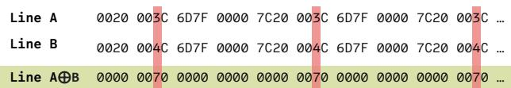

- **图像核心含义**：该图展示了来自 **PARSEC 3.0 bodytrack benchmark** 的两条相似 cache line：**Line A** 与 **Line B**，以及它们逐位异或后的结果 **Line A⊕B**。图中说明：当两条 line 的数值高度相似时，执行 **bitwise XOR** 后会产生大量 **0 值字段**，从而显著降低数据熵，为后续压缩算法创造更好的压缩条件。

- **图像结构解析**：

| 区域 | 内容 | 作用 |
|---|---|---|
| 第一行 | **Line A** | 原始 cache line A 的部分十六进制数据 |
| 第二行 | **Line B** | 原始 cache line B 的部分十六进制数据 |
| 第三行 | **Line A⊕B** | A 与 B 按位 XOR 后得到的结果 |
| 红色竖向高亮 | A 与 B 之间存在差异的位置 | 强调两条 line 只有少量 bit/field 不同 |
| 浅绿色背景 | XOR 后的结果行 | 突出 XOR 结果具有大量 0，低熵、易压缩 |

- **图中可见数据示例**：

| 位置片段 | Line A | Line B | Line A⊕B | 观察 |
|---|---:|---:|---:|---|
| 片段 1 | 0020 | 0020 | 0000 | 完全相同，XOR 后为 0 |
| 片段 2 | 003C | 004C | 0070 | 存在差异，XOR 后产生非零值 |
| 片段 3 | 6D7F | 6D7F | 0000 | 完全相同，XOR 后为 0 |
| 片段 4 | 0000 | 0000 | 0000 | 完全相同，XOR 后为 0 |
| 片段 5 | 7C20 | 7C20 | 0000 | 完全相同，XOR 后为 0 |
| 片段 6 | 003C | 004C | 0070 | 重复出现的差异模式 |
| 片段 7 | 6D7F | 6D7F | 0000 | 完全相同，XOR 后为 0 |
| 片段 8 | 0000 | 0000 | 0000 | 完全相同，XOR 后为 0 |
| 片段 9 | 7C20 | 7C20 | 0000 | 完全相同，XOR 后为 0 |
| 片段 10 | 003C | 004C | 0070 | 再次出现相同差异 |

- **关键现象**：  
  - **Line A 与 Line B 高度相似**，大部分字段完全一致。
  - 只有少量字段不同，例如 **003C** 与 **004C**。
  - 相同字段执行 XOR 后均变为 **0000**。
  - 不同字段执行 XOR 后得到较小且重复的非零值，例如 **0070**。
  - 因此，**Line A⊕B 中出现大量 0000**，呈现明显的稀疏性。

- **XOR 计算逻辑说明**：

| 输入关系 | XOR 结果 | 压缩意义 |
|---|---|---|
| A 字段 = B 字段 | 0 | 产生大量零，降低 entropy |
| A 字段 ≠ B 字段 | 差异掩码 | 只保留两条 line 的差异信息 |
| A ≈ B | A⊕B 稀疏 | 适合后续 BΔI、BPC 等 intra-line compression |
| A 与 B 差异随机 | A⊕B 不一定稀疏 | XOR synergy 较弱 |

- **图中红色高亮的意义**：  
  - 红色区域标出了 **Line A 与 Line B 的差异字段**。
  - 这些位置在 XOR 结果中对应非零值 **0070**。
  - 它说明 XOR 后的数据本质上变成了一个 **difference representation**，即只编码 A 与 B 的差异，而不是重复存储两条完整 line。

- **为什么 XOR 后 entropy 降低**：  
  - 原始 Line A 和 Line B 中包含多个看似普通的十六进制值，例如 **6D7F、7C20、003C、004C**。
  - 单独看每条 line，这些值并不一定能被传统 intra-line compressor 高效压缩。
  - 但由于 A 和 B 很相似，执行 **A⊕B** 后，相同部分全部归零。
  - 结果行变为类似：**0000 0070 0000 0000 0000 0070 ...**
  - 这种模式具有：
    - **大量零值**
    - **重复非零值**
    - **低动态范围**
    - **低 bit-level entropy**
  - 因而更适合压缩。

- **与 XOR Cache 设计目标的关系**：  
  - 该图是论文中 **XOR compression synergy** 的直观例子。
  - XOR Cache 不只是把两条 line 合并成一条 **A⊕B** 来节省 LLC 存储，还希望通过选择相似 line，让 XOR 结果更稀疏。
  - 这使得 XOR Cache 同时提供两类收益：

| 收益类型 | 对应机制 | 图中体现 |
|---|---|---|
| **inter-line compression** | 两条 line 存为一条 A⊕B | A 和 B 被组合成 Line A⊕B |
| **intra-line compression catalyst** | XOR 后产生低熵数据 | Line A⊕B 出现大量 0000 |

- **对 BΔI compression 的意义**：  
  - **BΔI** 依赖低动态范围数据，用 base 加 delta 表示 cache line。
  - XOR 后的 Line A⊕B 主要由 **0000** 和少量 **0070** 构成。
  - 这种结果非常适合用小 delta 编码。
  - 因此，XOR Cache 与 **BΔI** 结合时，能够提升 baseline BΔI 的压缩率。

- **对 BPC compression 的意义**：  
  - **BPC / Bit-Plane Compression** 对 bit-plane 中的规律性、零模式、重复模式敏感。
  - Line A⊕B 的大量 0 会使多个 bit-plane 呈现稀疏结构。
  - 因此 XOR 后的数据更容易被 BPC 的 run-length encoding 和 frequent pattern compression 捕获。

- **对 Thesaurus 类 inter-line compression 的启示**：  
  - Thesaurus 依赖相似 line 的动态聚类。
  - 图中 A 与 B 本身高度相似，说明现实 workload 中存在可利用的 value similarity。
  - XOR Cache 的 map table / map function 目标就是低成本寻找这类相似候选，而不是理想化地全 bank 搜索。

- **图像展示的核心公式**：  
  - **A ⊕ B = difference mask**
  - 如果 **A ≈ B**，则：
    - **A⊕B ≈ 0**
    - **entropy(A⊕B) < entropy(A)**
    - **entropy(A⊕B) < entropy(B)**
  - 因此：
    - **compress(A⊕B)** 通常比 **compress(A)** 或 **compress(B)** 更有效。

- **从 cache line 角度理解该图**：  
  - 每个 cache line 通常为 **64B = 512 bits**。
  - 图中只截取了部分十六进制字段。
  - XOR 是逐 bit 完成的，而图中以十六进制 word 形式显示结果。
  - 当两个 16-bit 字段完全相同时，例如：
    - **6D7F ⊕ 6D7F = 0000**
    - **7C20 ⊕ 7C20 = 0000**
  - 当字段略有差异时，例如：
    - **003C ⊕ 004C = 0070**
  - 这说明差异被压缩到少量 bit 上。

- **该例子体现的 workload 特征**：  
  - **bodytrack** 属于图像/视觉处理类 workload。
  - 这类程序常处理结构相似的数据，例如像素块、坐标、概率、矩阵或相邻帧数据。
  - 相邻或相关 cache line 之间可能存在明显的 **spatio-value locality**。
  - 因此，XOR Cache 可以利用这种相似性，将原本分散在多条 line 中的冗余转化为压缩机会。

- **与论文 Figure 5 的关系**：  
  - Figure 4 展示了单个具体例子。
  - Figure 5 进一步说明，如果通过改变 index bits 或利用 **spatio-value locality**，让相似 line 更可能落入同一 set，则 XOR candidate 搜索效果会提升。
  - 换言之，Figure 4 是现象证明，Figure 5 是策略验证。

- **为什么该图支持“XOR Cache 是 compression catalyst”这一论点**：  
  - 普通 compression scheme 直接压缩 A 或 B，可能看不到 A 与 B 之间的跨 line 相似性。
  - XOR Cache 先执行 **A⊕B**，把跨 line 相似性转化为单 line 内的零模式。
  - 后续 intra-line compressor 只需要处理低熵结果。
  - 因此 XOR 不是替代传统压缩，而是作为 **catalyst** 提高传统压缩效果。

- **潜在硬件意义**：  
  - XOR 操作硬件极其简单，只需要一组 XOR gates。
  - 对 64B line 而言，需要对 **512 bits** 执行并行 XOR。
  - 论文中指出 XOR gate array 延迟很低，可在 cache controller 或 SRAM 附近实现。
  - 图中这种高度稀疏结果说明：用很低硬件代价即可显著改善数据可压缩性。

- **该图也暗示 XOR policy 的重要性**：  
  - 如果随机选择两条完全无关的 line，A⊕B 可能仍然是高熵数据。
  - 图中能得到大量 0，是因为 A 与 B 高度相似。
  - 因此，XOR Cache 需要设计有效的 **XOR policy** 来寻找相似 line。
  - 论文后续采用 **map table** 和 **Sparse Byte Labeling, SBL** 来近似寻找相似候选。

- **总结性判断**：  
  - **Figure 4 是 XOR Cache 压缩机制的关键直觉图**。
  - 它证明了：当两条 cache line 具有高度 value similarity 时，**XOR 后的数据会变成低熵、稀疏、重复性强的形式**。
  - 这种形式不仅能通过 XOR 实现 **2:1 inter-line co-location**，还可以显著增强 **BΔI、BPC 等 intra-line compression** 的效果。
  - 因此，该图直接支撑论文的核心观点：**XOR Cache 可以把 cache hierarchy 中的冗余转化为额外压缩收益**。

### Figure 5: Sensitivity study of idealSet compression ratio on the effect of spatio-value locality. X in idealSet-X denotes the number of index bits shifted towards the MSBs.

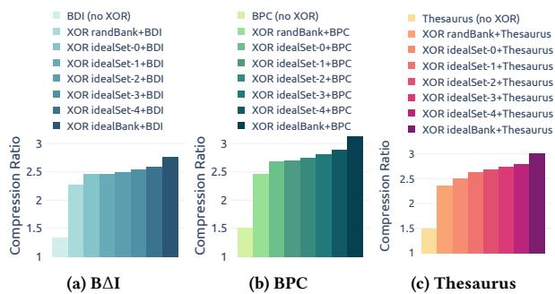

- 这张图展示的是 XOR Cache 中 **idealSet XOR policy** 对不同压缩器的敏感性分析，核心变量是 **spatio-value locality**。
- 图中三组子图分别对应 **BΔI、BPC、Thesaurus** 三种基线压缩方案；纵轴都是 **Compression Ratio**。
- 图例里包含：
  - **no XOR**：原始压缩方案
  - **XOR randBank + scheme**：随机选候选
  - **XOR idealSet-X + scheme**：在同一 set 内搜索，且将 **X 个 index bits 向 MSB 方向移动**
- 这意味着：**X 越大，地址映射越偏向把“相似数据”聚到同一 set，从而更容易找到值相近的 XOR 对象。**

- 先看整体结论：
  
  | 现象 | 结论 |
  |---|---|
  | **no XOR → randBank → idealSet-X** | 压缩比逐步上升，说明 **XOR pairing 本身有效** |
  | **X 增大** | 压缩比继续提升，说明 **spatio-value locality 越强，XOR 越能催化后续压缩** |
  | **提升幅度后期变小** | 存在 **边际收益递减**，不是无限增强 |
  | **BPC 增益最大** | 说明 **BPC 对 XOR 后低熵数据最敏感** |
  | **Thesaurus 和 BΔI 也受益明显** | 说明 XOR 不只优化 intra-line，也能增强 inter-line / centroid 类方案 |

- 分三幅图看：

- 在 **(a) BΔI** 中：
  - **no XOR** 的压缩比最低，约在 **1.3x** 左右。
  - **randBank** 直接把压缩比抬到大约 **2.3x**，说明即使随机配对，XOR 也能显著增加可压缩性。
  - 随着 **idealSet-1 到 idealSet-4** 逐步增强 locality，压缩比稳定上升，最终接近 **2.6x~2.7x**。
  - 说明 BΔI 对“**XOR 后数值范围更窄、delta 更小**”这件事很敏感。

- 在 **(b) BPC** 中：
  - **no XOR** 大约在 **1.5x**。
  - **randBank** 已经接近 **2.45x**。
  - 随着 **idealSet-X** 增强，压缩比继续涨到 **3.0x+**，是三者里最高的。
  - 这表明 **BPC 最能从 XOR 产生的低熵、零多、模式更规律的数据中获益**。
  - 也就是说，**XOR 对 BPC 的“催化”效果最强**。

- 在 **(c) Thesaurus** 中：
  - **no XOR** 约 **1.45x**。
  - **randBank** 提升到约 **2.3x**。
  - **idealSet-4** 接近 **2.9x**。
  - 说明 Thesaurus 这类 **基于 clustering / centroid 的 inter-line compression** 也能从 XOR 的“相似数据配对”中获益。
  - 但整体增幅略低于 BPC，表明它更依赖线间聚类结构，而不是纯粹的低熵编码。

- 从趋势上可以提炼出三点关键机制：

  - **XOR 不是只为了把两条线塞进一个槽位**
    - 它还能把两条“相似值”变成一条 **更稀疏、更低熵** 的数据块。
    - 这就是图里从 **randBank 到 idealSet-X** 压缩比继续提升的原因。

  - **spatio-value locality 越强，XOR pairing 越聪明**
    - 当地址映射把相似内容更多聚集到同一 set 时，idealSet 更容易找到“值差小”的配对。
    - 结果就是 **XOR 结果更接近 0，后续压缩更容易**。

  - **提升是“递增但饱和”的**
    - 从 **idealSet-1 到 idealSet-4**，增益逐步缩小。
    - 说明把 index bits 过度上移后，收益会进入平台期。
    - 也就是论文里说的 **coverage-accuracy tradeoff**：局部性增强了，但可配对范围和覆盖率会受限。

- 如果把这张图放回论文主线，它说明了一个非常重要的设计点：
  - **idealSet 不是单纯追求更多 XOR 对，而是追求“更相似的 XOR 对”**
  - 这种策略虽然比 randBank 更复杂，但能显著提升后续压缩器的效果。
  - 所以 XOR Cache 的真正价值不只是 **inter-line compression**，还在于它作为一个 **compression catalyst**，把后续压缩器的输入质量变高了。

- 简要结论可以概括为：
  - **XOR 配对越接近 value-similar，压缩比越高**
  - **BPC 的受益最大，其次是 Thesaurus 和 BΔI**
  - **idealSet-X 随 X 增大持续优化，但存在饱和区**
  - **这张图直接证明了 spatio-value locality 是 XOR Cache 成功的关键条件之一**

### Figure 6: LLC transitions between stable states. I for Invalid; S for Shared; M for Modified; S0 is a special S state when the number of sharers is zero; compression, decompression, and unXORing edges are in blue, green, and red, respectively.

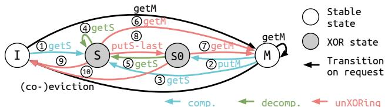

- 这张图展示的是 XOR Cache 在 LLC 层面的**稳定状态转换图**，核心不是传统 MSI 本身，而是把**XOR 压缩、解压、unXORing**三类操作嵌入到 MSI 生命周期中。

- 图中状态含义如下：

  | 状态 | 含义 | 是否保留 LLC 数据副本 | 是否可能参与 XOR |
  |---|---|---:|---:|
  | **I** | Invalid，LLC 中无效 | 否 | 否 |
  | **S** | Shared，LLC 有共享副本 | 是 | 是 |
  | **M** | Modified，脏数据由私有缓存持有 | 否，LLC 不存数据，仅目录保留 | 否 |
  | **S0** | 特殊的 Shared 状态，**LLC 有数据但私有缓存 sharer 数为 0** | 是 | 是，但受限 |

- 图右侧的图例说明了两种节点样式：
  - **白色圆圈**：stable state，表示普通稳定态。
  - **灰色圆圈**：XOR state，表示与 XOR 压缩相关的特殊态，图里主要强调 **S / S0 / M** 在 XOR 机制下的角色差异。
  - 箭头颜色表示不同类型操作：
    - **蓝色**：compression
    - **绿色**：decompression
    - **红色**：unXORing

- 这张图最重要的设计点是：XOR Cache 不是单纯“存压缩数据”，而是把**状态机和一致性协议一起改造**，使压缩后的数据仍然可恢复、可转发、可失效处理。

- 图中最关键的约束是 **minimum sharer invariant**：
  - 一个 XOR 对里的两条线，至少要有一条仍在上层缓存中有 sharer。
  - 这保证 LLC 中的 XOR 值始终可恢复。
  - 因此图中的 **S0** 很重要：它表示“LLC 里有数据，但上层没有 sharer”，这是最危险的边界状态，常常触发 **unXORing**。

- 各类箭头可以这样理解：

  | 颜色 | 操作 | 作用 |
  |---|---|---|
  | **蓝色 comp.** | compression | 插入/写回时尝试把两条线 XOR 到一个槽里 |
  | **绿色 decomp.** | decompression | 读请求到达 XOR 行时，通过上层缓存的另一份原始线恢复数据 |
  | **红色 unXORing** | unXORing | 当数据将失去可恢复性或即将修改时，拆开 XOR 对，恢复成两条独立线 |

- 图中编号 1–10 对应论文正文中的 10 类状态转换，含义如下：

  | 编号 | 事件 | 典型起点 → 终点 | 说明 |
  |---|---|---|---|
  | **1** | getS | I → S | 读缺失，从内存取回并可能插入为共享线 |
  | **2** | putM | M → S / S0 相关路径 | 脏写回相关，通常把修改后的数据下推到 LLC 或触发压缩 |
  | **3** | getS | M → S | 从持有者或内存服务共享读取 |
  | **4** | getS | S → 服务读取 | 当 LLC 中是 XOR 行时触发**解压/转发**流程 |
  | **5** | getS | S0 → 服务读取 | S0 上的 XOR 行也可能被读，需要通过 partner 恢复 |
  | **6** | getM | S → M 相关路径 | 当共享线要升级为 Modified，可能触发 **unXORing** |
  | **7** | getM | S0 → M 相关路径 | S0 上的 XOR 行若要修改，也必须先拆开 |
  | **8** | putS-last | S → S0 | 最后一个 sharer 退出时，若违背可恢复条件，触发 **unXORing** |
  | **9** | eviction | S → I / 相关回收 | 普通共享线驱逐，可能需要先恢复原始数据 |
  | **10** | eviction | S0 → I / 相关回收 | S0 驱逐时同样可能要 unXOR 并回写 |

- 从整体流程看，这张图体现了三层逻辑：

  - **压缩层**：在插入或写回时，LLC 可将两条 line 变成一条 **A ⊕ B**。
  - **访问层**：当读请求命中 XOR 行时，不是直接返回数据，而是通过上层缓存中的原始 line 做 **XOR 逆运算**恢复。
  - **一致性层**：当某条 line 要升级为 Modified、最后一个 sharer 退出、或者 line 要被驱逐时，系统会主动 **unXOR**，避免原始数据变得不可恢复。

- 图里左侧到右侧的主干关系可以概括为：
  - **I → S**：加载进来，进入共享态。
  - **S ↔ S0**：共享数变化导致从“普通共享”过渡到“无 sharer 的共享”。
  - **S / S0 → M**：写升级路径，往往是 XOR 生命周期的终止点之一。
  - **M → S**：写回或降级后重新回到共享域。
  - **任意 XOR 相关态 → unXORing**：只要恢复性不再成立，就必须拆分。

- 这张图的本质贡献不在于状态数很多，而在于它把传统 MSI 里的简单读写状态，扩展成了一个**带恢复约束的压缩一致性机**。也就是说：
  - **状态转换不仅取决于访问类型，还取决于“能不能恢复原始值”**。
  - 这是 XOR Cache 与普通 compressed cache 最大的不同。

- 图中最值得注意的工程含义有三点：
  - **压缩不是静态行为，而是和 coherence 紧密耦合**。
  - **读请求可能跨 cache level 进行数据恢复**，因此存在额外 forwarding 路径。
  - **写升级和最后 sharer 退出是最敏感的边界事件**，它们决定了何时必须拆开 XOR 对。

- 如果把这张图压缩成一句话，它表达的是：
  - **XOR Cache 在 LLC 中用 XOR 对替代原始 line pair，但必须通过 S/S0/M 的状态约束和 unXOR 机制，保证任何时候都能把原始数据恢复出来。**

- 这张图也直接说明了论文的两个核心设计目标：
  - **提高 LLC 有效容量**：通过 XOR 把两条线塞进一个槽。
  - **不破坏 coherence correctness**：通过 S0、forwarding、unXORing 保证协议可行。

- 从研究角度看，这种状态图的价值在于它揭示了一个关键事实：  
  **压缩缓存的难点不只是“怎么压”，而是“压了以后如何在一致性协议下安全地读、写、驱逐、恢复”。**

### Figure 7: Three forwarding cases when A and B are XORed. From top to bottom are local recovery, direct forwarding, and remote recovery.

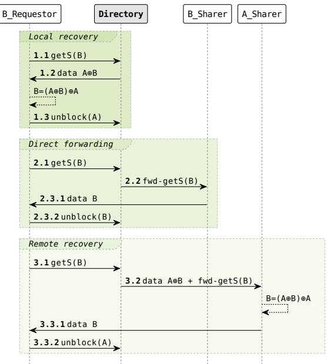

- **这张图展示的是 XOR Cache 在 LLC 中处理“被 XOR 压缩后的缓存行”时的三种数据转发路径**，核心对象是请求方 **B_Requestor**、目录 **Directory**、B 的潜在共享者 **B_Sharer**、以及 A 的共享者 **A_Sharer**。
- 图的目标不是说明普通 cache hit/miss，而是说明：当 LLC 里只存着 **A ⊕ B** 时，系统如何利用已有的 **A** 或 **B 的 sharer** 把真正需要的 **B** 恢复出来。
- 图中从上到下分别是：
  - **Local recovery**
  - **Direct forwarding**
  - **Remote recovery**

- 这三种路径都围绕同一个请求：**getS(B)**，即请求方要读 B。
- 由于 LLC 里存的不是 B 本身，而是 **A ⊕ B**，所以必须借助某个已知的原始线，或者借助其他 sharer，才能完成恢复。

| 路径 | 触发条件 | 数据从哪里来 | 是否需要 XOR 还原 | 复杂度 | 延迟 |
|---|---|---:|---:|---:|---:|
| **Local recovery** | 请求方自己就持有 A | **Directory → B_Requestor** 发送 **A ⊕ B** | **需要**，在本地做 `B = (A⊕B) ⊕ A` | 低 | **最低** |
| **Direct forwarding** | B 仍有 sharer，但请求方不持有 A | **B_Sharer → B_Requestor** 直接发 B | **不需要** | 中 | 中 |
| **Remote recovery** | B 没有 sharer，但 A 仍有 sharer | **A_Sharer** 先恢复 B，再回传 | **需要**，在远端做 `B = (A⊕B) ⊕ A` | **最高** | **最高** |

- **Local recovery 的含义**
  - 图左上角绿色区域对应这一类。
  - 流程是：
    1. **B_Requestor 发起 getS(B)**。
    2. **Directory** 返回压缩数据 **A ⊕ B**。
    3. 因为请求方本地已经有 **A**，所以它能直接执行 **`(A ⊕ B) ⊕ A = B`**。
    4. 最后发送 **unblock(A)**，通知目录该恢复流程结束。
  - 这个路径最优，因为：
    - 只需要一次目录返回；
    - 不需要跨核再取数据；
    - XOR 还原在本地完成，开销小。
  - 本质上，它利用了 **private cache 中已有的 A** 来解压 LLC 中的 XOR 结果。

- **Direct forwarding 的含义**
  - 图中间绿色区域对应这一类。
  - 流程是：
    1. **B_Requestor 发起 getS(B)**。
    2. **Directory** 发现 B 还有有效 sharer，于是发送 **fwd-getS(B)** 给 **B_Sharer**。
    3. **B_Sharer** 直接把 **B** 返还给请求方。
    4. 请求方收到 **data B** 后，发送 **unblock(B)**。
  - 这里的特点是：
    - **不需要访问 A**；
    - **不需要做 XOR 还原**；
    - 更像传统 cache-to-cache forwarding。
  - 所以它是三种路径里“最普通”的一种，只是被放在 XOR Cache 语境下作为兼容机制。

- **Remote recovery 的含义**
  - 图下方大绿色区域对应这一类。
  - 流程是：
    1. **B_Requestor 发起 getS(B)**。
    2. **Directory** 发现 **B 没有 sharer**，但 **A 仍有 sharer**。
    3. 于是目录把 **A ⊕ B + fwd-getS(B)** 发给 **A_Sharer**。
    4. **A_Sharer** 用本地的 **A** 做 XOR：`B = (A ⊕ B) ⊕ A`。
    5. 然后把 **data B** 回传给请求方。
    6. 最后 **B_Requestor** 发送 **unblock(A)**。
  - 这是最重的路径，因为：
    - 需要多跳转发；
    - 恢复工作在远端 cache 完成；
    - 对通信和延迟都更敏感。
  - 但它解决了一个关键问题：即使 **B 自己没有 sharer**，只要 **A 还活着**，数据仍然可恢复。

- **图中最关键的设计点是“可恢复性”**
  - XOR Cache 不是简单把两条线混合后就结束了，而是要求压缩后的数据仍可被还原。
  - 因此它依赖两个前提：
    - 至少有一条原始线可从 private cache 中找到；
    - 目录必须知道谁还能提供这条线。
  - 这正是论文里提到的 **minimum sharer invariant** 的图形化体现。

- **从协议角度看，这张图说明了 XOR Cache 的本质不是“只压缩”，而是“压缩 + 转发 + 恢复”一体化设计**
  - 传统 cache 只处理“找得到数据就返回”。
  - XOR Cache 要额外处理“找到的是 A⊕B，该怎么变回 B”。
  - 所以图中增加了：
    - **fwd-getS(B)** 这样的目录转发消息；
    - **unblock(A/B)** 这样的完成通知；
    - 以及远端恢复时的额外数据依赖。

- **三条路径的性能含义很明确**
  - **Local recovery**：最好，通常是最接近普通 LLC hit 的 XOR 访问。
  - **Direct forwarding**：次之，等价于普通 cache-to-cache transfer。
  - **Remote recovery**：最慢，因为多了一次跨核恢复。
  - 这也解释了论文后文为什么说 multi-programmed workload 里性能开销更高：**remote recovery 比例更大**。

- **从实现角度看，这张图传达了几个重要约束**
  - **Directory 必须是精确 sharer tracking**，否则无法判断 A 和 B 是否还能恢复。
  - **clean eviction / upgrade notification 不能随便省略**，因为一旦 sharer 信息不准，就可能破坏恢复路径。
  - **XORed pair 的生命周期是受 sharer 状态约束的**，不是单纯按数据是否存在来管理。

- **可以把这张图理解成一个“恢复决策树”**
  
| 决策问题 | 是 | 否 |
|---|---|---|
| 请求方是否已有 A？ | **Local recovery** | 继续判断 |
| B 是否仍有 sharer？ | **Direct forwarding** | 继续判断 |
| A 是否仍有 sharer？ | **Remote recovery** | 违反最低可恢复条件，理论上不应发生 |

- **图中箭头和编号的含义**
  - **1.1 / 2.1 / 3.1**：请求方发起 **getS(B)**。
  - **1.2 / 3.2**：目录返回压缩数据或带转发请求的数据。
  - **2.2**：目录向 B 的 sharer 发起 **fwd-getS(B)**。
  - **2.3.1 / 3.3.1**：数据返回给请求方。
  - **1.3 / 2.3.2 / 3.3.2**：**unblock**，表示该次服务完成，目录可以解除阻塞状态。

- **这张图的学术价值在于：它把“跨线压缩”真正落到了 coherence protocol 上**
  - 很多压缩方案只关心数据怎么压缩。
  - 这张图说明：如果压缩跨越了两条缓存线，那么协议层必须知道：
    - 谁是 partner；
    - 谁还能提供原始值；
    - 何时必须解压；
    - 何时必须解除配对关系。
  - 这也是 XOR Cache 相比普通 compressed cache 更难的地方。

- **一句话总结**
  - **这张图定义了 XOR Cache 的三种解压/转发路径，核心是在 LLC 中只保存 A⊕B 时，利用请求方本地的 A、B 的 sharer、或 A 的 sharer 来恢复 B，从而保证 XOR 压缩后的数据仍然可访问、可一致、可恢复。**

### Figure 8: XOR Cache organization. a) Decoupled tag-data store and map table; b) Tag entry; c) Data entry; Grey blocks are identical to the uncompressed baseline; T is the number of tag entries; D is the number of data entries.

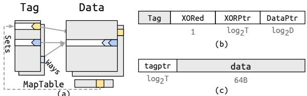

- 这张图展示的是 XOR Cache 的核心组织方式，重点不在“单行压缩”，而在于通过 **tag-data 解耦 + map table + 双向指针**，让两个原本独立的 cache line 能被合并存储，并且还能被正确恢复。

- 整体上可分为三部分：

  | 子图 | 作用 | 核心设计 |
  |---|---|---|
  | **(a)** | **整体组织结构** | decoupled tag-data store + map table |
  | **(b)** | **Tag entry 格式** | `XORed`、`XORPtr`、`DataPtr` |
  | **(c)** | **Data entry 格式** | `tagptr`、`data` |

- 图中灰色块表示：这些部分与 uncompressed baseline **相同**，也就是说 XOR Cache 并不是全盘重构，而是在 baseline 上叠加了少量结构和元数据。

- 图 (a) 的关键含义是：
  - **Tag array 和 Data array 分离**
  - 允许一个 tag entry 指向一个 data entry，而不是严格一一对应
  - 这样就能支持：
    - **一个 data entry 存放 XOR 后的数据**
    - **两个 tag entry 共享同一个压缩后的数据位置**
  - 左下角的 **MapTable** 是候选匹配器，负责在插入时找“可以 XOR 的另一条 line”

- 图 (a) 中的流程逻辑可以理解为：
  - 新 line 到来时，先经过 **map function**
  - 得到一个 **map value**
  - 用这个 value 去查 **MapTable**
  - 如果命中，说明找到一个合适的 XOR partner
  - 两条 line 就会被 **XOR 合并** 后写入 data array
  - 如果没命中，就按普通 line 存储，并把它登记进 MapTable

- 这个结构的本质是把“寻找相似 line”变成一个 **hash-like indirection problem**，从而避免全 bank 扫描。

- 图 (b) 的 Tag entry 设计非常关键，字段含义如下：

  | 字段 | 位宽/含义 | 作用 |
  |---|---|---|
  | **XORed** | **1 bit** | 标记该 line 是否与 partner 进行了 XOR 压缩 |
  | **XORPtr** | **log₂T** | 指向 partner 的 tag entry |
  | **DataPtr** | **log₂D** | 指向实际 data entry |

- 这里最重要的是 **XORPtr** 和 **DataPtr** 的配合：
  - **DataPtr** 负责定位压缩后的实际数据
  - **XORPtr** 负责定位“另一半”是谁
  - 因为 XOR 是可逆的，恢复时只要拿回其中一条原始 line，就能解出另一条

- `XORed` 这个 bit 的意义是：
  - 当前 line 是不是参与了 XOR compression
  - 若不是，就按普通 cache line 处理
  - 若是，就必须经过解压/forwarding/unXOR 流程

- 图 (c) 的 Data entry 设计同样体现了“可恢复性”：
  - `data`：存储真正的 64B 数据块，或者压缩后的数据块
  - `tagptr`：反向指针，指回对应的 tag entry

- 这个 `tagptr` 的作用非常重要：
  - 让 data entry 能快速反查自己属于哪个 tag
  - 对于 eviction、co-eviction、unXORing 等操作，反向定位非常关键
  - 它相当于维护了 **从数据到元数据** 的 обрат向映射

- 从结构上看，这张图传达了一个核心思想：**XOR Cache 不是简单把两条 line 做 XOR 后塞进一个槽里，而是构建了一个可追踪、可恢复、可转发的“二元绑定存储”系统。**

- 该设计的技术收益可以总结为：

  | 收益 | 说明 |
  |---|---|
  | **压缩更灵活** | 任意两条 line 可通过 partner 关系绑定 |
  | **支持恢复** | `XORPtr + tagptr` 使解压路径可追踪 |
  | **支持 coherence** | 便于处理 getS / getM / eviction / writeback |
  | **兼容其他压缩** | data array 可进一步承载 BΔI 等 intra-line 压缩 |
  | **降低冗余** | 利用 inclusion/private caching 的重复数据 |

- 但它也带来几个明显代价：

  | 代价 | 说明 |
  |---|---|
  | **metadata 增加** | tag entry 变大，需要 XORPtr、DataPtr、XORed |
  | **访问路径变复杂** | 读一个 XORed line 可能要查 partner 的状态 |
  | **一致性协议更难** | 需要处理 unXORing、forwarding、minimum sharer invariant |
  | **实现依赖 map table** | 候选选择不是免费，需要额外硬件逻辑 |

- 从架构角度看，这张图其实是在表达一种“分层职责”：
  - **MapTable**：负责“找谁和谁配对”
  - **Tag entry**：负责“这条 line 是否被 XOR、它的 partner 是谁、数据在哪”
  - **Data entry**：负责“真正存什么数据、它属于哪个 tag”

- 这种分工使 XOR Cache 同时具备两种能力：
  - **inter-line compression**：两条 line 合并存储
  - **intra-line compression catalyst**：XOR 后数据更稀疏，便于后续 BΔI/BPC 等继续压缩

- 如果从图的物理布局来理解：
  - 左侧的 tag 区比 baseline 更复杂
  - 中间的 data 区仍是主存储空间
  - 底部的 MapTable 很小，但决定了 XOR pairing 的效果
  - 整个设计本质上是在用少量 metadata 换取较大的 LLC footprint 缩减

- 这张图的设计重点可以概括为一句话：  
  **用 tag-data 解耦和 map-based pairing，把“数据相似性”转化为“可逆的结构化压缩关系”。**

- 结合论文整体，这张图是后续 coherence protocol、decompression、unXORing 和 evaluation 的硬件基础；没有这个组织结构，后面的协议设计就无法成立。

### Figure 9: Average byte-level entropy per 8-byte word.

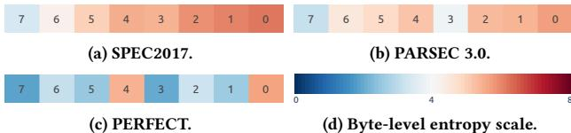

- 这张图是论文中 Figure 9，主题是 **Average byte-level entropy per 8-byte word**，核心结论很明确：**一个 8-byte word 内，不同 byte 的熵分布明显不均匀**。
- 图中横轴是 byte 位置，标号从 **7 到 0**，通常可理解为 **MSB → LSB** 的顺序。
- 右下角的色条给出 **Byte-level entropy scale**：**蓝色表示低熵，红色表示高熵**，范围大致从 **0 到 8**。

- 这张图想表达的不是“某个 benchmark 的绝对压缩率”，而是 **字节级别的数据规律**：
  - **高位字节（byte 7、6、5）熵较低**，颜色更偏蓝。
  - **低位字节（byte 3、2、1、0）熵较高**，颜色更偏橙红。
  - 这说明很多工作负载里，**低位字节更“随机”**，更难压缩；而高位字节往往更稳定、更接近 0 或重复模式，更适合压缩。

- 从三个 benchmark suite 看，分布模式大体一致，但细节不同：

| Suite | 整体特征 | 低熵区域 | 高熵区域 | 启示 |
|---|---|---|---|---|
| **SPEC2017** | 规律最清晰，层次感强 | byte **7, 6, 5** | byte **4 到 0**，尤其 **1/0** | 高低位差异明显，适合做 value-aware 处理 |
| **PARSEC 3.0** | 与 SPEC 类似，但中间位更接近高熵 | byte **7, 6, 5** | byte **4 到 0** | 低位噪声较强，压缩时应避开这些位的干扰 |
| **PERFECT** | 波动更大，byte 3 也出现较低熵现象 | byte **7, 6, 5** 仍偏低 | byte **4, 2, 1, 0** 偏高，但不如前两类完全单调 | 数据类型更混合，说明不同应用的字节统计特征会有差异 |

- 这张图和论文里的 **Sparse Byte Labeling (SBL)** 设计直接相关：
  - 论文指出，**低位字节的 entropy 最高**。
  - 因此在构造 map value 时，**如果把低位字节也纳入统计，反而会引入噪声**。
  - SBL 的做法是：**只关注每个 8-byte word 中较高位的 6 个 byte，弱化或忽略低位高熵部分**。
  - 这样做的目标是让 map function 更容易识别“真正相似”的 cache lines，从而提高 **XOR candidate selection accuracy**。

- 从架构角度看，这张图支持了两个关键判断：
  - **不是所有 byte 对压缩的贡献都一样**。
  - **word 的高位部分更适合用于相似性检测**，因为它们更稳定、熵更低、干扰更小。

- 如果把这张图和 XOR Cache 的设计连起来，可以得到一个很直接的逻辑链：
  - **XOR Cache 需要找相似 line 做 XOR pairing**
  - 但全 line 比较太贵
  - 所以用 map function 做近似筛选
  - 而 Figure 9 说明：**高位 byte 更有判别力，低位 byte 更容易制造噪声**
  - 因此 **SBL** 能提升 candidate matching 的质量，进而提升 **XOR 后的 intra-line compression synergy**

- 这张图还隐含了一个很重要的硬件结论：
  - **字节级 entropy 不是均匀分布的**，说明 cache compression 不应该对整个 line 采用完全平权的处理方式。
  - 更合理的方式是 **利用数据位级统计特性做定向优化**，这正是论文中 map function 设计的依据。

- 简单总结这张图的价值：
  - **证明了 cache line 内部存在明显的 byte-level entropy skew**
  - **验证了低位字节更难压缩**
  - **为 SBL 和 XOR candidate selection 提供了经验依据**
  - **支撑了 XOR Cache “先找相似，再 XOR，再压缩” 的整体思路**

### (b) XOR Cache flow. Forward XOR refers to the forwarding cases in Table 2. Figure 10: Data request flow. The critical path is in grey.

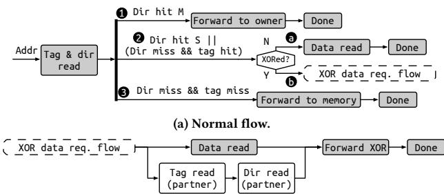

- **图像类型**：这是论文中的 **Figure 10(b) XOR Cache flow**，属于 **数据请求路径（data request flow）** 的细化图。
- **核心作用**：展示当 LLC 中某条缓存行是 **XORed line** 时，系统如何通过 **partner line** 的元数据与数据，完成 **decompression / recovery**，并把请求服务给上层核心。
- **图中重点**：
  - 上半部分是 **(a) Normal flow**，表示普通 LLC 访问路径。
  - 下半部分是 **(b) XOR Cache flow**，表示遇到 **XORed data** 时的附加处理流程。
  - **灰色部分是 critical path**，即对访问延迟有直接影响的路径。
  - **Forward XOR** 指表 2 中的三类转发恢复路径：**local recovery / direct forwarding / remote recovery**。

- **整体结构解读**：

| 区域 | 含义 | 关键动作 | 是否在关键路径 |
|---|---|---:|---:|
| **(a) Normal flow** | 常规 LLC 数据请求流程 | Tag & dir read → 分支判断 → Data read / Forward to owner / Forward to memory | 部分是 |
| **(b) XOR Cache flow** | XORed line 的特殊访问流程 | Data read + partner Tag read + partner Dir read + Forward XOR | **是** |
| **XOR_data_req_flow** | XOR 行的专用请求子流程 | 读取 partner 元数据后，再执行恢复 XOR | **是** |

- **(a) Normal flow 的含义**：
  - 请求从 **Addr** 进入后，先做 **Tag & dir read**。
  - 然后根据目录状态分三路：
    - **1 Dir hit M**：说明该行在某个 private cache 中是 **Modified**，于是 **Forward to owner**。
    - **2 Dir hit S / Dir miss & tag hit**：说明 LLC 有该行的共享版本或条目，直接进入 **Data read**。
    - **3 Dir miss & tag miss**：说明 LLC 中没有该行，直接 **Forward to memory**。
  - 这一部分是传统 LLC 的标准访问框架。

- **(b) XOR Cache flow 的关键含义**：
  - 当请求访问的是 **XORed line** 时，LLC 不能只读当前行本身的数据，因为存放的是 **A ⊕ B**，而不是原始数据。
  - 因此流程变成：
    - 先做 **Data read**，读出 XOR 结果。
    - 同时并行读取 **Tag read (partner)**，找到配对行的 tag 信息。
    - 再做 **Dir read (partner)**，确认 partner 的 coherence 状态和 sharer 情况。
    - 最后执行 **Forward XOR**，把数据送到合适的上层节点做恢复。
  - 这说明 XOR Cache 的解压并不是单纯本地解码，而是依赖 **partner line 的存在位置** 和 **coherence metadata**。

- **图中最重要的设计思想**：
  - **XORed line 本身不完整**，必须借助 partner 才能还原。
  - 因此访问路径比普通 LLC 多了两个动作：
    - **partner tag lookup**
    - **partner directory lookup**
  - 这也是论文强调的 **decompression via forwarding**。

- **“Forward XOR” 的本质**：
  - 不是把 XOR 数据简单返回给请求方。
  - 而是把 **A ⊕ B** 以及相关信息转发给能恢复原值的一方。
  - 恢复方式取决于请求方是否已经持有 partner line **A**，对应论文中的三种情况：
    - **local recovery**：请求方本地已有 A，直接 XOR 恢复 B。
    - **direct forwarding**：partner 仍在别的 sharer 处，直接转发请求。
    - **remote recovery**：partner 不在请求方本地，需要由远端 sharer 先恢复再回传。

- **从性能角度看，这张图说明了什么**：
  - **普通 LLC hit** 只需一次 tag/dir 判定和一次 data read。
  - **XOR hit** 需要额外访问 partner 元数据，因此访问链更长。
  - 这就是 XOR Cache 的主要性能代价来源之一。
  - 但论文认为这种开销可控，因为：
    - XOR 操作本身极快；
    - 大部分 L1/L2 hit 不受影响；
    - 只有命中 XORed LLC line 时才进入这条路径。

- **从系统设计角度看，这张图反映的约束**：
  - **目录一致性（directory coherence）** 必须精确，否则 partner 恢复可能失败。
  - **XOR pair 关系** 必须可追踪，因此需要额外的 **XORPtr / partner metadata**。
  - **请求流程并非完全本地化**，而是和 private cache 协同完成，这正是 XOR Cache 利用 **private caching redundancy** 的体现。

- **可以把这张图概括成一句话**：
  - **普通 LLC 只负责“存和取”，XOR Cache 还要负责“找配对、查状态、借伙伴、再恢复”。**

- **这张图的论文意义**：
  - 它不是单纯的流程图，而是在说明 XOR Cache 的核心创新点：
    - **压缩不是终点，恢复才是系统正确性的关键**。
    - LLC 中存的是 **压缩后的关系数据**，访问时必须通过 **coherence-aware forwarding** 完成解压。
  - 也因此，图 10(b) 是全文中连接 **压缩机制** 与 **coherence protocol** 的关键桥梁。

### Figure 11: Insertion flow (off critical path). F() denotes the map function.

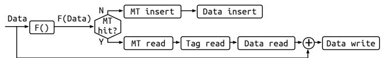

- 这张图展示的是 XOR Cache 的**插入流程（Insertion flow）**，并且明确标注为**off critical path**，意思是它不在前台访问的关键路径上执行，因此对命中延迟影响较小。

- 整体逻辑可以概括为：先对新到达的数据做 **map function F()**，生成一个 **map value**；再去查 **map table, MT**：
  - **MT hit**：说明找到一个可配对的候选行，进入 **XOR 压缩插入**；
  - **MT miss**：说明暂时找不到合适候选，只能先作为**standalone line** 存放，并登记到 MT 中，等待后续配对。

- 图中的流程可按步骤拆解如下：

| 阶段 | 图中节点 | 作用 | 结果 |
|---|---|---|---|
| 1 | **Data → F() → F(Data)** | 对输入 cache line 计算哈希/签名 | 得到用于索引 MT 的 map value |
| 2 | **MT hit?** | 判断 MT 中是否已有匹配候选 | 分流到 hit / miss 两条路径 |
| 3a | **N → MT insert → Data insert** | 若未命中，把当前 line 先单独存入系统 | 形成 standalone line，并登记候选信息 |
| 3b | **Y → MT read → Tag read → Data read** | 若命中，取出候选行的 tag 和 data | 准备与新数据做 XOR |
| 4 | **⊕** | 将 incoming data 与候选 data 做 bitwise XOR | 生成压缩后的 XORed data |
| 5 | **Data write** | 把 XOR 结果写回 data array | 完成成对存放 |

- 图中最核心的设计点是 **MT hit 才触发 XOR pairing**：
  - 这说明 XOR Cache 不是随机把两条线硬凑在一起；
  - 而是通过 **map function** 尽量把“相似数据”映射到同一个 MT 桶里；
  - 这样更容易找到**值相近**的 line pair，提升后续和其他压缩方式的协同效果。

- **MT miss 路径** 的含义很重要：
  - 新到达的数据并不会强行压缩；
  - 它会先被当作一个独立条目插入 **Data array**；
  - 同时它的 tag/pointer 也会被记录到 MT；
  - 这相当于在缓存里“挂起”一个候选，等待未来出现匹配项再做 XOR。

- **MT hit 路径** 体现了 XOR Cache 的核心压缩机制：
  - 先通过 **MT read** 找到候选行的定位信息；
  - 再做 **Tag read** 和 **Data read**；
  - 然后对两条 line 执行 **XOR**；
  - 最终把 XOR 结果写入数据阵列，完成“二合一”存储。

- 从结构上看，这个流程说明 XOR Cache 的插入不是单纯的“写入”，而是包含了一个**候选匹配 + 成对压缩**过程：
  - **F()** 负责“找相似对象”；
  - **MT** 负责“记忆未配对对象”；
  - **XOR** 负责“把两条 line 压成一条”。

- 从性能角度看，这个设计的关键优势是：
  - **插入阶段可以放在 off critical path**；
  - 也就是说，不必把候选搜索和 XOR 组合完全压到请求的前台延迟里；
  - 这样既能利用压缩，又尽量避免拉高 LLC 访问时延。

- 从语义上理解，这张图对应的是论文中第 5.2.5 节的 **Insertions**：
  - **Demand fetch** 或 **writeback** 返回的数据都可能走这里；
  - 如果 MT 命中，就执行 XOR compression；
  - 如果 MT 不命中，就先存为 standalone line；
  - 因而 MT 本质上是 XOR Cache 的“候选配对缓冲区”。

- 这张图还反映出一个重要系统特征：**插入时才决定是否压缩**，而不是访问时临时搜索整个 bank。
  - 这比 idealBank 那种全局搜索更现实；
  - 硬件复杂度更低；
  - 但依赖 map function 的质量来平衡 **coverage** 和 **accuracy**。

- 如果用一句话总结这张图：
  - **Figure 11 描述了 XOR Cache 如何通过 map table 在插入阶段寻找 XOR 配对对象；命中则执行 XOR 压缩写回，未命中则先作为独立行存储并登记候选。**

### Figure 12: Comp. ratio with four map functions (Section 5.1.3). (a) inter-line comp. ratio; (b) intra-line comp. ratio; (c) total comp. ratio. The $\mathbf { x }$ -axis is the number of map value bits.

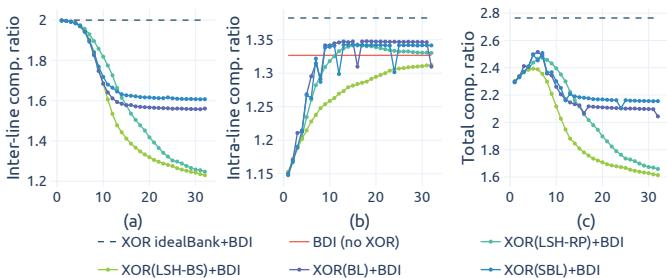

- **图像概述**
  - 该图为论文 Figure 12，用于分析 XOR Cache 中 **map table-based XOR policy** 的设计选择。
  - 图中比较了四种 **map function** 在不同 **map value bits** 数量下的压缩效果：
    - **LSH-RP**：Locality-Sensitive Hashing with Random Projection
    - **LSH-BS**：Locality-Sensitive Hashing with Bit Sampling
    - **BL**：Byte Labeling
    - **SBL**：Sparse Byte Labeling
  - 三个子图分别展示：
    - **(a) Inter-line comp. ratio**：XOR 配对本身带来的跨行压缩率
    - **(b) Intra-line comp. ratio**：XOR 后再使用 BΔI 的行内压缩率
    - **(c) Total comp. ratio**：二者组合后的总压缩率
  - 横轴均为 **number of map value bits**，即 map function 输出签名的 bit 数。

- **图例含义**

| 曲线 | 含义 | 作用 |
|---|---|---|
| **XOR idealBank+BΔI** | 理想情况下在整个 LLC bank 内寻找最佳 XOR partner | 上界参考 |
| **BΔI (no XOR)** | 不使用 XOR，仅使用 BΔI | baseline |
| **XOR(LSH-RP)+BΔI** | 使用 LSH-RP 选择 XOR partner 后再 BΔI | 实用 map function 候选 |
| **XOR(LSH-BS)+BΔI** | 使用 LSH-BS 选择 XOR partner 后再 BΔI | 实用 map function 候选 |
| **XOR(BL)+BΔI** | 使用 Byte Labeling 选择 XOR partner 后再 BΔI | 表现较优 |
| **XOR(SBL)+BΔI** | 使用 Sparse Byte Labeling 选择 XOR partner 后再 BΔI | 最终采用方案 |

- **子图 (a)：Inter-line compression ratio 分析**
  - **纵轴范围约为 1.2 到 2.0**。
  - 虚线 **XOR idealBank+BΔI** 接近 **2.0**，表示 XOR 两条 cache lines 理论上最多可达到 **2:1 inter-line compression**。
  - 随着 **map value bits 增加**，所有实用 map function 的 inter-line compression ratio 都下降。
  - 原因是：
    - map value bits 越多，签名空间越大；
    - cache line 被分散到更多 map table bins；
    - 每个 bin 内可匹配的 standalone candidate 变少；
    - 因而 **XOR pairing coverage 降低**。

| map function | Inter-line trend | 解释 |
|---|---|---|
| **LSH-RP** | 从接近 2.0 逐步下降到约 1.25 | bits 增多后 coverage 快速下降 |
| **LSH-BS** | 下降更快，后期约 1.23 左右 | bit sampling 对候选聚类不稳定 |
| **BL** | 下降后稳定在约 1.58 左右 | coverage 保持较好 |
| **SBL** | 下降后稳定在约 1.60 左右 | 相比 BL 保留更多有效候选 |
| **idealBank** | 维持约 2.0 | 理想全 bank 搜索，无 coverage 限制 |

- **子图 (a) 的核心结论**
  - **map value bits 越少，XOR 配对机会越多，inter-line compression 越高。**
  - 但 bits 太少会导致不相似的 cache lines 被错误归为同一类，影响后续 intra-line compression。
  - **BL 和 SBL 在较多 bits 下仍能保持较高 inter-line compression ratio**，说明 byte-level sparsity 对 cache line 相似性有较强捕捉能力。

- **子图 (b)：Intra-line compression ratio 分析**
  - **纵轴范围约为 1.15 到 1.36**。
  - 红色水平线 **BΔI (no XOR)** 约为 **1.33**，表示不经过 XOR 时 BΔI 的 baseline 压缩率。
  - 随着 **map value bits 增加**，多数 XOR-based 方法的 intra-line compression ratio 上升。
  - 原因是：
    - map value bits 越多，签名越精确；
    - 同一个 bin 中的 cache lines 更相似；
    - XOR 后的结果更稀疏、熵更低；
    - BΔI 更容易压缩。
  - 这体现了 **accuracy 提升**。

| map function | Intra-line trend | 与 BΔI baseline 比较 |
|---|---|---|
| **LSH-RP** | 快速上升并接近/略高于 BΔI baseline | 约 12 bits 后表现较好 |
| **LSH-BS** | 缓慢上升，低 bits 时明显低于 baseline | 需要更多 bits 才接近 baseline |
| **BL** | 很快达到约 1.34 左右 | 约 7 bits 后即可接近或超过 baseline |
| **SBL** | 很快达到约 1.34 左右 | 约 7 bits 后即可达到较优效果 |
| **BΔI no XOR** | 水平线约 1.33 | baseline |
| **idealBank** | 约 1.35 左右 | 理想候选选择带来的上界 |

- **子图 (b) 的核心结论**
  - **map value bits 越多，候选匹配越准确，XOR 后数据越容易被 BΔI 压缩。**
  - **BL 和 SBL 在较少 bits 下即可达到接近 idealBank 的 intra-line compression ratio**。
  - **LSH-BS 收敛最慢**，说明简单 bit sampling 对捕捉可压缩相似性不够高效。
  - **SBL 的优势在于去除了低位高熵字节的噪声**，使签名更关注高价值的低熵区域。

- **子图 (c)：Total compression ratio 分析**
  - **纵轴范围约为 1.6 到 2.8**。
  - 虚线 **XOR idealBank+BΔI** 接近 **2.75**，表示理想 XOR partner 搜索与 BΔI 组合后的上界。
  - 红色 **BΔI (no XOR)** 约为 **1.33**，显著低于所有合理 XOR+BΔI 配置，说明 XOR Cache 对 BΔI 有明显催化作用。
  - Total compression ratio 同时受两方面影响：
    - **Inter-line compression coverage**
    - **Intra-line compression accuracy**
  - 曲线普遍呈现先升后降或峰值后下降的形态，体现 **coverage-accuracy tradeoff**。

| map function | Total compression peak | 后期趋势 | 综合评价 |
|---|---:|---|---|
| **LSH-RP** | 约 2.45 左右 | bits 增加后明显下降 | 初期较好，但 coverage 损失较大 |
| **LSH-BS** | 约 2.35 左右 | 后期降至约 1.65 | 整体较弱 |
| **BL** | 约 2.50 左右 | 后期稳定在约 2.1 | 稳定且高效 |
| **SBL** | 约 2.50 左右 | 后期稳定在约 2.15 | 最优或接近最优 |
| **idealBank** | 约 2.75 | 保持不变 | 理想上界 |
| **BΔI no XOR** | 约 1.33 | 保持不变 | baseline |

- **子图 (c) 的核心结论**
  - **最佳 total compression ratio 出现在约 7 bits 附近。**
  - bits 太少：
    - 候选多，coverage 高；
    - 但候选相似性差；
    - intra-line compression 不理想。
  - bits 太多：
    - 候选相似性高；
    - 但可匹配候选数量少；
    - inter-line compression 大幅下降。
  - 因此，**7-bit SBL 是较优折中点**。

- **Coverage-Accuracy tradeoff 总结**

| map value bits | Coverage | Accuracy | Inter-line comp. | Intra-line comp. | Total comp. |
|---|---|---|---|---|---|
| **较少 bits** | 高 | 低 | 高 | 低 | 不一定最优 |
| **中等 bits，例如 7 bits** | 较高 | 较高 | 较高 | 较高 | **最优区域** |
| **较多 bits** | 低 | 高 | 低 | 高 | 下降 |

- **为什么 SBL 表现最好**
  - **SBL = Sparse Byte Labeling**。
  - 它只关注每个 8-byte word 中更高位、更低熵的字节，忽略低位高熵字节。
  - 论文 Figure 9 表明，word 内低位 bytes 通常 entropy 更高，容易引入噪声。
  - SBL 的优势是：
    - **降低 map value 噪声**
    - **提升相似 cache line 的聚类质量**
    - **保持较高 XOR pairing coverage**
    - **使 XOR 后结果更稀疏**
    - **增强 BΔI 压缩效果**

- **与 BL 的比较**
  - BL 和 SBL 都利用 byte-level sparsity。
  - BL 对所有 bytes 做 0/非0 标签。
  - SBL 只选择部分更有代表性的 bytes。
  - 从图中看：
    - 二者在 intra-line compression 上都较快达到较高水平；
    - 但 **SBL 在 inter-line compression 上更稳**；
    - 因此 **SBL 的 total compression ratio 略优于 BL**。

- **与 LSH-RP / LSH-BS 的比较**
  - **LSH-RP**：
    - 在较少 bits 时 total compression ratio 较高；
    - 但随着 bits 增加，inter-line coverage 快速下降；
    - 后期 total compression ratio 明显下降。
  - **LSH-BS**：
    - intra-line compression 提升慢；
    - 需要更多 bits 才能接近 BΔI baseline；
    - 但更多 bits 又损害 inter-line coverage；
    - 因此整体表现最弱。
  - **BL/SBL 更适合 XOR Cache**，因为它们直接捕捉数据稀疏性，而不是依赖一般性的 locality-sensitive hash。

- **该图支撑的论文设计决策**
  - 论文最终选择 **7-bit SBL** 作为 XOR Cache 的 map function 配置。
  - 原因是：
    - 在约 7 bits 处 total compression ratio 接近峰值；
    - inter-line coverage 仍较高；
    - intra-line accuracy 已接近理想；
    - map table 规模小，硬件开销低。
  - 使用 7-bit map value 时，map table 只需要约 **2⁷ = 128 entries**。
  - 这与论文后续实现一致：**direct-mapped map table with 128 entries**。

- **对 XOR Cache 机制的意义**
  - 该图验证了 XOR Cache 的核心思想：
    - **不是任意两条 cache lines XOR 都有效**；
    - 需要通过 map function 找到值相似的 cache lines；
    - 相似 lines XOR 后会产生更多 0 或低熵模式；
    - 再交给 BΔI 后可以获得更高压缩率。
  - 因此 XOR Cache 同时获得：
    - **inter-line compression**：两条 lines 共用一个 data entry；
    - **intra-line compression boost**：XOR 后数据更适合 BΔI。

- **关键数据结论**
  - **idealBank+BΔI 上界约为 2.75× total compression ratio**。
  - **BΔI no XOR baseline 约为 1.33×**。
  - **7-bit SBL+BΔI 可达到约 2.5× total compression ratio**。
  - **SBL 在 practical implementation 中接近理想上界，同时硬件成本可控**。
  - 该结果直接支撑论文在 Table 4 中将 XOR+BΔI 的 data array 缩小约 **2.5×**。

- **总体结论**
  - Figure 12 的核心信息是：**map value bits 存在最佳折中点**。
  - **少 bits 提供高 coverage，多 bits 提供高 accuracy，但二者不可兼得。**
  - 在四种 map function 中，**SBL 在 7 bits 左右实现最佳综合效果**。
  - 该图证明 XOR Cache 的压缩收益并非只来自简单的 2:1 XOR 配对，而是来自 **value-aware pairing + BΔI synergy**。
  - 因此，Figure 12 是论文中支撑 XOR Cache 实用性和硬件配置选择的关键实验图。

### Figure 13: Compression ratio analysis.

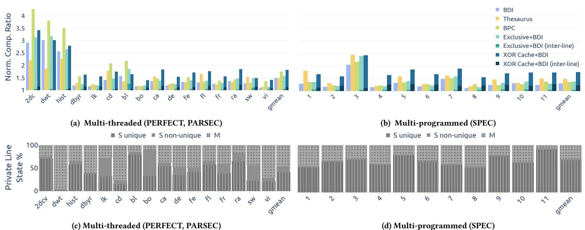

- **图像整体含义**
  - Figure 13 展示了 **XOR Cache 与多种压缩 LLC 方案的压缩率对比**，并进一步解释压缩率差异背后的原因：**private cache line state 分布**。
  - 图中包含四个子图：
  
| 子图 | 内容 | 工作负载类型 | 主要指标 |
|---|---|---|---|
| **(a)** | Normalized compression ratio | **Multi-threaded：PERFECT + PARSEC** | 各压缩方案相对未压缩 LLC 的压缩率 |
| **(b)** | Normalized compression ratio | **Multi-programmed：SPEC CPU2017 mixes** | 各压缩方案相对未压缩 LLC 的压缩率 |
| **(c)** | Private line state breakdown | **Multi-threaded** | private cache 中 **S unique / S non-unique / M** 的比例 |
| **(d)** | Private line state breakdown | **Multi-programmed** | private cache 中 **S unique / S non-unique / M** 的比例 |

- **图例说明**
  - 上半部分压缩率柱状图包含以下方案：
  
| 图例 | 含义 |
|---|---|
| **BDI** | Base-Delta-Immediate intra-line compression |
| **Thesaurus** | 基于动态聚类的 inter-line compression |
| **BPC** | Bit-Plane Compression |
| **Exclusive+BDI** | Exclusive LLC 上应用 BDI |
| **Exclusive+BDI (inter-line)** | Exclusive+BDI 中由 exclusive policy 带来的有效容量收益部分 |
| **XOR Cache+BDI** | XOR Cache 与 BDI 结合后的总压缩率 |
| **XOR Cache+BDI (inter-line)** | XOR Cache 中仅由 XOR inter-line compression 带来的部分 |

  - 下半部分 private line state 分布包含：
  
| 状态 | 含义 | 对 XOR Cache 的影响 |
|---|---|---|
| **S unique** | Shared 状态，但只被一个 private cache 持有 | **最有利于 XOR compression**，提供可恢复的 partner |
| **S non-unique** | Shared 状态，被多个 private cache 共享 | 有利于 recoverability，但实际 unique XOR 机会可能下降 |
| **M** | Modified 状态 | **不利于 XOR Cache**，因为 dirty line 在该设计中强制 exclusion，不存 LLC data |

- **子图 (a)：Multi-threaded 压缩率分析**
  - 横轴是 PERFECT 与 PARSEC 中的 benchmark，包括 **2dcv, dwt, hist, dbys, lk, cd, bl, bo, ca, de, fe, fl, fr, ra, sw, vi** 以及 **gmean**。
  - 纵轴是 **Normalized Compression Ratio**，即相对未压缩 LLC 的压缩率。
  - **XOR Cache+BDI 通常高于 BDI、Thesaurus、BPC 和 Exclusive+BDI**，说明 XOR Cache 不只是减少重复数据，还能增强 BDI 的 intra-line compressibility。
  - 在 **2dcv, dwt, hist** 等 benchmark 中，压缩率非常高：
    - **BPC** 在这些 benchmark 上表现极强，部分超过 **4×**。
    - **XOR Cache+BDI** 也达到约 **3× 左右**，但在个别高度规则数据上略低于 BPC。
  - 在 **dbys, lk, bo, de, fr, vi** 等 benchmark 中，整体压缩率较低，说明这些 workload 的数据相似性或 inclusion redundancy 较弱。
  - **gmean** 上，XOR Cache+BDI 的总压缩率明显优于 BDI 与 Thesaurus，并略高于或接近 BPC。
  - 深蓝色的 **XOR Cache+BDI (inter-line)** 部分显示：XOR Cache 的收益中有相当一部分来自 **XOR pair co-location**，即两个 cache lines 存为一个 XORed line。

- **子图 (b)：Multi-programmed SPEC 压缩率分析**
  - 横轴是 11 个 SPEC CPU2017 random mixes，编号 **1–11**，以及 **gmean**。
  - 与 multi-threaded 相比，SPEC multi-programmed 的压缩率整体更平稳，极端高压缩率较少。
  - **XOR Cache+BDI 在多数 SPEC mix 上是最高或接近最高的方案**。
  - **BPC** 在 SPEC 中优势减弱，原因是 multi-programmed workloads 的数据类型更混杂，跨 cache line 或 bit-plane 层面的规律性更弱。
  - **Thesaurus** 在部分 mix 上有不错表现，但整体低于 XOR Cache+BDI。
  - **Exclusive+BDI** 的压缩率低于 XOR Cache+BDI，说明：
    - Exclusive LLC 通过不存 private cache 中已有数据获得一定有效容量提升；
    - 但它无法利用 inclusion redundancy 来产生额外的 XOR compressibility；
    - XOR Cache 是“利用冗余”，而不是简单“消除冗余”。

- **子图 (c)：Multi-threaded private line state 分布**
  - 该子图解释了为什么不同 multi-threaded benchmark 的 XOR compression ratio 差异较大。
  - **S unique 比例越高，XOR Cache 的 inter-line compression 机会通常越多**。
  - 例如：
    - **2dcv、hist、ra** 等 benchmark 中，S unique 或 Shared 状态比例较高，因此 XOR Cache 有较多可恢复 partner。
    - **dwt** 中几乎全部 private lines 都是 **M state**，这会严重限制 XOR Cache，因为 Modified lines 不在 LLC data array 中保留 clean copy。
    - **cd** 中 M state 比例也很高，因此 inter-line XOR 机会受限。
  - Multi-threaded workloads 中经常存在较多 **S non-unique**，即多个 core 共享同一 line。
    - 这对传统 inclusive LLC 是重复存储；
    - 对 XOR Cache 来说，这种共享提供 recoverability，但如果许多 private cache 共享的是同一批 LLC lines，则可配对的 unique line 数量并不会线性增加。

- **子图 (d)：Multi-programmed SPEC private line state 分布**
  - SPEC random mixes 的 private line state 分布更稳定。
  - 大多数 mix 中 **S unique 占比较高**，M state 相对较少。
  - 这解释了为什么 SPEC 中 XOR Cache 的 inter-line compression ratio 在多数 mix 上比较稳定。
  - 与 multi-threaded workloads 不同，multi-programmed workloads 的进程之间共享数据较少，因此：
    - **S non-unique 比例较低**；
    - **S unique 比例较高**；
    - XOR Cache 更容易找到一对一的 recoverable XOR partner。

- **关键趋势总结**

| 观察点 | 图中证据 | 含义 |
|---|---|---|
| **XOR Cache+BDI 总体压缩率最高或接近最高** | (a)(b) 中深蓝柱普遍较高 | XOR compression 与 BDI 有明显 synergy |
| **BPC 在部分 multi-threaded benchmark 上极强** | 2dcv、dwt、hist 中浅绿色柱很高 | BPC 对规则、低熵数据非常敏感 |
| **Exclusive+BDI 不如 XOR Cache+BDI** | 青色柱通常低于深蓝柱 | 单纯消除 inclusion redundancy 不如利用 redundancy 做 compression |
| **M state 会削弱 XOR Cache** | (c) 中 dwt、cd 的 M 占比高，对应 XOR inter-line 收益低 | Dirty/exclusive data 减少 recoverable clean copy |
| **S unique 是 XOR compression 的关键来源** | (c)(d) 中 S unique 高时，inter-line 部分通常更明显 | XOR Cache 依赖 private cache 中 clean shared copy 进行恢复 |
| **SPEC 中 XOR Cache 更稳定** | (b)(d) 中压缩率和状态分布较均衡 | Multi-programmed workloads 通常有更多 S unique、较少复杂共享 |

- **为什么 XOR Cache 能超过 Exclusive LLC**
  - **Exclusive LLC** 的策略是：如果 line 已经在 private cache 中，则 LLC 不再保存它，从而减少重复。
  - **XOR Cache** 的策略是：保留 inclusion redundancy，但将它转化为压缩机会。
  - 如果 LLC 中有 line B，private cache 中有 line A，那么 LLC 可存储 **A⊕B**。
  - 当需要恢复 B 时，可利用 private cache 中的 A 执行：
    - **B = A⊕B⊕A**
  - 因此，XOR Cache 不只是减少容量占用，还能产生更低熵的 XORed line，使 BDI 等 intra-line compressor 更容易压缩。

- **图中最重要的结论**
  - **XOR Cache+BDI 的优势来自两层压缩叠加**：
    - **inter-line compression**：两个 cache lines 通过 XOR 合并存储；
    - **intra-line compression**：XOR 后的数据通常更稀疏、更低熵，更适合 BDI 压缩。
  - **Private cache state 分布决定 XOR Cache 的可用机会**：
    - **S unique 多 → XOR opportunity 多**；
    - **M 多 → XOR opportunity 少**；
    - **S non-unique 多但集中共享 → 不一定带来等比例收益**。
  - 图 13 用上半部分展示结果，用下半部分解释原因，是论文证明 XOR Cache 有效性的核心证据之一。

### (b) Normalized cache hierarchy power breakdown. Figure 14: Normalized area and power breakdown.

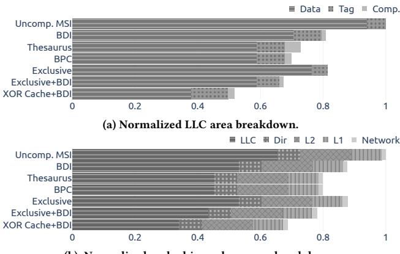

- **图片总体内容**
  - 该图为论文 Figure 14：**Normalized area and power breakdown**，由两个横向堆叠柱状图组成。
  - 上半部分是 **(a) Normalized LLC area breakdown**，展示不同 LLC 设计相对于 **Uncomp. MSI** 的归一化 LLC 面积组成。
  - 下半部分是 **(b) Normalized cache hierarchy power breakdown**，展示不同缓存层次结构相对于 **Uncomp. MSI** 的归一化功耗组成。
  - 横轴均为归一化数值，**Uncomp. MSI = 1.0** 作为基准。
  - 对比对象包括：
    - **Uncomp. MSI**
    - **BΔI**
    - **Thesaurus**
    - **BPC**
    - **Exclusive**
    - **Exclusive+BΔI**
    - **XOR Cache+BΔI**

- **(a) Normalized LLC area breakdown：面积分析**

| 方案 | 主要面积组成 | 归一化面积趋势 | 关键观察 |
|---|---|---:|---|
| **Uncomp. MSI** | Data + Tag | **1.00** | 未压缩基准，面积最大 |
| **BΔI** | Data + Tag + Comp. | 约 **0.80** | Data array 缩小，但 Tag 与 compressor 带来额外开销 |
| **Thesaurus** | Data + Tag + Comp. | 约 **0.70** | 压缩效果较好，但需要额外元数据/压缩结构 |
| **BPC** | Data + Tag + Comp. | 约 **0.70** | 面积接近 Thesaurus |
| **Exclusive** | Data + Tag | 约 **0.82** | 通过 exclusive cache 减少重复数据，但压缩能力有限 |
| **Exclusive+BΔI** | Data + Tag + Comp. | 约 **0.67** | 比 Exclusive 更小，但仍大于 XOR Cache+BΔI |
| **XOR Cache+BΔI** | Data + Tag + Comp. | 约 **0.52** | **面积最小**，数据阵列显著缩减 |

- **面积图中的核心结论**
  - **XOR Cache+BΔI 的 LLC 面积最低**，约为未压缩基准的一半左右。
  - 论文给出的定量结论是：
    - **相比 Uncomp. MSI，XOR Cache 实现 1.93× LLC area reduction**
    - 即面积约为基准的 **1 / 1.93 ≈ 51.8%**
  - 面积下降的主要来源是：
    - **Data array 大幅缩小**
    - XOR compression 将两个 cache lines 以 **A⊕B** 形式共存于一个物理数据槽中
    - 再结合 **BΔI intra-line compression**，进一步压缩 XOR 后的低熵数据
  - 虽然 XOR Cache 需要额外结构：
    - **XORPtr**
    - **DataPtr**
    - **map table**
    - **compressor / decompressor logic**
  - 但这些额外开销相对较小，论文指出 XOR Cache 额外硬件面积仅约 **0.01 mm²**，远小于 Data array 缩减带来的收益。

- **面积组成细节**
  - 图例包含：
    - **Data**：LLC 数据阵列面积
    - **Tag**：标签与元数据面积
    - **Comp.**：压缩器、map table、base cache 等压缩相关结构
  - 对所有方案而言，**Data 仍是 LLC 面积的主要组成部分**。
  - 因此，压缩方案是否能有效减少 Data array，决定了总体面积收益。
  - **XOR Cache+BΔI 的 Data 部分明显短于所有其他方案**，说明其压缩比最高、所需数据存储最少。

- **(b) Normalized cache hierarchy power breakdown：功耗分析**

| 方案 | 主要功耗组成 | 归一化功耗趋势 | 关键观察 |
|---|---|---:|---|
| **Uncomp. MSI** | LLC + Dir + L2 + L1 + Network | **1.00** | 功耗基准 |
| **BΔI** | LLC 降低，其他层次接近 | 约 **0.88** | 有一定功耗收益 |
| **Thesaurus** | LLC 降低，但压缩/访问复杂度较高 | 约 **0.80** | 功耗低于 BΔI |
| **BPC** | LLC 降低，解压复杂度较高 | 约 **0.79** | 接近 Thesaurus |
| **Exclusive** | LLC 降低，但 Network 增加 | 约 **0.88** | 维护 exclusivity 带来额外通信 |
| **Exclusive+BΔI** | LLC 进一步降低 | 约 **0.78** | 优于 Exclusive，但仍高于 XOR Cache |
| **XOR Cache+BΔI** | LLC 显著降低，Network 略增 | 约 **0.68–0.70** | **总功耗最低** |

- **功耗图中的核心结论**
  - **XOR Cache+BΔI 的 cache hierarchy power 最低**。
  - 论文给出的定量结论是：
    - **相比 Uncomp. MSI，XOR Cache 实现 1.92× LLC power reduction**
    - **相比 Uncomp. MSI，XOR Cache 实现 1.46× cache hierarchy power reduction**
  - 也就是说：
    - LLC 本身功耗约降至 **52%**
    - 整个 cache hierarchy 功耗约降至 **68.5%**
  - 图中可见，XOR Cache+BΔI 的 **LLC 功耗段明显缩短**，这是总功耗下降的主要原因。

- **功耗组成细节**

| 功耗部分 | 图中含义 | 对 XOR Cache+BΔI 的影响 |
|---|---|---|
| **LLC** | Last-Level Cache 数据与标签访问、泄漏功耗 | **显著下降**，是主要收益来源 |
| **Dir** | Directory 结构功耗 | 略有增加或保持较小占比 |
| **L2** | 私有 L2 cache 功耗 | 因 forwarding/recovery 可能略增 |
| **L1** | 私有 L1 cache 功耗 | 局部恢复时可能增加访问 |
| **Network** | 片上网络通信功耗 | **增加**，因为 XOR Cache 需要额外 forwarding 消息 |

- **为什么 XOR Cache 功耗仍然最低**
  - XOR Cache 引入了额外通信和私有缓存访问：
    - **local recovery**
    - **direct forwarding**
    - **remote recovery**
    - **unXORing**
  - 论文指出：
    - 额外 private cache accesses 仅占总 private cache accesses 的 **1.99%**
    - Network traffic 增加 **23.4%**
  - 但这些动态功耗开销被 LLC 缩小带来的收益抵消。
  - LLC 的功耗中 **leakage power 占比较高**，而 XOR Cache 大幅减少 SRAM 数据阵列规模，因此总功耗显著下降。
  - 与 **Exclusive LLC** 相比，XOR Cache 的 network traffic 增加也并不更糟：
    - XOR Cache：**+23.4%**
    - Exclusive LLC：**+24.6%**
  - 因此，XOR Cache 在功耗上优于 Exclusive 与 Exclusive+BΔI。

- **XOR Cache+BΔI 相比其他压缩方案的优势**

| 对比对象 | XOR Cache+BΔI 的优势 |
|---|---|
| **BΔI** | 不仅做 intra-line compression，还通过 XOR 做 inter-line compression |
| **BPC** | BPC 解压复杂度更高，XOR+BΔI 以简单 XOR gates 获得更高收益 |
| **Thesaurus** | Thesaurus 需要 clustering/base cache，XOR Cache 结构更简单且面积更低 |
| **Exclusive** | Exclusive 消除 inclusion redundancy；XOR Cache 则利用该 redundancy 进行压缩 |
| **Exclusive+BΔI** | XOR Cache 保留并利用 private caching redundancy，压缩比和面积功耗收益更高 |

- **图中最重要的设计含义**
  - **XOR Cache 的关键思想不是简单删除冗余，而是将冗余转化为压缩机会。**
  - Inclusive 或 mixed-inclusive cache hierarchy 中，LLC 与 private caches 之间存在重复数据。
  - 传统设计认为这种 duplication 会降低 effective capacity。
  - XOR Cache 则利用该 duplication：
    - LLC 存储 **A⊕B**
    - private cache 中保留 A 或 B
    - 需要访问时通过 XOR 恢复原始 cache line
  - 因此它能在不明显损害性能的前提下减少 LLC 数据阵列。

- **与论文整体结果的对应关系**
  - 图 14 支撑论文摘要中的核心结果：
    - **LLC area reduction：1.93×**
    - **LLC power reduction：1.92×**
    - **cache hierarchy power reduction：1.46×**
    - **performance overhead：2.06%**
    - **EDP reduction：26.3%**
  - 该图主要证明：
    - XOR Cache 的压缩收益不是只体现在理论 compression ratio 上
    - 它能实际转化为 **面积降低** 与 **功耗降低**

- **最终结论**
  - **XOR Cache+BΔI 在所有方案中同时取得最小 LLC 面积和最低缓存层次功耗。**
  - 面积收益主要来自 **Data array 缩减**。
  - 功耗收益主要来自 **LLC leakage/dynamic power 降低**。
  - 虽然 XOR Cache 增加了 coherence forwarding、map table 和部分 network traffic，但开销较小。
  - 图 14 清楚表明：**XOR Cache 是一种以极低硬件开销换取显著 LLC 面积和功耗收益的压缩架构。**

### (a) Multi-threaded (PERFECT, PARSEC) (b) Multi-programmed (SPEC) Figure 15: Normalized performance overhead. (a) shows norm. runtime of multi-threaded runs; (b) shows the norm. geometric mean of CPI of multi-programmed runs.

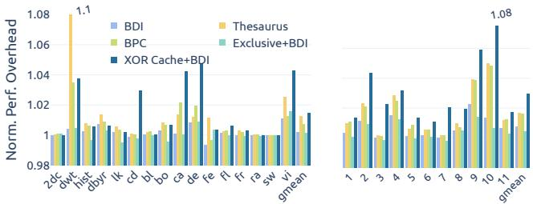

- **图的核心含义**：这张图比较了 5 种 LLC 方案在不同工作负载下的**归一化性能开销**，基线为 uncompressed MSI cache，数值越接近 **1.0** 说明性能损失越小。
- **两幅子图含义**：
  - **(a) Multi-threaded (PERFECT, PARSEC)**：纵轴是 **normalized runtime**，反映多线程程序的运行时间变化。
  - **(b) Multi-programmed (SPEC)**：纵轴是 **normalized CPI geometric mean**，反映多程序并发时的平均周期代价。
- **整体结论**：所有方案的性能开销都很小，基本集中在 **0.99–1.08** 区间，说明这些压缩缓存的主要收益来自面积/功耗，而不是性能提升；其中 **XOR Cache+BΔI** 在大多数 benchmark 上保持接近基线，但相较其他方案会略有额外开销。

- **图中方案对比**
  
  | 方案 | 颜色 | 性能特征 | 主要原因 |
  |---|---|---|---|
  | **BDI** | 浅蓝 | 开销最低或接近最低 | 仅需较轻量的 intra-line decompression |
  | **BPC** | 浅绿 | 通常略高于 BDI | 压缩/解压逻辑更复杂 |
  | **Thesaurus** | 黄色 | 开销最高之一 | 需要 base cache / clustering 相关访问 |
  | **Exclusive+BDI** | 浅青 | 中等 | 虽减少冗余，但结构与命中路径有额外影响 |
  | **XOR Cache+BDI** | 深蓝 | 总体略高于其他方案，但仍很低 | 需要 XOR recovery、remote recovery 等额外路径 |

- **(a) 多线程负载的表现**
  - **XOR Cache+BDI** 大部分 benchmark 都在 **1.00–1.04** 左右，少数 workload 接近 **1.07–1.08**。
  - 这说明在 PERFECT/PARSEC 这类多线程场景中，XOR 方案引入的额外延迟大多可控。
  - 图中最明显的高点出现在个别 benchmark 上，表明其开销更像是**局部敏感型**，不是全局普遍恶化。
  - 文中给出的总结是：多线程平均 slowdown 约 **1.45%**。

- **(b) 多程序负载的表现**
  - **XOR Cache+BDI** 在 SPEC 上的波动比多线程略大，部分 benchmark 明显高于其他方案，最高接近 **1.07–1.08**。
  - 右图中 **Thesaurus** 和 **Exclusive+BDI** 也会出现较明显上升，但整体仍低于或接近 XOR 方案的最差点。
  - 文中指出多程序场景下平均 slowdown 约 **2.95%**，高于多线程，说明这种负担更容易在独立工作集更分散、共享更弱的场景中体现出来。

- **为什么 XOR Cache 的开销会更高**
  - **local recovery**：需要本地持有配对线并执行额外 XOR。
  - **direct forwarding**：虽然不一定要 XOR，但仍有额外 coherence 路径。
  - **remote recovery**：最慢，涉及跨 sharer 的转发和恢复，是性能开销的主要来源。
  - 多程序场景下，**remote recovery 命中比例更高**，因此 CPI 增幅更明显。

- **从图上能读出的相对排序**
  - 在大多数 benchmark 上，性能开销大致是：
    - **BDI 最低**
    - **BPC ≈ Exclusive+BDI**
    - **XOR Cache+BDI 略高**
    - **Thesaurus 通常最高**
  - 但这个排序不是绝对固定，说明不同工作负载对压缩机制的敏感度不同。

- **和论文结论的对应关系**
  - 这张图支撑了论文的关键论点：**XOR Cache 能显著降低面积和功耗，但性能代价很小**。
  - 它不是“更快”的方案，而是一个**以轻微性能代价换取更高压缩收益**的架构设计。
  - 文中最终给出的总评是：整体平均性能开销仅 **2.06%**，但能带来 **1.93× area reduction**、**1.92× power reduction**，以及 **26.3% EDP improvement**。

- **工程解读**
  - 这张图说明 XOR Cache 的设计在实践中是“**可接受的低开销压缩**”，并没有因为跨层 XOR、coherence forwarding、unXORing 而导致明显性能崩溃。
  - 性能损失主要来自**少量慢路径**，而不是大部分访问路径。
  - 因此，这种设计更适合**以容量/能效为优先目标**的 LLC 场景。

- **一句话总结**
  - **图 15 证明 XOR Cache+BΔI 在几乎不破坏性能的前提下，成功把压缩收益转化为面积和功耗优势；其代价主要体现在少量 benchmark 上的额外恢复延迟，整体仍然很小。**

### Figure 16: Iso-storage performance.

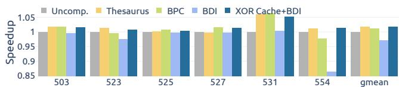

- **图像内容概览**
  - 该图为论文中的 **Figure 16: Iso-storage performance**，展示在**相同 LLC 存储预算**下，不同压缩缓存方案相对于 **Uncomp. baseline** 的性能表现。
  - 横轴为若干 SPEC CPU 2017 workload：**503、523、525、527、531、554**，以及 **gmean**。
  - 纵轴为 **Speedup**，以 **Uncomp. = 1.0** 作为归一化基准。
  - 对比方案包括：
    - **Uncomp.**
    - **Thesaurus**
    - **BPC**
    - **BDI**
    - **XOR Cache + BDI**

- **图中主要数据趋势**

  | Workload | Uncomp. | Thesaurus | BPC | BDI | XOR Cache + BDI | 主要观察 |
  |---|---:|---:|---:|---:|---:|---|
  | **503** | ≈1.00 | ≈1.02 | ≈1.02 | ≈1.00 | ≈1.02 | 多数压缩方案略有收益，**XOR Cache + BDI 与 Thesaurus/BPC 接近** |
  | **523** | ≈1.00 | ≈1.01 | ≈0.99 | ≈0.97 | ≈1.01 | **BDI 明显落后**，XOR Cache + BDI 恢复并略超 baseline |
  | **525** | ≈1.00 | ≈1.00 | ≈1.01 | ≈1.00 | ≈1.005 | 各方案差距较小，**XOR Cache + BDI 稳定接近最优** |
  | **527** | ≈1.00 | ≈0.99 | ≈1.02 | ≈1.00 | ≈1.02 | **BPC 与 XOR Cache + BDI 表现较好** |
  | **531** | ≈1.00 | >1.05 | >1.05 | ≈1.00 | ≈1.05 | 该 workload 对压缩容量收益敏感，**Thesaurus/BPC/XOR 均有明显加速** |
  | **554** | ≈1.00 | ≈1.01 | ≈0.97 | ≈0.86 | ≈1.01 | **BDI 出现严重性能损失**，XOR Cache + BDI 明显优于 BDI |
  | **gmean** | ≈1.00 | ≈1.02 | ≈1.01 | ≈0.97 | ≈1.02 | **XOR Cache + BDI 几何平均最高或接近最高** |

- **核心结论**
  - **XOR Cache + BDI 在 iso-storage 条件下取得了最佳整体性能。**
  - 论文正文给出的定量结果是：
    - **XOR Cache + BDI 平均 speedup 为 1.78%**
    - **最高 speedup 为 5.22%**
    - **BDI 平均为 -2.89%**
    - **Thesaurus 平均为 1.75%**
    - **BPC 平均为 1.28%**
  - 因此，在相同物理存储面积下，**XOR Cache + BDI 的有效容量提升更高**，能够比传统压缩方案提供更稳定的性能收益。

- **为什么 XOR Cache + BDI 表现更好**
  - **XOR Cache 提供 inter-line compression**
    - 它将两个 cache line 通过 bitwise XOR 合并存储。
    - 在相同数据阵列容量下，可容纳更多逻辑 cache lines。
  - **XOR 后的数据更适合 BDI**
    - 如果两个 line 数值相似，执行 XOR 后会产生大量 0 或低熵模式。
    - 这会提升 **BDI intra-line compression** 的效果。
  - **容量收益转化为性能收益**
    - 对 LLC 容量敏感的 workload，如 **531、554、503**，更容易从更高有效容量中获益。
    - 因此 XOR Cache + BDI 在这些 workload 上通常优于单独 BDI。

- **BDI 的问题在图中很明显**
  - **BDI 在 554 上性能下降最严重，约为 0.86 speedup。**
  - 这说明在 iso-storage 场景下，单独 BDI 可能存在：
    - 压缩率不足；
    - 数据布局或重压缩开销；
    - 有效容量提升不稳定；
    - 额外 decompression latency 无法被 miss reduction 抵消。
  - 相比之下，**XOR Cache + BDI 避免了 BDI 单独使用时的性能退化**，在 554 上恢复到约 **1.01**。

- **Thesaurus 与 BPC 的表现**
  - **Thesaurus**
    - 在 **531** 上表现突出，超过 1.05。
    - gmean 约为 **1.02**，与 XOR Cache + BDI 接近。
    - 但其机制更复杂，需要动态聚类、base cache 等额外结构。
  - **BPC**
    - 在 **503、527、531** 上表现较好。
    - 但在 **554** 上低于 baseline，说明其对数据模式较敏感。
  - 相比之下，**XOR Cache + BDI 的优势是表现更均衡**。

- **gmean 结果解读**
  - 从右侧 **gmean** 可以看出：
    - **Uncomp. = 1.0**
    - **Thesaurus ≈ 1.02**
    - **BPC ≈ 1.01**
    - **BDI ≈ 0.97**
    - **XOR Cache + BDI ≈ 1.02**
  - **XOR Cache + BDI 是整体最优或并列最优方案**。
  - 这表明 XOR Cache 不只是节省面积和功耗，在相同存储预算下也能带来实际性能收益。

- **与论文整体结论的关系**
  - Figure 16 是一个 **case study**，并非论文主目标。
  - 论文主目标是通过 XOR Cache 缩小 LLC area 和 power，同时保持性能。
  - 但 Figure 16 说明：
    - 如果不缩小存储，而是在 **iso-storage** 下使用 XOR Cache；
    - XOR Cache 的更高压缩率可以转化为更大的有效缓存容量；
    - 从而获得一定性能提升。
  - 这强化了论文观点：**XOR Cache 不仅是 area/power optimization，也是 compression effectiveness 的增强器。**

- **一句话总结**
  - **Figure 16 表明，在相同 LLC 存储预算下，XOR Cache + BDI 通过 inter-line XOR compression 与 intra-line BDI 的协同作用，获得了最高或接近最高的几何平均性能，并显著避免了单独 BDI 在部分 workload 上的性能退化。**

### Figure 17: Geometric mean of normalized inter-line compression ratio. X-axis denotes LLC-to-private cache size ratio.

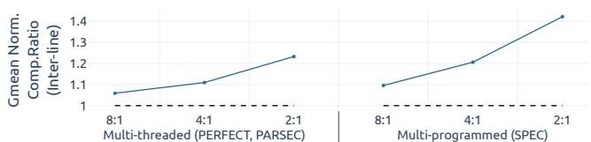

- **图 17 展示的是 XOR Cache 的 inter-line compression ratio 对 LLC-to-private cache size ratio 的敏感性**，横轴为 **LLC : private cache** 比例，分别取 **8:1、4:1、2:1**；纵轴为 **Geometric mean of normalized inter-line comp. ratio**，虚线 **1.0** 表示基线水平。

- **核心结论很直接：LLC 相对 private cache 越小，XOR 的 inter-line 压缩收益越高。**
  - 这符合论文的设计逻辑：XOR Cache 利用的是 **LLC 与 private caches 之间的冗余**。
  - 当 LLC 变小、private cache 相对更大时，更多数据已经存在于上层缓存中，LLC 中可被 XOR 的“共享/重复”机会更高。
  - 因此，**2:1 的压缩比最高，8:1 的压缩比最低**。

- **从图中读出的近似趋势如下：**

  | 工作负载类型 | 8:1 | 4:1 | 2:1 | 趋势 |
  |---|---:|---:|---:|---|
  | **Multi-threaded (PERFECT, PARSEC)** | **≈1.07** | **≈1.12** | **≈1.23–1.24** | 随比例降低稳步上升 |
  | **Multi-programmed (SPEC)** | **≈1.10** | **≈1.20** | **≈1.40–1.41** | 上升更明显 |

- **对比两组 workload：**
  - **Multi-programmed (SPEC)** 在三个点上都普遍高于 **Multi-threaded**，说明这类负载下 XOR 产生的 inter-line redundancy 更强，或者更容易形成可压缩的 pair。
  - 到 **2:1** 时差距最明显，表明 **更小的 LLC / 更大的 private cache** 会显著放大 XOR 的收益。

- **图中的工程含义：**
  - XOR Cache 并不是在所有容量配置下都同样有效。
  - 它对 **LLC-to-private cache ratio** 有明显依赖性：
    - **ratio 越低** → private cache 中的“可借用冗余”越多 → **更容易形成 XOR pair** → **inter-line compression 更强**。
    - **ratio 越高** → LLC 相对更大、上层冗余占比下降 → **XOR 机会减少**。
  - 这也解释了论文为什么强调它更适合在**存在较强层级冗余**的系统中部署。

- **与论文正文的对应关系：**
  - 该图对应 Section 6.7.2。
  - 作者明确指出：**当 LLC-to-private cache ratio 降低时，XOR Cache 在 multi-threaded 和 multi-programmed 场景下都获得更多 compression opportunity。**
  - 图 17 是这一结论的直接证据。

- **可以提炼为一句话：**
  - **XOR Cache 的 inter-line compression 对缓存层级比例高度敏感，private cache 越相对充足，XOR 利用 inclusion/private caching redundancy 的能力越强。**

### Figure 18: Normalized energy-delay product.

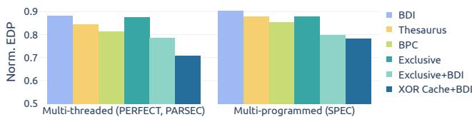

- **Figure 18 展示的是各类 LLC 设计相对 uncompressed MSI baseline 的 Normalized Energy-Delay Product，简称 Norm. EDP。**
  - 纵轴：**Norm. EDP**，数值越低越好。
  - 横轴：两类 workload：
    - **Multi-threaded：PERFECT, PARSEC**
    - **Multi-programmed：SPEC**
  - baseline 为 **uncompressed cache**，归一化值为 **1.0**，图中所有方案均低于 1.0，说明压缩或 exclusive 设计均可降低 EDP。
  - 图例包含：
    - **BDI**
    - **Thesaurus**
    - **BPC**
    - **Exclusive**
    - **Exclusive+BDI**
    - **XOR Cache+BDI**

- **图中近似数据如下：**

| Workload 类型 | BDI | Thesaurus | BPC | Exclusive | Exclusive+BDI | XOR Cache+BDI |
|---|---:|---:|---:|---:|---:|---:|
| **Multi-threaded / PERFECT, PARSEC** | ≈0.88 | ≈0.84 | ≈0.82 | ≈0.87 | ≈0.79 | **≈0.71** |
| **Multi-programmed / SPEC** | ≈0.90 | ≈0.88 | ≈0.85 | ≈0.88 | ≈0.80 | **≈0.79** |

- **核心结论：XOR Cache+BDI 在两类 workload 上均取得最低 EDP。**
  - 在 **Multi-threaded** workload 中，**XOR Cache+BDI 的 Norm. EDP 约为 0.71**，明显低于其他方案。
  - 在 **Multi-programmed SPEC** 中，**XOR Cache+BDI 的 Norm. EDP 约为 0.79**，仍为最低或与 Exclusive+BDI 非常接近但略优。
  - 论文正文总结称，**XOR Cache 的 EDP 相比 uncompressed baseline 降低 26.3%**，即整体 Norm. EDP 约为 **0.737**。

- **不同方案的表现对比：**

| 方案 | 主要特征 | EDP 表现解读 |
|---|---|---|
| **BDI** | intra-line compression | EDP 有改善，但幅度较小，主要受限于压缩率不够高 |
| **Thesaurus** | inter-line clustering compression | 优于 BDI，但 decompression latency 和额外结构带来一定开销 |
| **BPC** | bit-plane intra-line compression | Multi-threaded 中表现较好，但复杂 decompressor 可能增加延迟 |
| **Exclusive** | 去除 private cache 与 LLC 的重复数据 | EDP 改善有限，因为仅减少 inclusion redundancy，缺少压缩协同 |
| **Exclusive+BDI** | exclusive LLC + BDI | 明显优于单独 Exclusive 或 BDI，但仍不如 XOR Cache+BDI |
| **XOR Cache+BDI** | XOR inter-line compression + BDI intra-line compression | **同时降低面积、功耗，并保持较低性能损失，因此 EDP 最优** |

- **为什么 XOR Cache+BDI 的 EDP 最低：**
  - **面积显著下降**：
    - XOR Cache 通过将两条 cache line 存为 **A⊕B**，减少 LLC data array 需求。
    - 论文报告 LLC area 可降低 **1.93×**。
  - **功耗显著下降**：
    - 更小的 LLC data array 降低 leakage power。
    - 论文报告 LLC power 可降低 **1.92×**。
  - **性能损失较小**：
    - 虽然 XOR Cache 需要 local recovery、direct forwarding、remote recovery 等额外 coherence 操作，但平均性能开销仅 **2.06%**。
  - **压缩协同效果明显**：
    - XOR 后的数据往往更稀疏、更低熵，使 **BDI** 更容易压缩。
    - 因此 **XOR Cache+BDI** 不只是简单叠加两个压缩方法，而是产生了 **synergistic compression**。

- **Multi-threaded 与 Multi-programmed 的差异：**
  - **Multi-threaded workload 中 XOR Cache+BDI 优势更明显。**
    - Norm. EDP 约 **0.71**。
    - 说明 PERFECT 和 PARSEC 中，XOR Cache 能更有效地利用 shared/private cache redundancy。
  - **Multi-programmed SPEC 中优势有所缩小。**
    - Norm. EDP 约 **0.79**。
    - 原因包括：
      - 多程序 workload 的 value similarity 较弱。
      - remote recovery 比例更高，带来额外 latency。
      - XOR compression opportunity 相对 Multi-threaded 更受限。
  - 但即使在 SPEC 中，**XOR Cache+BDI 仍保持最低 EDP**，说明其收益不是 workload 特化的。

- **从 EDP 角度看，XOR Cache 的设计权衡是成功的。**
  - EDP 同时考虑 **Energy** 和 **Delay**。
  - XOR Cache 引入了额外操作：
    - map table lookup
    - XOR compression/decompression
    - coherence forwarding
    - unXORing
  - 但这些开销被更大的收益抵消：
    - **LLC leakage power 大幅下降**
    - **cache hierarchy power 降低**
    - **性能损失很小**
  - 因此最终表现为 **EDP 显著下降**。

- **与 Exclusive+BDI 的关键区别：**
  - **Exclusive+BDI** 通过不在 LLC 中保存 private cache 已有的 clean lines 来减少冗余。
  - **XOR Cache+BDI** 则不是消除 redundancy，而是利用 redundancy：
    - 将 private cache 中仍可访问的 line 作为恢复依据。
    - LLC 中只保存 **A⊕B**。
    - 同时让 XOR 后数据更适合 BDI 压缩。
  - 因此 XOR Cache 将 inclusion/private caching redundancy 从“容量浪费”转化为 **compression opportunity**。

- **图 18 的整体含义：**
  - 所有压缩方案都能降低 EDP，但效果不同。
  - 单一压缩方法如 **BDI、BPC、Thesaurus** 的收益有限。
  - **Exclusive** 设计能减少冗余，但缺乏进一步的压缩协同。
  - **XOR Cache+BDI** 同时利用：
    - **inter-line compression**
    - **intra-line compression**
    - **inclusive/private-cache redundancy**
    - **low-overhead XOR hardware**
  - 因此在两类 workload 上获得最优 EDP。

- **最终评价：**
  - Figure 18 是论文实验结果的总结性图表。
  - 它表明 **XOR Cache+BDI 在能耗-性能综合指标上优于 BDI、BPC、Thesaurus、Exclusive 和 Exclusive+BDI**。
  - 其核心价值不是单纯提高性能，而是以极小性能代价换取显著面积和功耗下降。
  - 因此，**XOR Cache 是一种面向低功耗、高面积效率 LLC 的有效压缩架构方案**。

